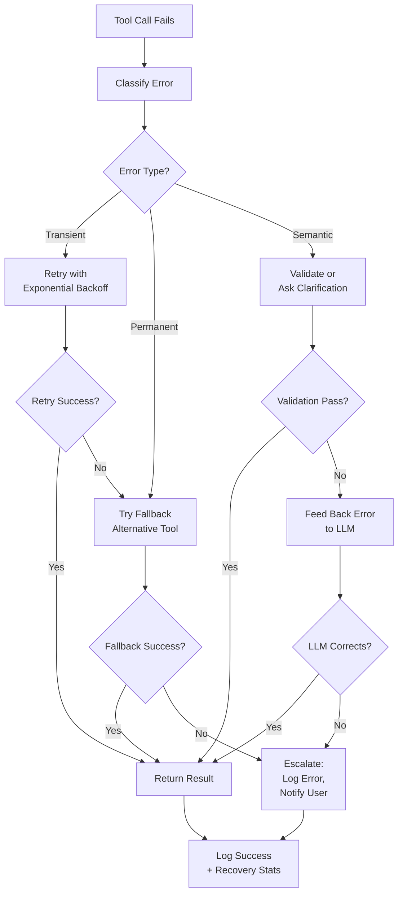

# Error Recovery in Agents

## Detailed Explanation

Error recovery is the set of strategies agents use to handle failures: timeouts, invalid outputs, hallucinations, and tool failures. Unlike traditional systems where failures are rare, agentic systems fail regularly—tools timeout, APIs rate-limit, LLMs hallucinate, network is flaky. Without explicit recovery strategies, a single failure cascades to a bad user experience. Recovery strategies include: *retry* (for transient failures like timeouts), *fallback* (use alternative tool if primary fails), *validation* (check LLM outputs against a knowledge base before trusting them), *clarification* (tell the LLM a previous response was invalid, ask for correction), and *reset* (abandon current approach and restart). The key insight is that not all failures are the same—a timeout is transient and benefits from retry; a hallucination is systematic and benefits from validation; an invalid API call benefits from fixing and retrying. Production agents implement multiple strategies layered: retry transient errors up to 3 times with exponential backoff, validate critical outputs, fallback to simpler approaches if retries fail, and surface to user only when all recovery options exhausted. Most importantly: never silently fail. Always inform the user or system of failures, even after recovery—they provide signal for improving the agent.

## Core Intuition

Think of a human dealing with obstacles. You call a friend, get a voicemail (transient failure). You retry in 5 minutes. Still voicemail—you call their partner (fallback). Can't reach them either, you text instead (different approach). When all else fails, you ask someone else for help (escalation). Agents should be similarly resilient: retry transient failures, switch tactics when needed, escalate when stuck.

## How It Works

Error recovery operates through classification, strategy selection, and escalation:

1. **Error Classification** — Determine error type: transient (timeout, rate limit, temp server error), permanent (invalid params, not found), or semantic (hallucination, inconsistency).

2. **Strategy Selection** — Match error type to strategy: transient → retry, permanent → fallback or clarify, semantic → validate or clarify.

3. **Retry with Backoff** — For transient errors, retry up to N times with exponential backoff (1s, 2s, 4s, 8s). Track retry count; give up after max.

4. **Fallback** — If retry exhausted, switch to alternative: use slower but more reliable tool, use simplified approach, or ask user for input.

5. **Validation** — For LLM outputs, check against knowledge base: "Did the LLM generate valid HTML?" "Is the proposed action safe?" "Is the reasoning logically sound?"

6. **Clarification** — If LLM output is invalid, feedback the error to the LLM: "You generated invalid SQL. Error: syntax error at line 2. Please fix it."

7. **Escalation** — If all recovery exhausted, escalate: log detailed error with context, notify ops, inform user of limitations.

8. **Observability** — Log every error, recovery attempt, and outcome. This data drives improvements: "90% of failures are rate limits on tool X—add caching", "LLM hallucinated dates 5% of time—add validation".

**Error Recovery Flow:**


## Architecture / Trade-offs

**Recovery Strategies & Trade-offs:**

1. **Aggressive Retry vs Resource Conservation**
   - Aggressive: retry 10 times with 1s backoff = fast recovery but hammers service
   - Conservative: retry 2 times with 10s backoff = slower, kinder to service
   - Trade-off: speed vs downstream impact

2. **Validation Strictness vs Performance**
   - Strict: validate every LLM output (safe, slower, expensive)
   - Loose: validate only critical outputs (fast, risky)
   - Trade-off: safety vs speed/cost

3. **Fallback Quality vs Latency**
   - High-quality fallback: switch to better tool (slow, expensive)
   - Low-quality fallback: use cached approximation (fast, less accurate)
   - Trade-off: quality vs latency

**Strategy Matrix:**


## Interview Q&A

**Q: An API call times out. How would you recover?**
A: Retry with exponential backoff: first retry after 1 second, then 2s, 4s, 8s. Give up after 3-4 retries (total ~15s). Log each retry with attempt number. If retries exhaust, fallback: use cached result if available, or simplified approach (query subset of data), or ask user for help. The key is that retry works because timeouts are usually transient; the API recovers. But you can't retry forever—you need circuit breakers: if >50% of requests timeout, stop retrying and go straight to fallback.

**Q: The LLM generates SQL, but it's syntactically invalid. How do you fix it?**
A: This is a semantic error. Strategy: (1) Validate the SQL (parse it, check against schema), (2) If invalid, extract the error message, (3) Feedback to LLM: "You generated invalid SQL: syntax error at line 2. Please fix it. Here's the error: [error message]." (4) LLM attempts to fix. (5) Validate again. Repeat up to 2-3 times. If still invalid, fallback to simpler approach (ask LLM to generate SQL for subset of data) or use predefined queries. Never execute invalid SQL—this is critical. Always validate before executing.

**Q: When do you give up on recovery?**
A: Set clear limits: max 3 retries for transient errors, max 2 fallback attempts, max 3 correction attempts for semantic errors. After that, escalate: log detailed error with context (what was attempted, all error messages, current state), notify ops/user, return graceful failure to user. The user should see: "I couldn't complete this query. The database was unreachable after 3 attempts. Please try again later." NOT: "Internal server error" or silence.

**Q: How do you differentiate between rate limiting and a real server error?**
A: HTTP status codes help: 429 = rate limited (transient, retry with backoff). 500 = server error (transient, retry). 400 = bad request (permanent, don't retry). 404 = not found (permanent). Implement intelligent retry logic: retry on 429, 500, 502, 503. Don't retry on 400, 401, 403, 404. If you're unsure, check the error response—rate limit errors often include "Retry-After" header telling you when to retry.

**Q: How do you handle cascading failures (Tool A fails, causing Tool B to fail)?**
A: Don't proceed down the chain if a prerequisite fails. Use dependency tracking: Tool B depends on Tool A. If Tool A fails, don't call Tool B. Instead, use alternate path: try different Tool A, or skip to Tool C which doesn't need A's output. Visualize the dependency graph of tools; when one fails, know immediately which downstream tools are affected. This prevents compound failures where one timeout cascades to 10 timeouts.

**Q: Validation seems expensive. Should you always validate?**
A: No, be selective. Always validate: security-critical outputs (SQL, file paths, payment amounts), user-facing claims (should be factual). Validate when output is surprising (LLM suddenly changes approach 5x). Don't validate: intermediate reasoning, internal states that get logged but not used. Profile validation cost vs risk. If validation takes 500ms but catches hallucinations 2% of time, and hallucinations cost you reputation, it's worth it.

## Best Practices

1. **Classify Errors Immediately** — Every error should have a type: transient, permanent, semantic. This classification drives recovery strategy. Don't have a catch-all "try again" approach.

2. **Implement Exponential Backoff** — For retries, use delays: 1s, 2s, 4s, 8s (double each time). This prevents hammering a recovering service. Add jitter (random ±10%) so retries don't synchronize across clients.

3. **Set Clear Limits** — Max retries per error type (3 for transient, 1 for permanent), max total time (don't retry for >60s), max concurrent retries (don't spawn 1000 retry tasks). Hard limits prevent runaway retry loops.

4. **Fallback Chain** — Don't have single fallback. Have chain: primary tool → fallback tool 1 → fallback tool 2 → simplified approach → ask user. Try each in sequence.

5. **Validate Critical Outputs** — Always validate security-critical (SQL, file paths, code) and factual outputs (claims to users). Skip validation for internal/intermediate states.

6. **Feedback LLM on Failures** — When LLM makes errors (invalid SQL, hallucination), feedback them back: "You generated invalid JSON. Error: unexpected token. Please fix." Most LLMs can self-correct with the right feedback.

7. **Log Every Failure** — Log not just the final error, but every recovery attempt: retry 1/3, timeout after 5s. Retry 2/3, timeout after 7s. This data identifies patterns: "90% fail on retry 1, succeed on retry 2" tells you the service is flaky but recovers.

8. **Don't Hide Failures** — Even after recovery, tell the system what happened: "Warning: API was slow, took 3 retries." This signals that monitoring should alert, or the service needs optimization.

9. **Use Circuit Breakers** — If a tool fails >50% of the time, stop trying it. Use circuit breaker: after 5 consecutive failures, skip the tool for 60s, then try 1 request to see if it recovered. This prevents resource waste on dead services.

10. **Test Failure Modes** — Explicitly test what happens on timeout, invalid output, rate limit, network error. Don't wait for production to discover missing recovery logic.

## Common Pitfalls

**Pitfall 1: Retrying Everything Blindly**
Issue: You retry on all errors. Invalid API params? Retry 3 times. 404 Not Found? Retry. Silent stack overflow? Retry. None of these benefit from retry.
Fix: Classify errors. Retry only transient (timeout, 429, 502, 503). Don't retry permanent (400, 404, 401) or semantic errors.

**Pitfall 2: Infinite Retry Loop**
Issue: You set retry indefinitely. One slow service cascades: clients keep retrying, hammering the service further, making it slower. Positive feedback loop.
Fix: Max retries + exponential backoff. After 3 retries over 15 seconds, give up. Circuit breaker: if >50% fail, stop retrying for 60s.

**Pitfall 3: Cascading Timeouts**
Issue: Tool A times out, so Tool B times out waiting for A, so Tool C times out waiting for B. A single slow service cascades into global slowdown.
Fix: Aggressive timeouts per tool (5s max), don't wait for all tools sequentially. Use timeouts at every level: if Tool A isn't done in 5s, move on.

**Pitfall 4: Trusting Unvalidated Outputs**
Issue: LLM generates SQL, you execute it without checking syntax. Generates file path, you load it without validation. Generates numbers, you charge user without checking.
Fix: Always validate critical outputs before using. Check syntax, format, reasonableness. Never trust LLM for security-critical or user-impacting output without validation.

**Pitfall 5: Silent Failures**
Issue: Recovery succeeds but you don't log it. User reports slowness; you have no idea which tool was slow because you didn't log recovery attempts.
Fix: Log every failure and recovery: "Tool search failed with timeout, retry 1 succeeded." This creates signal for improvement.

**Pitfall 6: No Escalation Path**
Issue: All recovery fails. Agent is stuck in retry loop or returns garbage to user. No fallback, no escalation.
Fix: Define escalation: if all recovery fails, log error with full context, notify ops/user, return graceful message to user. Never return garbage or error message to end user; return simple "I couldn't complete this, please try again."

**Pitfall 7: Overly Aggressive Validation**
Issue: You validate every single LLM output. System becomes 10x slower. Validation is so strict that valid outputs get rejected.
Fix: Validation cost analysis. Validate critical paths, not everything. Tune validation rules: instead of "reject if minor grammar error," reject if semantic error (wrong fact, invalid format).

## Code Examples

### Example 1: Retry with Exponential Backoff

```python
import anthropic
import time
from typing import Optional, Any, Callable

class RetryableAgent:
    """Agent with retry logic for transient failures"""
    
    def __init__(self, client):
        self.client = client
        self.max_retries = 3
        self.initial_backoff = 1  # seconds
    
    def call_with_retry(self, func: Callable, *args, **kwargs) -> Optional[Any]:\n        \"\"\"Call function with exponential backoff on failure\"\"\"\n        backoff = self.initial_backoff\n        \n        for attempt in range(1, self.max_retries + 1):\n            try:\n                return func(*args, **kwargs)\n            except Exception as e:\n                error_msg = str(e).lower()\n                \n                # Classify error\n                if \"timeout\" in error_msg or \"rate limit\" in error_msg or \"503\" in error_msg:\n                    # Transient—retry\n                    if attempt < self.max_retries:\n                        print(f\"Retry {attempt}/{self.max_retries}: {e}. Waiting {backoff}s...\")\n                        time.sleep(backoff)\n                        backoff *= 2  # Exponential backoff\n                    else:\n                        print(f\"Max retries exhausted. Giving up.\")\n                        return None\n                else:\n                    # Permanent error—don't retry\n                    print(f\"Permanent error, not retrying: {e}\")\n                    return None\n        \n        return None\n    \n    def query_with_fallback(self, prompt: str) -> str:\n        \"\"\"Query primary tool, fallback to simpler approach if fails\"\"\"\n        # Try primary\n        result = self.call_with_retry(\n            self.client.messages.create,\n            model=\"claude-3-5-sonnet-20241022\",\n            max_tokens=300,\n            messages=[{\"role\": \"user\", \"content\": prompt}]\n        )\n        \n        if result:\n            return result.content[0].text\n        \n        # Fallback to simpler model if primary fails\n        print(\"Primary model failed, trying fallback...\")\n        result = self.call_with_retry(\n            self.client.messages.create,\n            model=\"claude-3-5-haiku-20241022\",\n            max_tokens=200,\n            messages=[{\"role\": \"user\", \"content\": prompt}]\n        )\n        \n        if result:\n            return result.content[0].text\n        \n        return \"Sorry, couldn't complete this query. Please try again later.\"\n\n# Usage\n# agent = RetryableAgent(client)\n# response = agent.query_with_fallback(\"What is AI?\")\n```

### Example 2: Output Validation and Self-Correction

```python\nimport json\nimport re\n\nclass ValidatingAgent:\n    \"\"\"Agent that validates outputs and asks LLM to fix errors\"\"\"\n    \n    def __init__(self, client):\n        self.client = client\n        self.max_corrections = 3\n    \n    def validate_json(self, text: str) -> tuple[bool, Optional[dict], str]:\n        \"\"\"Validate JSON output\"\"\"\n        try:\n            data = json.loads(text)\n            return True, data, \"\"\n        except json.JSONDecodeError as e:\n            return False, None, f\"Invalid JSON: {e}\"\n    \n    def validate_sql(self, sql: str) -> tuple[bool, str]:\n        \"\"\"Simple SQL validation\"\"\"\n        # Check for basic issues\n        if not sql.strip().upper().startswith((\"SELECT\", \"INSERT\", \"UPDATE\", \"DELETE\")):\n            return False, \"SQL must start with SELECT, INSERT, UPDATE, or DELETE\"\n        \n        if \"DROP\" in sql.upper() or \"DELETE FROM\" in sql.upper():\n            return False, \"Dangerous SQL detected (DROP or DELETE)\"\n        \n        return True, \"\"\n    \n    def query_with_validation(self, prompt: str, output_type: str = \"json\") -> Optional[Any]:\n        \"\"\"Query and validate output, ask LLM to fix if invalid\"\"\"\n        initial_message = [{\"role\": \"user\", \"content\": prompt}]\n        messages = initial_message.copy()\n        \n        for attempt in range(1, self.max_corrections + 1):\n            # Get response\n            response = self.client.messages.create(\n                model=\"claude-3-5-sonnet-20241022\",\n                max_tokens=300,\n                messages=messages\n            )\n            \n            output = response.content[0].text\n            \n            # Validate based on type\n            if output_type == \"json\":\n                is_valid, data, error = self.validate_json(output)\n                if is_valid:\n                    return data\n            elif output_type == \"sql\":\n                is_valid, error = self.validate_sql(output)\n                if is_valid:\n                    return output\n            else:\n                return output  # No validation\n            \n            if attempt < self.max_corrections:\n                # Ask LLM to fix\n                print(f\"Attempt {attempt}: Validation failed: {error}\")\n                feedback = f\"Your previous response was invalid: {error}\\nPlease fix it and try again.\"\n                messages.append({\"role\": \"assistant\", \"content\": output})\n                messages.append({\"role\": \"user\", \"content\": feedback})\n            else:\n                print(f\"Max validation attempts ({self.max_corrections}) exhausted.\")\n                return None\n        \n        return None\n\n# Usage\n# agent = ValidatingAgent(client)\n# result = agent.query_with_validation(\n#     \"Generate JSON for a person with name and age\",\n#     output_type=\"json\"\n# )\n```

### Example 3: Circuit Breaker for Failing Tools

```python\nfrom enum import Enum\nfrom datetime import datetime, timedelta\n\nclass CircuitState(Enum):\n    CLOSED = \"closed\"      # Normal, can call\n    OPEN = \"open\"        # Too many failures, don't call\n    HALF_OPEN = \"half_open\"  # Testing if recovered\n\nclass CircuitBreaker:\n    \"\"\"Prevent hammering of failing services\"\"\"\n    \n    def __init__(self, failure_threshold: int = 5, recovery_timeout: int = 60):\n        self.failure_threshold = failure_threshold\n        self.recovery_timeout = recovery_timeout  # seconds\n        self.state = CircuitState.CLOSED\n        self.failure_count = 0\n        self.last_failure_time = None\n    \n    def record_success(self) -> None:\n        \"\"\"Record successful call\"\"\"\n        self.failure_count = 0\n        self.state = CircuitState.CLOSED\n    \n    def record_failure(self) -> None:\n        \"\"\"Record failed call\"\"\"\n        self.failure_count += 1\n        self.last_failure_time = datetime.now()\n        \n        if self.failure_count >= self.failure_threshold:\n            self.state = CircuitState.OPEN\n    \n    def can_call(self) -> bool:\n        \"\"\"Check if we should attempt a call\"\"\"\n        if self.state == CircuitState.CLOSED:\n            return True\n        elif self.state == CircuitState.OPEN:\n            # Check if recovery timeout elapsed\n            if datetime.now() > self.last_failure_time + timedelta(seconds=self.recovery_timeout):\n                self.state = CircuitState.HALF_OPEN\n                self.failure_count = 0  # Reset to test recovery\n                return True\n            return False\n        elif self.state == CircuitState.HALF_OPEN:\n            # Test call; if it succeeds, circuit resets\n            return True\n\nclass CircuitBreakerAgent:\n    \"\"\"Agent with circuit breaker for tools\"\"\"\n    \n    def __init__(self):\n        self.breakers = {}  # {tool_name: CircuitBreaker}\n    \n    def get_breaker(self, tool_name: str) -> CircuitBreaker:\n        if tool_name not in self.breakers:\n            self.breakers[tool_name] = CircuitBreaker(failure_threshold=5)\n        return self.breakers[tool_name]\n    \n    def call_tool(self, tool_name: str, *args, **kwargs) -> Optional[Any]:\n        breaker = self.get_breaker(tool_name)\n        \n        if not breaker.can_call():\n            print(f\"Circuit OPEN for {tool_name}. Service unhealthy, skipping.\")\n            return None\n        \n        try:\n            # Simulate tool call\n            result = f\"Result from {tool_name}\"\n            breaker.record_success()\n            return result\n        except Exception as e:\n            breaker.record_failure()\n            print(f\"Tool {tool_name} failed. Failures: {breaker.failure_count}/{breaker.failure_threshold}\")\n            if breaker.state == CircuitState.OPEN:\n                print(f\"Circuit OPEN. Backing off for {breaker.recovery_timeout}s.\")\n            return None\n\n# Usage\nagent = CircuitBreakerAgent()\nfor i in range(10):\n    agent.call_tool(\"flaky_service\")  # Simulates: fails first 5 times, then circuit opens\n```

## Related Concepts

- **Observability for Agents** — Error logs feed into observability system
- **Latency Optimization** — Recovery strategies (retry, fallback) impact latency
- **Tracing Agents** — Traces show which tool fails and why
- **Agent Testing** — Test error paths and recovery logic explicitly
- **Agent Monitoring** — Monitor failure rates by tool/type

## Interview Quick-Reference
**Error recovery?** Retry, fallback, validation, ask for clarification, reset. Set max_attempts.

## Related Topics
- [Agent Loops](agent-loops.md) — loop handles retries
- [Safety & Alignment](safety-alignment.md) — validation is safety check

## Resources
- [Robust AI Systems](https://openai.com/research/safety/)
