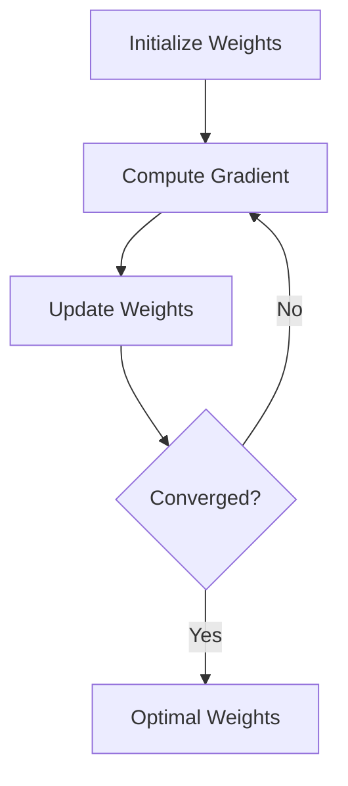

# Gradient Descent

## Detailed Explanation

Gradient descent is an iterative optimization algorithm that minimizes a loss function by taking steps proportional to the negative gradient. The algorithm computes the gradient (direction of steepest increase) and moves in the opposite direction to find the minimum. Variants include batch gradient descent (all data), stochastic (one sample), and mini-batch (subset). Learning rate controls step size: too high causes oscillation, too low causes slow convergence. Critical for training neural networks and solving regression problems.

## Core Intuition

Walking downhill in fog: you feel the ground slope beneath you and step in the downhill direction. Repeat until reaching the bottom.

## How It Works

1. Initialize weights randomly
2. Compute loss on training data
3. Calculate gradient ∂L/∂w
4. Update: w = w - lr × ∇L
5. Repeat until convergence



## Architecture / Trade-offs

Batch GD: stable, slow on large data | SGD: fast, noisy updates | Mini-batch: balanced

## Interview Q&A

**Q: When would you use Gradient Descent?**
A: Use when... (context-dependent answer)

**Q: What's the main trade-off?**
A: Speed vs accuracy, simplicity vs power, etc.

**Q: How do you choose parameters?**
A: Cross-validation, domain knowledge, empirical testing.

**Q: What are common failure modes?**
A: (Concept-specific failures)

## Best Practices

- Normalize features to [-1, 1] or [0, 1] for stable learning
- Use mini-batch (32-256) for good gradient estimates and hardware efficiency
- Monitor loss on validation set to detect overfitting
- Use learning rate scheduling to improve convergence
- Start with lr=0.01 or 0.001 and adjust based on loss curves
- Clip gradients if they explode (for RNNs/deep networks)
- Use momentum or Adam for faster convergence than vanilla GD
- Set maximum iterations to prevent infinite loops

## Common Pitfalls

- Learning rate too high: weights oscillate and diverge
- Learning rate too low: convergence takes forever
- Not normalizing features: different scales cause bad gradient directions
- Batch size too small: very noisy gradient estimates
- Not checking for convergence: may stop early or waste compute

## Code Examples

### Example 1: Manual Gradient Descent

```python
import numpy as np
import matplotlib.pyplot as plt

def gradient_descent(X, y, learning_rate=0.01, iterations=1000):
    m = len(y)
    theta = np.zeros(X.shape[1])
    costs = []

    for i in range(iterations):
        # Predictions
        predictions = X.dot(theta)
        errors = predictions - y

        # Gradient
        gradient = (2/m) * X.T.dot(errors)

        # Update
        theta -= learning_rate * gradient

        # Cost (MSE)
        cost = np.mean(errors**2)
        costs.append(cost)

    return theta, costs

# Test
X = np.random.randn(100, 2)
y = 3*X[:, 0] + 2*X[:, 1] + np.random.randn(100)*0.1
theta, costs = gradient_descent(X, y)
print(f"Learned weights: {theta}")
plt.plot(costs)
plt.xlabel("Iteration")
plt.ylabel("Loss")
plt.show()
```

### Example 2: Momentum and Adam Optimizers

```python
import numpy as np

class MomentumOptimizer:
    def __init__(self, lr=0.01, momentum=0.9):
        self.lr = lr
        self.momentum = momentum
        self.velocity = None

    def update(self, params, gradients):
        if self.velocity is None:
            self.velocity = np.zeros_like(params)

        self.velocity = (self.momentum * self.velocity -
                        self.lr * gradients)
        return params + self.velocity

class AdamOptimizer:
    def __init__(self, lr=0.001, beta1=0.9, beta2=0.999):
        self.lr = lr
        self.beta1 = beta1
        self.beta2 = beta2
        self.m = None
        self.v = None
        self.t = 0

    def update(self, params, gradients):
        if self.m is None:
            self.m = np.zeros_like(params)
            self.v = np.zeros_like(params)

        self.t += 1
        self.m = self.beta1*self.m + (1-self.beta1)*gradients
        self.v = self.beta2*self.v + (1-self.beta2)*(gradients**2)

        m_hat = self.m / (1 - self.beta1**self.t)
        v_hat = self.v / (1 - self.beta2**self.t)

        return params - self.lr * m_hat / (np.sqrt(v_hat) + 1e-8)

# Compare
np.random.seed(42)
X = np.random.randn(1000, 5)
y = np.sum(X[:, :3], axis=1) + np.random.randn(1000)*0.1

for OptClass, name in [(MomentumOptimizer, "Momentum"),
                        (AdamOptimizer, "Adam")]:
    opt = OptClass()
    theta = np.random.randn(5) * 0.1
    for _ in range(100):
        pred = X.dot(theta)
        grad = (2/len(y)) * X.T.dot(pred - y)
        theta = opt.update(theta, grad)
    print(f"{name}: final loss = {np.mean((X.dot(theta) - y)**2):.4f}")
```

### Example 3: Adaptive Learning Rate with Decay

```python
import numpy as np

def gradient_descent_adaptive(X, y, initial_lr=0.1, decay_rate=0.99):
    m = len(y)
    theta = np.zeros(X.shape[1])

    for epoch in range(50):
        lr = initial_lr * (decay_rate ** epoch)

        pred = X.dot(theta)
        grad = (2/m) * X.T.dot(pred - y)
        theta -= lr * grad

        loss = np.mean((pred - y)**2)
        if epoch % 10 == 0:
            print(f"Epoch {epoch}: loss={loss:.4f}, lr={lr:.4f}")

    return theta

X = np.random.randn(100, 3)
y = np.sum(X, axis=1) + np.random.randn(100)*0.1
theta = gradient_descent_adaptive(X, y)
```

## Related Concepts

- [Related Concept 1](./XX-related-1.md)
- [Related Concept 2](./XX-related-2.md)
- [Related Concept 3](./XX-related-3.md)
