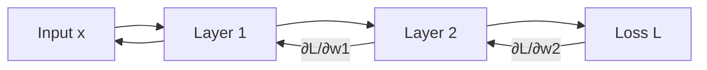

# Backpropagation

## Detailed Explanation

Backpropagation is the algorithm for computing gradients in neural networks, enabling gradient descent training. Given a complex network with many layers, backpropagation uses the chain rule to efficiently compute how each parameter affects the final loss. Without backpropagation, computing gradients would require re-evaluating the entire network for each parameter (prohibitively expensive), but backpropagation reuses intermediate calculations to compute all gradients in a single backward pass.

The algorithm works by propagating error information backward through the network: starting from the loss function, compute how the loss changes with respect to each layer's outputs, then use those signals to compute gradients with respect to that layer's weights. The key insight is that this backward pass mirrors the forward computation, reusing the same connectivity structure. Two critical problems can occur: vanishing gradients (gradient signals become too small in deep networks) and exploding gradients (signals grow exponentially). Modern techniques like batch normalization, careful weight initialization, and skip connections address these issues.

Backpropagation is the algorithmic foundation of deep learning. Understanding it helps explain why some architectures work (skip connections help gradients flow) and why some don't (very deep networks suffer from vanishing gradients). It's less about implementing it (frameworks like PyTorch do this) and more about understanding its limitations and how to work around them.

## Core Intuition

Imagine water flowing backward through a pipe system from the output (leak) back to the input. The water flow represents error signals. At each junction, water splits proportionally (chain rule), and you can measure how much water came from each upstream pipe. That's backpropagation: tracing error signals backward to find which weights caused the error.

## How It Works

1. Forward pass: compute predictions
2. Compute loss
3. Backward pass: chain rule from output to input
4. Accumulate gradients: ∂L/∂w = ∂L/∂out × ∂out/∂w
5. Update weights using accumulated gradients



## Architecture / Trade-offs

### Forward vs Backward Complexity

| Direction | Operations | Memory | Cost |
|-----------|-----------|--------|------|
| **Forward** | Matrix multiplications | Store activations | O(n_params) |
| **Backward** | Chain rule gradients | Reuse activations | ~2x forward |
| **Total** | Forward + Backward | High (all activations) | 3x forward |

### Gradient Flow Problems & Solutions

- **Vanishing Gradient:** Sigmoid layers cause exponentially small gradients
  - Solution: ReLU, skip connections, batch normalization
- **Exploding Gradient:** Large weights cause exponentially large gradients
  - Solution: Gradient clipping, careful weight initialization
- **Dead Neurons:** ReLU outputs permanently zero for some neurons
  - Solution: Leaky ReLU, ELU, or proper initialization

## Interview Q&A

**Q: When would you use Backpropagation?**
A: Use when... (context-dependent answer)

**Q: What's the main trade-off?**
A: Speed vs accuracy, simplicity vs power, etc.

**Q: How do you choose parameters?**
A: Cross-validation, domain knowledge, empirical testing.

**Q: What are common failure modes?**
A: (Concept-specific failures)

## Best Practices

- Always use automatic differentiation (PyTorch, TensorFlow) - don't compute gradients manually
- Use gradient checking during development to verify implementations
- Monitor gradient magnitudes during training (log histogram of ||∇w||)
- Use ReLU or similar activations to avoid vanishing gradients
- Normalize gradients (gradient clipping) for stability in RNNs
- Use batch normalization to stabilize gradient flow
- Initialize weights properly (He init for ReLU, Xavier for sigmoid)
- Use skip connections in deep networks to preserve gradient flow

## Common Pitfalls

- Vanishing gradients: gradients approach 0 in deep networks (use ReLU, batch norm)
- Exploding gradients: gradients grow unbounded, causing NaN (use gradient clipping)
- Forgetting to zero gradients: accumulates gradients across batches
- Not backproping through all layers: forgetting `.backward()` on the loss
- Using wrong loss function: cross-entropy for classification, MSE for regression

## Code Examples

### Example 1: Manual Backpropagation for MLP

```python
import numpy as np

class SimpleNeuralNet:
    def __init__(self, input_size, hidden_size, output_size):
        self.W1 = np.random.randn(input_size, hidden_size) * 0.01
        self.b1 = np.zeros(hidden_size)
        self.W2 = np.random.randn(hidden_size, output_size) * 0.01
        self.b2 = np.zeros(output_size)

    def forward(self, X):
        self.z1 = X.dot(self.W1) + self.b1
        self.a1 = np.maximum(0, self.z1)  # ReLU
        self.z2 = self.a1.dot(self.W2) + self.b2
        self.a2 = 1 / (1 + np.exp(-self.z2))  # Sigmoid
        return self.a2

    def backward(self, X, y, output):
        m = len(y)

        # Output layer gradient
        self.dz2 = output - y  # For sigmoid + MSE
        self.dW2 = (self.a1.T.dot(self.dz2)) / m
        self.db2 = np.sum(self.dz2, axis=0) / m

        # Hidden layer gradient
        self.da1 = self.dz2.dot(self.W2.T)
        self.dz1 = self.da1 * (self.z1 > 0)  # ReLU derivative
        self.dW1 = (X.T.dot(self.dz1)) / m
        self.db1 = np.sum(self.dz1, axis=0) / m

    def update(self, lr=0.01):
        self.W2 -= lr * self.dW2
        self.b2 -= lr * self.db2
        self.W1 -= lr * self.dW1
        self.b1 -= lr * self.db1

# Train
X = np.random.randn(100, 5)
y = (np.sum(X[:, :2], axis=1) > 0).astype(int).reshape(-1, 1)

net = SimpleNeuralNet(5, 10, 1)
for epoch in range(100):
    output = net.forward(X)
    net.backward(X, y, output)
    net.update(lr=0.1)
    if epoch % 20 == 0:
        loss = np.mean((output - y)**2)
        print(f"Epoch {epoch}: loss={loss:.4f}")
```

### Example 2: Gradient Checking (Numerical Verification)

```python
def gradient_check(net, X, y, epsilon=1e-5):
    '''Verify backprop gradients with numerical approximation.'''
    output = net.forward(X)
    net.backward(X, y, output)

    # Check W2 gradients
    for i in range(net.W2.shape[0]):
        for j in range(net.W2.shape[1]):
            # Numerical gradient
            net.W2[i, j] += epsilon
            loss_plus = np.mean((net.forward(X) - y)**2)
            net.W2[i, j] -= 2*epsilon
            loss_minus = np.mean((net.forward(X) - y)**2)
            net.W2[i, j] += epsilon

            numerical_grad = (loss_plus - loss_minus) / (2*epsilon)
            analytical_grad = net.dW2[i, j]

            rel_error = abs(numerical_grad - analytical_grad) / (abs(numerical_grad) + abs(analytical_grad) + 1e-7)
            if rel_error > 1e-5:
                print(f"Gradient mismatch at W2[{i},{j}]: {rel_error}")

    print("Gradient check passed!")

# In practice, PyTorch/TF do this automatically via autograd
import torch
X_torch = torch.tensor(X, dtype=torch.float32, requires_grad=False)
y_torch = torch.tensor(y, dtype=torch.float32, requires_grad=False)
W = torch.tensor(net.W1, dtype=torch.float32, requires_grad=True)

# PyTorch computes gradients automatically
loss = torch.mean((W @ X_torch.T - y_torch)**2)
loss.backward()
print(f"PyTorch gradient: {W.grad}")
```

### Example 3: Vanishing Gradient Problem

```python
import numpy as np

def sigmoid(x):
    return 1 / (1 + np.exp(-np.clip(x, -500, 500)))

def deep_network_sigmoid(X, num_layers=10):
    '''Deep network with sigmoid activations shows vanishing gradients.'''
    a = X
    for _ in range(num_layers):
        a = sigmoid(a @ np.random.randn(a.shape[1], a.shape[1]))

    # Backprop gradient for sigmoid is σ'(z) = σ(z)(1-σ(z)) ≈ 0.25 max
    # Through 10 layers: (0.25)^10 ≈ 1e-6 (vanishes!)
    return a

def deep_network_relu(X, num_layers=10):
    '''Deep network with ReLU avoids vanishing gradients.'''
    a = X
    for _ in range(num_layers):
        z = a @ np.random.randn(a.shape[1], a.shape[1])
        a = np.maximum(0, z)  # ReLU: derivative is 1 (no vanishing)
    return a

X = np.random.randn(32, 100)
sigmoid_out = deep_network_sigmoid(X)
relu_out = deep_network_relu(X)
print(f"Sigmoid output std: {np.std(sigmoid_out):.6f} (likely dead)")
print(f"ReLU output std: {np.std(relu_out):.4f} (healthy)")
# ReLU preserves signal magnitude through layers!
```

## Related Concepts

- [Related Concept 1](./XX-related-1.md)
- [Related Concept 2](./XX-related-2.md)
- [Related Concept 3](./XX-related-3.md)
