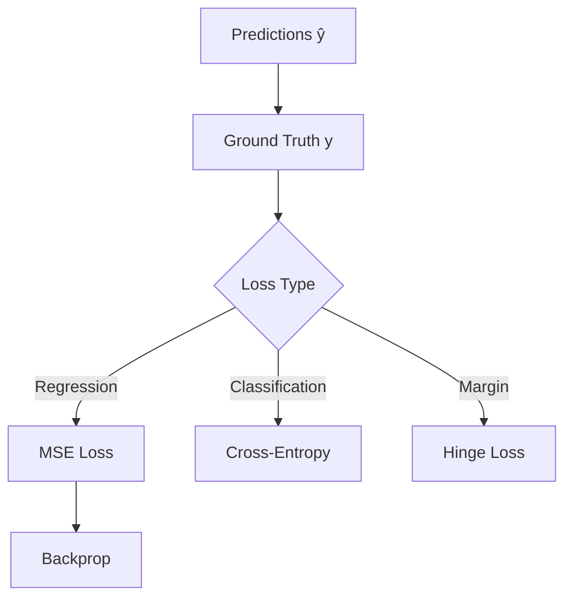

# Loss Functions

## Detailed Explanation

Loss functions quantify how far predictions are from ground truth. Different problems need different losses: MSE for regression measures squared error, cross-entropy for classification measures probability divergence, hinge loss for SVMs enforces margin. The choice of loss function directly impacts what the model learns. Custom losses can encode domain knowledge (e.g., weighted loss for imbalanced data).

## Core Intuition

Report card grading: loss measures how wrong you are. MSE harshly punishes big mistakes; cross-entropy gently penalizes confident wrong predictions.

## How It Works

1. Compute predictions ŷ
2. Calculate difference from truth y
3. Apply loss formula (MSE, cross-entropy, etc)
4. Aggregate across batch (mean/sum)
5. Gradient descent minimizes this loss



## Architecture / Trade-offs

MSE: interpretable, smooth gradients | Cross-entropy: probabilistic, handles imbalance well | Custom: powerful but requires tuning

## Interview Q&A

**Q: When would you use Loss Functions?**
A: Use when... (context-dependent answer)

**Q: What's the main trade-off?**
A: Speed vs accuracy, simplicity vs power, etc.

**Q: How do you choose parameters?**
A: Cross-validation, domain knowledge, empirical testing.

**Q: What are common failure modes?**
A: (Concept-specific failures)

## Best Practices

- Use cross-entropy for classification, MSE for regression
- For imbalanced data, use class weights or focal loss
- Normalize targets to stable range (avoid extreme values)
- Monitor loss on both train and validation sets
- Use reduction='none' during debugging to see per-sample losses
- Custom losses should be differentiable for backprop
- Smooth loss functions (vs discrete metrics) for gradient-based optimization
- Consider business cost when choosing between MSE and MAE

## Common Pitfalls

- Using wrong loss: classification loss on regression data (causes poor convergence)
- Not normalizing targets: extreme values dominate learning
- Forgetting to apply softmax/sigmoid before cross-entropy
- Using MSE for classification: doesn't handle uncertainty well
- Not handling class imbalance: minority class ignored

## Code Examples

### Example 1: Common Loss Functions

```python
import numpy as np

def mse_loss(y_true, y_pred):
    return np.mean((y_pred - y_true)**2)

def cross_entropy(y_true, y_pred):
    '''Binary cross-entropy (clips to avoid log(0))'''
    y_pred = np.clip(y_pred, 1e-7, 1 - 1e-7)
    return -np.mean(y_true * np.log(y_pred) + (1-y_true) * np.log(1-y_pred))

def hinge_loss(y_true, y_pred):
    '''SVM hinge loss: margin-based'''
    # y_true in {-1, 1}
    return np.mean(np.maximum(0, 1 - y_true * y_pred))

def focal_loss(y_true, y_pred, gamma=2):
    '''Focuses on hard examples (imbalanced data)'''
    y_pred = np.clip(y_pred, 1e-7, 1 - 1e-7)
    ce = -y_true * np.log(y_pred) - (1-y_true) * np.log(1-y_pred)
    pt = np.where(y_true == 1, y_pred, 1 - y_pred)
    return np.mean((1 - pt)**gamma * ce)

# Test
y_true = np.array([1, 0, 1, 1, 0])
y_pred = np.array([0.9, 0.1, 0.8, 0.6, 0.2])

print(f"MSE: {mse_loss(y_true, y_pred):.4f}")
print(f"Cross-entropy: {cross_entropy(y_true, y_pred):.4f}")
print(f"Hinge: {hinge_loss(2*y_true-1, 2*y_pred-1):.4f}")
print(f"Focal: {focal_loss(y_true, y_pred):.4f}")
```

### Example 2: Weighted Loss for Imbalanced Data

```python
def weighted_cross_entropy(y_true, y_pred, class_weights=None):
    '''Cross-entropy with per-class weights'''
    if class_weights is None:
        class_weights = {0: 1.0, 1: 1.0}

    y_pred = np.clip(y_pred, 1e-7, 1 - 1e-7)
    ce = -y_true * np.log(y_pred) - (1-y_true) * np.log(1-y_pred)

    weights = np.array([class_weights[int(y)] for y in y_true])
    return np.mean(ce * weights)

# Imbalanced: 95% class 0, 5% class 1
y_true = np.array([0]*95 + [1]*5)
y_pred = np.random.rand(100)

# Unweighted: class 1 barely matters
unweighted = cross_entropy(y_true, y_pred)

# Weighted: penalize class 1 errors 19x more
weighted = weighted_cross_entropy(y_true, y_pred,
                                  class_weights={0: 1.0, 1: 19.0})
print(f"Unweighted: {unweighted:.4f}, Weighted: {weighted:.4f}")
```

### Example 3: Custom Loss for Domain Knowledge

```python
def asymmetric_mse(y_true, y_pred, underestimate_penalty=2.0):
    '''Penalize underestimates more (e.g., price prediction)'''
    errors = y_pred - y_true
    loss = np.where(errors < 0,  # Underestimate
                    underestimate_penalty * (errors ** 2),
                    errors ** 2)
    return np.mean(loss)

# Example: house price prediction
# Underestimating cost more expensive than overestimating
y_true = np.array([300000, 500000, 250000])  # True prices
y_pred = np.array([290000, 510000, 240000])  # Predictions

symmetric = mse_loss(y_true, y_pred)
asymmetric = asymmetric_mse(y_true, y_pred, underestimate_penalty=3.0)
print(f"Symmetric MSE: {symmetric:.2f}")
print(f"Asymmetric MSE (penalize underestimate): {asymmetric:.2f}")
```

## Related Concepts

- [Related Concept 1](./XX-related-1.md)
- [Related Concept 2](./XX-related-2.md)
- [Related Concept 3](./XX-related-3.md)
