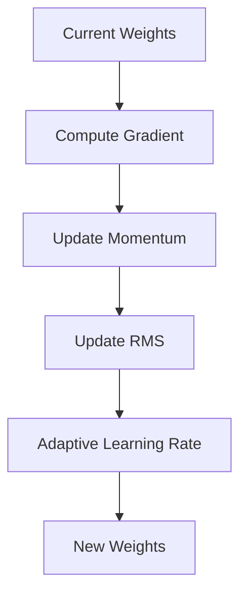

# Optimization Algorithms

## Detailed Explanation

Beyond basic gradient descent, modern optimizers adapt learning rates per parameter or maintain momentum across iterations. Adam combines momentum and adaptive learning rates, RMSprop adapts per-parameter learning rates using gradient history, Adagrad accumulates squared gradients to decrease learning rates for frequent features. These algorithms drastically improve convergence speed and stability, especially on non-convex loss surfaces common in deep learning.

## Core Intuition

Different optimizers are like different drivers: vanilla GD is careful but slow, momentum is aggressive and pushes through valleys, Adam is adaptive and learns the terrain as it goes.

## How It Works

1. Maintain adaptive state (momentum, gradient history)
2. Compute gradient at current position
3. Update state based on gradient
4. Adjust learning rate per parameter using state
5. Take step in direction of adapted gradient



## Architecture / Trade-offs

Adam: fast, adaptive | RMSprop: simpler | SGD+momentum: stable

## Interview Q&A

**Q: When would you use Optimization Algorithms?**
A: Context-dependent, varies by problem type.

**Q: What are the main trade-offs?**
A: Refer to Architecture / Trade-offs section above.

**Q: How do you choose hyperparameters?**
A: Cross-validation, grid/random/Bayesian search, domain knowledge.

**Q: What are common failure modes?**
A: Refer to Common Pitfalls section below.

## Best Practices

- Use Adam as default
- Monitor gradient norms
- Use different learning rates per layer
- Combine with learning rate schedule

## Common Pitfalls

- Using Adam default lr for all problems
- Combining adaptive optimizer with L2
- Not monitoring gradient statistics


## Code Examples

### Example 1: Adam vs SGD Comparison

```python
import numpy as np
import matplotlib.pyplot as plt

class SGDOptimizer:
    def __init__(self, lr=0.01):
        self.lr = lr

    def update(self, weights, gradients):
        return weights - self.lr * gradients

class AdamOptimizer:
    def __init__(self, lr=0.001, beta1=0.9, beta2=0.999):
        self.lr, self.beta1, self.beta2 = lr, beta1, beta2
        self.m = None
        self.v = None
        self.t = 0

    def update(self, weights, gradients):
        if self.m is None:
            self.m = np.zeros_like(weights)
            self.v = np.zeros_like(weights)

        self.t += 1
        self.m = self.beta1*self.m + (1-self.beta1)*gradients
        self.v = self.beta2*self.v + (1-self.beta2)*(gradients**2)

        m_hat = self.m / (1 - self.beta1**self.t)
        v_hat = self.v / (1 - self.beta2**self.t)

        return weights - self.lr * m_hat / (np.sqrt(v_hat) + 1e-8)

# Test on simple convex function
np.random.seed(42)
X = np.random.randn(100, 5)
y = np.sum(X[:, :2], axis=1) + np.random.randn(100)*0.1

sgd = SGDOptimizer(lr=0.1)
adam = AdamOptimizer(lr=0.1)
theta_sgd = np.random.randn(5) * 0.01
theta_adam = theta_sgd.copy()

sgd_losses, adam_losses = [], []
for _ in range(50):
    pred_sgd = X @ theta_sgd
    grad = (2/len(y)) * X.T @ (pred_sgd - y)
    theta_sgd = sgd.update(theta_sgd, grad)
    sgd_losses.append(np.mean((pred_sgd - y)**2))

    pred_adam = X @ theta_adam
    grad = (2/len(y)) * X.T @ (pred_adam - y)
    theta_adam = adam.update(theta_adam, grad)
    adam_losses.append(np.mean((pred_adam - y)**2))

plt.figure(figsize=(10, 4))
plt.plot(sgd_losses, label='SGD', alpha=0.7)
plt.plot(adam_losses, label='Adam', alpha=0.7)
plt.xlabel('Iteration'), plt.ylabel('Loss')
plt.legend(), plt.title('SGD vs Adam Convergence')
plt.show()
```

### Example 2: RMSprop Implementation

```python
class RMSpropOptimizer:
    def __init__(self, lr=0.01, decay=0.99):
        self.lr = lr
        self.decay = decay
        self.cache = None

    def update(self, weights, gradients):
        if self.cache is None:
            self.cache = np.zeros_like(weights)

        self.cache = self.decay * self.cache + (1 - self.decay) * (gradients**2)
        return weights - self.lr * gradients / (np.sqrt(self.cache) + 1e-8)

# Test
rmsprop = RMSpropOptimizer(lr=0.1)
theta = np.random.randn(5) * 0.01
losses = []
for _ in range(50):
    pred = X @ theta
    grad = (2/len(y)) * X.T @ (pred - y)
    theta = rmsprop.update(theta, grad)
    losses.append(np.mean((pred - y)**2))

print(f"Final loss: {losses[-1]:.4f}")
```

### Example 3: Adagrad with Sparse Gradients

```python
class AdagradOptimizer:
    def __init__(self, lr=0.01):
        self.lr = lr
        self.accumulated_grad = None

    def update(self, weights, gradients):
        if self.accumulated_grad is None:
            self.accumulated_grad = np.zeros_like(weights)

        self.accumulated_grad += gradients ** 2
        # Features with large gradient history get smaller updates
        return weights - self.lr * gradients / (np.sqrt(self.accumulated_grad) + 1e-8)

# Sparse data (many zeros)
X_sparse = X.copy()
X_sparse[X_sparse < 0.5] = 0
adagrad = AdagradOptimizer(lr=0.1)
theta = np.random.randn(5) * 0.01

for epoch in range(50):
    pred = X_sparse @ theta
    grad = (2/len(y)) * X_sparse.T @ (pred - y)
    theta = adagrad.update(theta, grad)

print(f"Adagrad final weights: {theta}")
```

## Related Concepts

- [Gradient Descent](./01-gradient-descent.md)
- [Cross-Validation](./22-cross-validation.md)
- [Hyperparameter Tuning](./26-hyperparameter-tuning.md)
