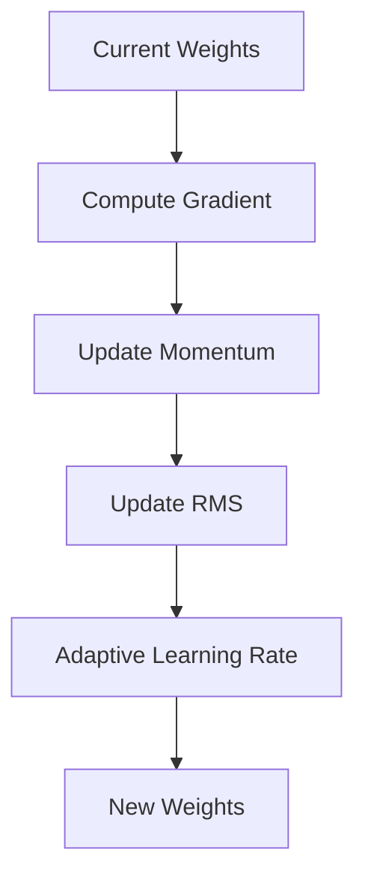

# Optimization Algorithms

## Detailed Explanation

Beyond basic gradient descent, many optimization algorithms adaptively adjust learning rates and incorporate momentum to accelerate convergence and improve stability. Momentum methods (like SGD with momentum) accumulate gradients over time, helping escape shallow local minima and plateaus. Adam combines momentum with adaptive per-parameter learning rates, automatically scaling step sizes. RMSprop divides learning rates by the root mean square of accumulated gradients. AdamW (Adam with weight decay) adds L2 regularization, crucial for neural networks.

Each optimizer has different properties: SGD with momentum is simple and reliable but requires careful learning rate tuning. Adam is often the default choice—less sensitive to learning rate and usually requires minimal tuning. RMSprop works well when gradients are sparse. Different optimizers can converge to different final solutions because they navigate loss landscapes differently. Modern practice usually starts with Adam, but understanding the alternatives helps when Adam gets stuck.

Optimization algorithms are the engines driving neural network training. They matter as much as architecture choices for final performance. Knowing which optimizer to try when training isn't working is a practical debugging skill. Most importantly, understanding that all these algorithms are solving the same problem (minimizing loss) with different strategies helps you predict which might work best for a given problem.

## Core Intuition

Optimization algorithms are like different navigation strategies on a road trip. Basic gradient descent is like following the steepest downhill path (works but slow on flat terrain). Momentum is like having momentum that helps you push through flat areas. Adam is like an intelligent navigator that adjusts your pace based on the terrain (steep = slower, flat = faster). Different strategies reach the destination at different speeds.

## How It Works

1. Maintain adaptive state (momentum, gradient history)
2. Compute gradient at current position
3. Update state based on gradient
4. Adjust learning rate per parameter using state
5. Take step in direction of adapted gradient



## Architecture / Trade-offs

Adam: fast, adaptive | RMSprop: simpler | SGD+momentum: stable

## Interview Q&A

**Q: When would you choose SGD over Adam?**
A: Use SGD with momentum for computer vision tasks where generalization matters more than fast convergence — SGD often finds flatter minima that generalize better. Adam converges faster but can overfit, especially on small datasets. For production CV models (ResNets, VGGs), SGD+momentum+LR schedule is still the standard.

**Q: What's the difference between Adam and AdamW?**
A: AdamW decouples weight decay from the gradient update, fixing a subtle bug in Adam where L2 regularization is scaled by the adaptive learning rate (effectively weakening regularization for parameters with large gradients). For transformers and modern architectures, always use AdamW over Adam when regularization matters.

**Q: Why does the learning rate interact with optimizer choice?**
A: Each optimizer expects a different learning rate magnitude. Adam typically uses 1e-3 to 1e-4; SGD typically uses 0.01 to 0.1. Using Adam's typical LR with SGD would barely move the parameters; using SGD's LR with Adam would cause instability. Always re-tune LR when switching optimizers.

**Q: What happens when you apply L2 regularization with Adam instead of AdamW?**
A: The L2 penalty gets scaled by Adam's adaptive learning rate, meaning parameters with historically large gradients receive weaker regularization. This is mathematically inconsistent with the intended behavior. AdamW separates the weight decay step from the gradient update, restoring the correct regularization effect.

**Q: How would you debug optimizer divergence (NaN loss)?**
A: Check in order: (1) learning rate too high — reduce by 10x; (2) missing gradient clipping for RNNs/transformers — add clip_grad_norm_(1.0); (3) numerical instability in loss function (log of zero) — add epsilon; (4) exploding weights from bad initialization — check initial loss value. Log gradient norms to identify which layer is exploding.

**Q: What's the intuition behind momentum in SGD?**
A: Momentum accumulates a velocity vector in the direction of consistent gradients and dampens oscillations in directions with inconsistent gradients. Imagine rolling a ball down a loss landscape — momentum lets it build speed in consistent directions (valleys) and reduces zigzagging across ravines. Typical momentum=0.9 means 90% of previous velocity is retained each step.
## Best Practices

- Use Adam as default
- Monitor gradient norms
- Use different learning rates per layer
- Combine with learning rate schedule

## Common Pitfalls

- Using Adam default lr for all problems
- Combining adaptive optimizer with L2
- Not monitoring gradient statistics


## Code Examples

### Example 1: Adam vs SGD Comparison

```python
import numpy as np
import matplotlib.pyplot as plt

class SGDOptimizer:
    def __init__(self, lr=0.01):
        self.lr = lr

    def update(self, weights, gradients):
        return weights - self.lr * gradients

class AdamOptimizer:
    def __init__(self, lr=0.001, beta1=0.9, beta2=0.999):
        self.lr, self.beta1, self.beta2 = lr, beta1, beta2
        self.m = None
        self.v = None
        self.t = 0

    def update(self, weights, gradients):
        if self.m is None:
            self.m = np.zeros_like(weights)
            self.v = np.zeros_like(weights)

        self.t += 1
        self.m = self.beta1*self.m + (1-self.beta1)*gradients
        self.v = self.beta2*self.v + (1-self.beta2)*(gradients**2)

        m_hat = self.m / (1 - self.beta1**self.t)
        v_hat = self.v / (1 - self.beta2**self.t)

        return weights - self.lr * m_hat / (np.sqrt(v_hat) + 1e-8)

# Test on simple convex function
np.random.seed(42)
X = np.random.randn(100, 5)
y = np.sum(X[:, :2], axis=1) + np.random.randn(100)*0.1

sgd = SGDOptimizer(lr=0.1)
adam = AdamOptimizer(lr=0.1)
theta_sgd = np.random.randn(5) * 0.01
theta_adam = theta_sgd.copy()

sgd_losses, adam_losses = [], []
for _ in range(50):
    pred_sgd = X @ theta_sgd
    grad = (2/len(y)) * X.T @ (pred_sgd - y)
    theta_sgd = sgd.update(theta_sgd, grad)
    sgd_losses.append(np.mean((pred_sgd - y)**2))

    pred_adam = X @ theta_adam
    grad = (2/len(y)) * X.T @ (pred_adam - y)
    theta_adam = adam.update(theta_adam, grad)
    adam_losses.append(np.mean((pred_adam - y)**2))

plt.figure(figsize=(10, 4))
plt.plot(sgd_losses, label='SGD', alpha=0.7)
plt.plot(adam_losses, label='Adam', alpha=0.7)
plt.xlabel('Iteration'), plt.ylabel('Loss')
plt.legend(), plt.title('SGD vs Adam Convergence')
plt.show()
```

### Example 2: RMSprop Implementation

```python
class RMSpropOptimizer:
    def __init__(self, lr=0.01, decay=0.99):
        self.lr = lr
        self.decay = decay
        self.cache = None

    def update(self, weights, gradients):
        if self.cache is None:
            self.cache = np.zeros_like(weights)

        self.cache = self.decay * self.cache + (1 - self.decay) * (gradients**2)
        return weights - self.lr * gradients / (np.sqrt(self.cache) + 1e-8)

# Test
rmsprop = RMSpropOptimizer(lr=0.1)
theta = np.random.randn(5) * 0.01
losses = []
for _ in range(50):
    pred = X @ theta
    grad = (2/len(y)) * X.T @ (pred - y)
    theta = rmsprop.update(theta, grad)
    losses.append(np.mean((pred - y)**2))

print(f"Final loss: {losses[-1]:.4f}")
```

### Example 3: Adagrad with Sparse Gradients

```python
class AdagradOptimizer:
    def __init__(self, lr=0.01):
        self.lr = lr
        self.accumulated_grad = None

    def update(self, weights, gradients):
        if self.accumulated_grad is None:
            self.accumulated_grad = np.zeros_like(weights)

        self.accumulated_grad += gradients ** 2
        # Features with large gradient history get smaller updates
        return weights - self.lr * gradients / (np.sqrt(self.accumulated_grad) + 1e-8)

# Sparse data (many zeros)
X_sparse = X.copy()
X_sparse[X_sparse < 0.5] = 0
adagrad = AdagradOptimizer(lr=0.1)
theta = np.random.randn(5) * 0.01

for epoch in range(50):
    pred = X_sparse @ theta
    grad = (2/len(y)) * X_sparse.T @ (pred - y)
    theta = adagrad.update(theta, grad)

print(f"Adagrad final weights: {theta}")
```

## Related Concepts

- [Gradient Descent](./01-gradient-descent.md)
- [Cross-Validation](./22-cross-validation.md)
- [Hyperparameter Tuning](./26-hyperparameter-tuning.md)
