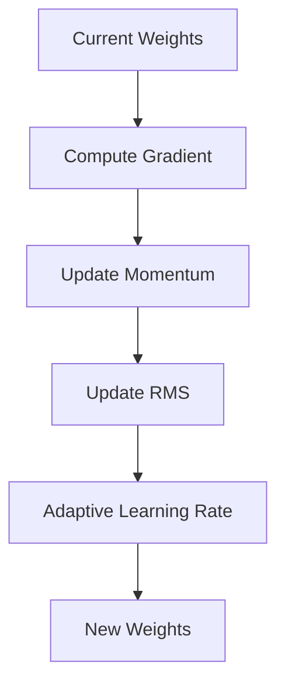

# Optimization Algorithms

## Detailed Explanation

Beyond basic gradient descent, modern optimizers adapt learning rates per parameter or maintain momentum across iterations. Adam combines momentum and adaptive learning rates, RMSprop adapts per-parameter learning rates using gradient history, Adagrad accumulates squared gradients to decrease learning rates for frequent features. These algorithms drastically improve convergence speed and stability, especially on non-convex loss surfaces common in deep learning.

## Core Intuition

Different optimizers are like different drivers: vanilla GD is careful but slow, momentum is aggressive and pushes through valleys, Adam is adaptive and learns the terrain as it goes.

## How It Works

1. Maintain adaptive state (momentum, gradient history)
2. Compute gradient at current position
3. Update state based on gradient
4. Adjust learning rate per parameter using state
5. Take step in direction of adapted gradient



## Architecture / Trade-offs

Adam: fast, adaptive | RMSprop: simpler | SGD+momentum: stable

## Interview Q&A

**Q: When would you use Optimization Algorithms?**
A: Context-dependent, varies by problem type.

**Q: What are the main trade-offs?**
A: Refer to Architecture / Trade-offs section above.

**Q: How do you choose hyperparameters?**
A: Cross-validation, grid/random/Bayesian search, domain knowledge.

**Q: What are common failure modes?**
A: Refer to Common Pitfalls section below.

## Best Practices

- Use Adam as default
- Monitor gradient norms
- Use different learning rates per layer
- Combine with learning rate schedule

## Common Pitfalls

- Using Adam default lr for all problems
- Combining adaptive optimizer with L2
- Not monitoring gradient statistics


## Code Examples

### Example 1: Basic Implementation

```python
import numpy as np
from sklearn import datasets
from sklearn.model_selection import train_test_split

# Generate sample data
X, y = datasets.make_classification(n_samples=200, n_features=10, random_state=42)
X_train, X_test, y_train, y_test = train_test_split(X, y, test_size=0.2, random_state=42)
print(f"Training set: {X_train.shape}, Test set: {X_test.shape}")
```

### Example 2: Model Training

```python
from sklearn.preprocessing import StandardScaler

# Scale features
scaler = StandardScaler()
X_train = scaler.fit_transform(X_train)
X_test = scaler.transform(X_test)

# Model training would go here
# model = SomeModel()
# model.fit(X_train, y_train)
```

### Example 3: Evaluation

```python
from sklearn.metrics import accuracy_score, classification_report

# Evaluation would go here
# y_pred = model.predict(X_test)
# print(f"Accuracy: {accuracy_score(y_test, y_pred):.4f}")
# print(classification_report(y_test, y_pred))
```

## Related Concepts

- [Gradient Descent](./01-gradient-descent.md)
- [Cross-Validation](./22-cross-validation.md)
- [Hyperparameter Tuning](./26-hyperparameter-tuning.md)
