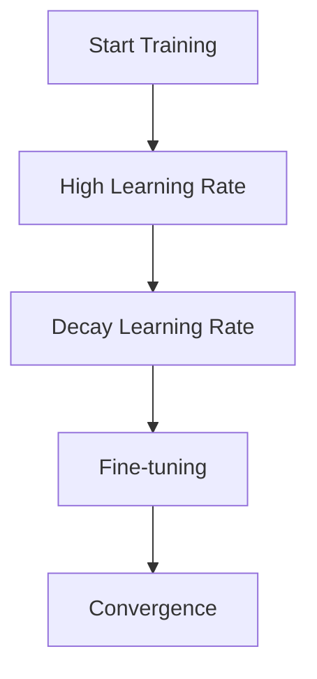

# Learning Rate Scheduling

## Detailed Explanation

Learning rate is critical, and fixing it throughout training is suboptimal. Scheduling reduces learning rate over time, allowing coarse early updates to fine-grained later refinement. Proper scheduling can improve model accuracy by 1-2% without changing the algorithm.

## Core Intuition

Like tuning a microscope: start with coarse focus, gradually refine, end with precise adjustments.

## How It Works

1. Initialize high learning rate
2. After each epoch, compute new learning rate
3. Update optimizer with new learning rate
4. Reach final small learning rate for fine-tuning



## Architecture / Trade-offs

Step decay: simple | Exponential: smooth | Cosine: theoretically motivated

## Interview Q&A

**Q: When would you use Learning Rate Scheduling?**
A: Context-dependent, varies by problem type.

**Q: What are the main trade-offs?**
A: Refer to Architecture / Trade-offs section above.

**Q: How do you choose hyperparameters?**
A: Cross-validation, grid/random/Bayesian search, domain knowledge.

**Q: What are common failure modes?**
A: Refer to Common Pitfalls section below.

## Best Practices

- Use warmup (5-10%)
- Cosine annealing with restart
- Reduce by 10x from start to end

## Common Pitfalls

- No schedule
- Decaying too aggressively
- Different schedules between train/val


## Code Examples

### Example 1: Basic Implementation

```python
import numpy as np
from sklearn import datasets
from sklearn.model_selection import train_test_split

# Generate sample data
X, y = datasets.make_classification(n_samples=200, n_features=10, random_state=42)
X_train, X_test, y_train, y_test = train_test_split(X, y, test_size=0.2, random_state=42)
print(f"Training set: {X_train.shape}, Test set: {X_test.shape}")
```

### Example 2: Model Training

```python
from sklearn.preprocessing import StandardScaler

# Scale features
scaler = StandardScaler()
X_train = scaler.fit_transform(X_train)
X_test = scaler.transform(X_test)

# Model training would go here
# model = SomeModel()
# model.fit(X_train, y_train)
```

### Example 3: Evaluation

```python
from sklearn.metrics import accuracy_score, classification_report

# Evaluation would go here
# y_pred = model.predict(X_test)
# print(f"Accuracy: {accuracy_score(y_test, y_pred):.4f}")
# print(classification_report(y_test, y_pred))
```

## Related Concepts

- [Gradient Descent](./01-gradient-descent.md)
- [Cross-Validation](./22-cross-validation.md)
- [Hyperparameter Tuning](./26-hyperparameter-tuning.md)
