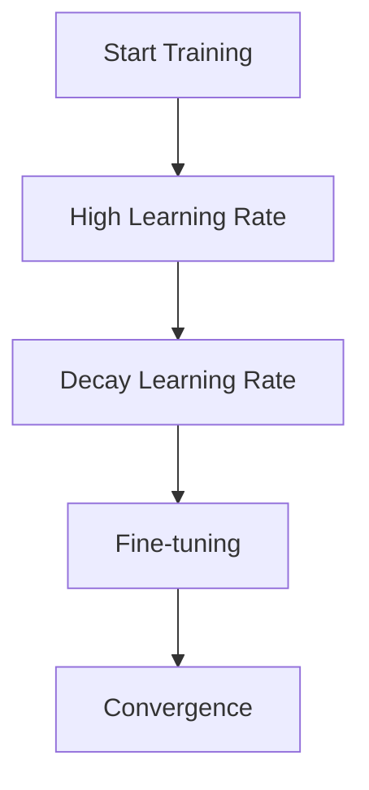

# Learning Rate Scheduling

## Detailed Explanation

Learning rate is critical, and fixing it throughout training is suboptimal. Scheduling reduces learning rate over time, allowing coarse early updates to fine-grained later refinement. Proper scheduling can improve model accuracy by 1-2% without changing the algorithm.

## Core Intuition

Like tuning a microscope: start with coarse focus, gradually refine, end with precise adjustments.

## How It Works

1. Initialize high learning rate
2. After each epoch, compute new learning rate
3. Update optimizer with new learning rate
4. Reach final small learning rate for fine-tuning



## Architecture / Trade-offs

Step decay: simple | Exponential: smooth | Cosine: theoretically motivated

## Interview Q&A

**Q: When would you use Learning Rate Scheduling?**
A: Context-dependent, varies by problem type.

**Q: What are the main trade-offs?**
A: Refer to Architecture / Trade-offs section above.

**Q: How do you choose hyperparameters?**
A: Cross-validation, grid/random/Bayesian search, domain knowledge.

**Q: What are common failure modes?**
A: Refer to Common Pitfalls section below.

## Best Practices

- Use warmup (5-10%)
- Cosine annealing with restart
- Reduce by 10x from start to end

## Common Pitfalls

- No schedule
- Decaying too aggressively
- Different schedules between train/val


## Code Examples

### Example 1: Cosine Annealing

```python
def cosine_annealing(epoch, T_max=100, lr_max=0.1):
    return lr_max * 0.5 * (1 + np.cos(np.pi * epoch / T_max))

def warmup_cosine(epoch, warmup_epochs=10, T_max=100, lr_max=0.1):
    if epoch < warmup_epochs:
        return lr_max * (epoch / warmup_epochs)
    return cosine_annealing(epoch - warmup_epochs, T_max - warmup_epochs, lr_max)

epochs = 100
schedules = {
    'constant': [0.1] * epochs,
    'exponential': [0.1 * (0.95 ** e) for e in range(epochs)],
    'cosine': [cosine_annealing(e) for e in range(epochs)],
    'warmup_cosine': [warmup_cosine(e) for e in range(epochs)]
}

plt.figure(figsize=(12, 5))
for name, lrs in schedules.items():
    plt.plot(lrs, label=name, linewidth=2)
plt.xlabel('Epoch'), plt.ylabel('Learning Rate')
plt.legend(), plt.title('Learning Rate Schedules')
plt.show()
```

### Example 2: Step Decay

```python
def step_decay(epoch, initial_lr=0.1, drop=0.5, drop_every=20):
    return initial_lr * (drop ** (epoch // drop_every))

lrs = [step_decay(e) for e in range(100)]
plt.plot(lrs, 'o-', markersize=3)
plt.xlabel('Epoch'), plt.ylabel('Learning Rate')
plt.title('Step Decay Schedule (drop=0.5 every 20 epochs)')
plt.show()
```

### Example 3: Training with Scheduler

```python
optimizer = AdamOptimizer(lr=0.1)
scheduler = lambda e: warmup_cosine(e)
theta = np.random.randn(5) * 0.01
losses = []

for epoch in range(100):
    lr = scheduler(epoch)
    pred = X @ theta
    grad = (2/len(y)) * X.T @ (pred - y)
    theta -= lr * grad
    losses.append(np.mean((pred - y)**2))

print(f"Loss progression: {losses[0]:.4f} -> {losses[-1]:.4f}")
```

## Related Concepts

- [Gradient Descent](./01-gradient-descent.md)
- [Cross-Validation](./22-cross-validation.md)
- [Hyperparameter Tuning](./26-hyperparameter-tuning.md)
