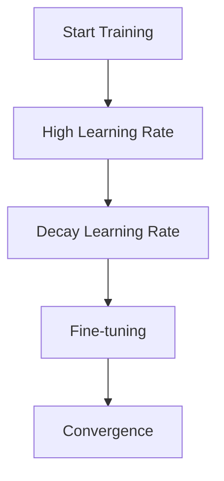

# Learning Rate Scheduling

## Detailed Explanation

Learning rate scheduling gradually changes the learning rate during training to improve convergence and final performance. Starting with a higher learning rate helps initial progress, but eventually the model needs smaller steps to settle into good solutions. Schedules can decrease linearly, exponentially, or in steps. Warmup (increasing learning rate for the first few steps) prevents gradient explosion early in training. Cosine annealing (smoothly decreases to near-zero then restarts) has been empirically effective for both preventing overfitting and discovering diverse solutions.

The intuition is that learning rate is a trade-off: large steps make progress quickly but might overshoot optima, small steps navigate precisely but take forever. Scheduling automatically balances this over training: be aggressive early, careful later. Different schedules encode different assumptions about learning dynamics. Linear decay is simplest. Exponential decay speeds up convergence. Step decay (drop by factor every N epochs) is easy to implement. Cosine annealing provides smooth transitions with a principled mathematical foundation.

Learning rate scheduling often improves final model performance by 1-5% compared to fixed learning rates, which is worth the minimal implementation effort (most frameworks support multiple schedulers). Understanding scheduling helps explain why some models plateau early (learning rate too high, overshooting) and why others converge slowly (learning rate too low). Practitioners often overlook this easy win.

## Core Intuition

Learning rate scheduling is like driving on a mountain road: start with steady progress (high speed), slow down as you near the destination (lower speed for precision), and consider rest stops (warmup) to avoid crashing early. Different road conditions (optimization landscapes) benefit from different speed profiles.

## How It Works

1. Initialize high learning rate
2. After each epoch, compute new learning rate
3. Update optimizer with new learning rate
4. Reach final small learning rate for fine-tuning



## Architecture / Trade-offs

### Schedule Types

| Schedule | Formula | Best For | Trade-off |
|----------|---------|----------|-----------|
| **Constant** | lr = fixed value | Baseline | May oscillate or plateau |
| **Step Decay** | lr *= gamma @ epoch N | Simple implementation | Discontinuous jumps |
| **Exponential** | lr *= exp(-k*epoch) | Smooth decay | Hard to tune decay constant |
| **Cosine** | lr = 0.5*base*(1+cos(π*t/T)) | Smooth + principled | More computation |
| **Warmup** | Linear increase then decay | Prevents instability | Extra hyperparameter |

### When to Use Each

- **Linear decay:** Fast early progress, slow fine-tuning at end
- **Step decay:** Sudden drops help escape plateaus
- **Cosine annealing:** Mathematically principled smooth transitions
- **Warmup:** Essential for Transformers to prevent gradient explosion
- **Cyclical:** Multiple restarts help find diverse good solutions

## Interview Q&A

**Q: Why use learning rate warmup at all? Can you just start with the target LR?**
A: For large models and transformers, starting with a high LR causes unstable updates in early training when parameters are far from any good optimum. The gradient magnitudes are large and inconsistent, so large updates thrash rather than converge. Warmup lets the model first move to a reasonable region, then apply the full LR. For small models trained from scratch, warmup is often unnecessary.

**Q: What's the difference between cosine annealing and step decay in practice?**
A: Step decay drops LR abruptly at fixed intervals, which can cause instability at each drop. Cosine annealing smoothly reduces LR following a cosine curve, which typically produces smoother convergence. In practice, cosine annealing often achieves comparable or better final accuracy without requiring tuning of when to drop. Step decay is still used in image classification benchmarks where exact training protocols are replicated.

**Q: When would you use ReduceLROnPlateau vs a fixed schedule?**
A: ReduceLROnPlateau is adaptive — it reduces LR when validation loss stops improving for `patience` epochs. Use it when you don't know the optimal training duration or want automatic adaptation. Fixed schedules (cosine, step) are better for reproducibility and hyperparameter tuning since the schedule doesn't depend on training dynamics. For large-scale training with a fixed budget, use a fixed schedule.

**Q: How does learning rate interact with batch size?**
A: When you increase batch size by k, the gradient estimate is k times more accurate (lower variance), so you can safely increase LR by approximately √k (linear scaling rule for large k). This is why papers report "LR 0.1 with batch size 256" — doubling batch to 512 suggests LR ~0.14. Ignoring this causes undertraining with large batches.

**Q: What is cyclic learning rate and when does it help?**
A: Cyclic LR (CLR) alternates between a minimum and maximum LR on a fixed cycle, allowing the optimizer to periodically escape local minima and explore the loss landscape. It often reduces training time by 2-5x because the model doesn't need extensive LR search — a range test to find min/max LR is sufficient. Works particularly well for CNNs; less commonly used for transformers where cosine with warmup dominates.

**Q: How would you find a good initial learning rate without extensive grid search?**
A: Use the LR range test (Leslie Smith, 2017): train for 1-2 epochs with LR increasing exponentially from 1e-7 to 10, log loss vs LR, pick the LR just before loss starts diverging (steepest decline region). This typically identifies a good LR in 5-10 minutes. Tools: fastai's lr_find(), PyTorch Lightning's lr_finder.
## Best Practices

- Use warmup (5-10%)
- Cosine annealing with restart
- Reduce by 10x from start to end

## Common Pitfalls

- No schedule
- Decaying too aggressively
- Different schedules between train/val


## Code Examples

### Example 1: Cosine Annealing

```python
def cosine_annealing(epoch, T_max=100, lr_max=0.1):
    return lr_max * 0.5 * (1 + np.cos(np.pi * epoch / T_max))

def warmup_cosine(epoch, warmup_epochs=10, T_max=100, lr_max=0.1):
    if epoch < warmup_epochs:
        return lr_max * (epoch / warmup_epochs)
    return cosine_annealing(epoch - warmup_epochs, T_max - warmup_epochs, lr_max)

epochs = 100
schedules = {
    'constant': [0.1] * epochs,
    'exponential': [0.1 * (0.95 ** e) for e in range(epochs)],
    'cosine': [cosine_annealing(e) for e in range(epochs)],
    'warmup_cosine': [warmup_cosine(e) for e in range(epochs)]
}

plt.figure(figsize=(12, 5))
for name, lrs in schedules.items():
    plt.plot(lrs, label=name, linewidth=2)
plt.xlabel('Epoch'), plt.ylabel('Learning Rate')
plt.legend(), plt.title('Learning Rate Schedules')
plt.show()
```

### Example 2: Step Decay

```python
def step_decay(epoch, initial_lr=0.1, drop=0.5, drop_every=20):
    return initial_lr * (drop ** (epoch // drop_every))

lrs = [step_decay(e) for e in range(100)]
plt.plot(lrs, 'o-', markersize=3)
plt.xlabel('Epoch'), plt.ylabel('Learning Rate')
plt.title('Step Decay Schedule (drop=0.5 every 20 epochs)')
plt.show()
```

### Example 3: Training with Scheduler

```python
optimizer = AdamOptimizer(lr=0.1)
scheduler = lambda e: warmup_cosine(e)
theta = np.random.randn(5) * 0.01
losses = []

for epoch in range(100):
    lr = scheduler(epoch)
    pred = X @ theta
    grad = (2/len(y)) * X.T @ (pred - y)
    theta -= lr * grad
    losses.append(np.mean((pred - y)**2))

print(f"Loss progression: {losses[0]:.4f} -> {losses[-1]:.4f}")
```

## Related Concepts

- [Gradient Descent](./01-gradient-descent.md)
- [Cross-Validation](./22-cross-validation.md)
- [Hyperparameter Tuning](./26-hyperparameter-tuning.md)
