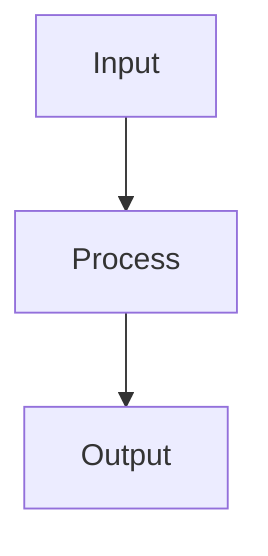

# Linear Regression

## Detailed Explanation

Linear regression predicts continuous values by fitting a line (or plane/hyperplane in high dimensions) to minimize squared prediction errors. The mathematical elegance is that the optimal solution has a closed-form formula (normal equation), making it computationally efficient. However, the closed form requires inverting a matrix which becomes numerically unstable with many features, so gradient descent is often used instead despite being iterative.

The model assumes target = linear combination of features + noise, which is rarely exactly true but is often a good approximation. Regularization (ridge regression adds L2 penalty, lasso adds L1 penalty) prevents overfitting by penalizing large coefficients. Ridge keeps all features (shrinking coefficients) while lasso zeros out some features entirely (feature selection). The interpretation of coefficients is straightforward: coefficient = change in target per unit change in feature (holding others fixed), making linear regression highly interpretable.

Linear regression is often considered 'simple' but remains incredibly valuable because it's interpretable, efficient, and often performs as well as complex methods on real data. Understanding when linear assumptions are reasonable helps you choose whether to use linear regression or move to more complex methods. It's also the foundation for understanding more complex models—many advanced techniques can be viewed as non-linear extensions of linear regression.

## Core Intuition

Linear regression is like fitting a straight line through scatter plot points to predict future values. The line minimizes total vertical distances from points to the line. It's simple but powerful: if the relationship is roughly linear, a straight line often predicts better than a complex curve would (avoiding overfitting).

## How It Works

1. Represent the model as ŷ = Xθ, where X is the feature matrix and θ are the parameters to learn
2. Define a loss function — Mean Squared Error: L(θ) = (1/n) Σ(ŷᵢ − yᵢ)²
3. Minimize the loss either analytically via the Normal Equation: θ = (XᵀX)⁻¹Xᵀy, or iteratively with gradient descent
4. Compute the gradient: ∂L/∂θ = (2/n) Xᵀ(Xθ − y)
5. Update parameters: θ ← θ − α · ∂L/∂θ until convergence
6. Add L2 regularization (Ridge) by penalizing θᵀθ: θ = (XᵀX + λI)⁻¹Xᵀy
7. Evaluate fit using R², RMSE, and residual plots



## Architecture / Trade-offs

Trade-off 1 vs trade-off 2

## Interview Q&A

**Q: When would you choose Ridge over Lasso, and vice versa?**
A: Choose Ridge when you expect most features to contribute (correlated features), since it shrinks all coefficients toward zero smoothly. Choose Lasso when you want sparse solutions — it drives some coefficients exactly to zero, performing implicit feature selection. Use Elastic Net when you want both: sparsity with grouping effect for correlated features.

**Q: Why is the closed-form Normal Equation not used for large datasets?**
A: The Normal Equation requires computing (XᵀX)⁻¹, which is O(p³) in the number of features and O(np²) to form XᵀX. For n=1M rows and p=10k features, this is computationally prohibitive and XᵀX may not fit in memory. Gradient descent scales linearly with data and features, making it the practical choice beyond ~10k features.

**Q: What does a violation of linear regression assumptions look like, and how do you fix it?**
A: Heteroscedasticity (variance of residuals increases with fitted values) shows as a fan pattern in residuals vs fitted plot — fix with log transformation of the target. Non-linearity shows as curved residual patterns — add polynomial or interaction terms. Multicollinearity shows as large standard errors on coefficients — fix with Ridge or remove correlated features.

**Q: How do you interpret coefficients when features have different scales?**
A: Raw coefficients reflect the unit scale of each feature, making them incomparable. To compare feature importance, standardize all features first — then coefficients represent the change in y per standard deviation of x. Always standardize before interpreting coefficient magnitudes, especially when features have different units.

**Q: What's the difference between p-values and regularization for feature selection?**
A: P-values test whether a coefficient is statistically different from zero given the data — they depend heavily on sample size and can be misleading with correlated features. Regularization (Lasso) penalizes complexity and drives irrelevant coefficients to zero in a way that's more robust to collinearity. For feature selection, Lasso regularization is more reliable than p-value filtering.

**Q: How does adding more features affect linear regression?**
A: Adding irrelevant features adds noise to the model and reduces generalization, though training error keeps falling. With p > n features the system is underdetermined and requires regularization. More features also increase multicollinearity risk. Always validate with cross-validation — training R² improvement doesn't mean generalization improvement.
## Best Practices

- Always scale features before regression
- Use Ridge over OLS when features are correlated (multicollinearity)
- Plot residuals vs fitted values to detect non-linearity
- Check VIF (Variance Inflation Factor) to diagnose multicollinearity
- Use adjusted R² not R² for comparing models with different feature counts
- Consider log-transforming skewed targets
- Validate homoscedasticity with Breusch-Pagan test

## Common Pitfalls

- Including highly correlated features causes unstable coefficients (multicollinearity)
- Forgetting to scale features makes coefficient magnitudes incomparable
- Assuming linearity when the true relationship is non-linear (check residual plots)
- Evaluating on training data only — always hold out a test set


## Code Examples

### Example 1: Closed-form OLS

```python
def ols_regression(X, y):
    # Add intercept
    X_with_intercept = np.c_[np.ones(len(X)), X]
    # θ = (X^T X)^-1 X^T y
    theta = np.linalg.lstsq(X_with_intercept, y, rcond=None)[0]
    return theta

theta = ols_regression(X, y)
y_pred = np.c_[np.ones(len(X)), X] @ theta
mse = np.mean((y_pred - y)**2)
print(f"OLS MSE: {mse:.4f}")
print(f"Learned weights: {theta}
```

### Example 2: Ridge Regression (L2)

```python
def ridge_regression(X, y, lambda_reg=0.1):
    X_with_intercept = np.c_[np.ones(len(X)), X]
    # θ = (X^T X + λI)^-1 X^T y
    n_features = X_with_intercept.shape[1]
    theta = np.linalg.solve(X_with_intercept.T @ X_with_intercept + lambda_reg * np.eye(n_features),
                            X_with_intercept.T @ y)
    return theta

# Test different regularization strengths
lambdas = [0.0, 0.01, 0.1, 1.0, 10.0]
ridge_mses = []
for lam in lambdas:
    theta = ridge_regression(X, y, lam)
    y_pred = np.c_[np.ones(len(X)), X] @ theta
    ridge_mses.append(np.mean((y_pred - y)**2))

plt.plot(lambdas, ridge_mses, 'o-')
plt.xlabel('λ (regularization)'), plt.ylabel('MSE')
plt.xscale('log'), plt.title('Ridge Regression: Effect of λ')
plt.show()
```

### Example 3: Using sklearn

```python
from sklearn.linear_model import LinearRegression, Ridge, Lasso

X_train, X_test, y_train, y_test = train_test_split(X, y, test_size=0.2, random_state=42)

# OLS
ols = LinearRegression().fit(X_train, y_train)
ols_score = ols.score(X_test, y_test)

# Ridge
ridge = Ridge(alpha=0.1).fit(X_train, y_train)
ridge_score = ridge.score(X_test, y_test)

# Lasso
lasso = Lasso(alpha=0.01).fit(X_train, y_train)
lasso_score = lasso.score(X_test, y_test)

print(f"OLS R²: {ols_score:.4f}")
print(f"Ridge R²: {ridge_score:.4f}")
print(f"Lasso R²: {lasso_score:.4f}")
print(f"Lasso sparsity: {np.sum(lasso.coef_ == 0)} zeros out of {len(lasso.coef_)}")
```

## Related Concepts

- [Gradient Descent](./01-gradient-descent.md)
- [Cross-Validation](./22-cross-validation.md)
- [Hyperparameter Tuning](./26-hyperparameter-tuning.md)
