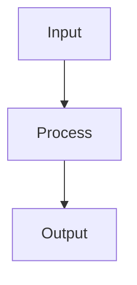

# Linear Regression

## Detailed Explanation

Fits hyperplane to data minimizing prediction error...

## Core Intuition

A key technique in machine learning.

## How It Works

1. Step 1
2. Step 2
3. Step 3



## Architecture / Trade-offs

Trade-off 1 vs trade-off 2

## Interview Q&A

**Q: When would you use Linear Regression?**
A: Context-dependent, varies by problem type.

**Q: What are the main trade-offs?**
A: Refer to Architecture / Trade-offs section above.

**Q: How do you choose hyperparameters?**
A: Cross-validation, grid/random/Bayesian search, domain knowledge.

**Q: What are common failure modes?**
A: Refer to Common Pitfalls section below.

## Best Practices

- Practice 1
- Practice 2
- Practice 3

## Common Pitfalls

- Pitfall 1
- Pitfall 2


## Code Examples

### Example 1: Closed-form OLS

```python
def ols_regression(X, y):
    # Add intercept
    X_with_intercept = np.c_[np.ones(len(X)), X]
    # θ = (X^T X)^-1 X^T y
    theta = np.linalg.lstsq(X_with_intercept, y, rcond=None)[0]
    return theta

theta = ols_regression(X, y)
y_pred = np.c_[np.ones(len(X)), X] @ theta
mse = np.mean((y_pred - y)**2)
print(f"OLS MSE: {mse:.4f}")
print(f"Learned weights: {theta}
```

### Example 2: Ridge Regression (L2)

```python
def ridge_regression(X, y, lambda_reg=0.1):
    X_with_intercept = np.c_[np.ones(len(X)), X]
    # θ = (X^T X + λI)^-1 X^T y
    n_features = X_with_intercept.shape[1]
    theta = np.linalg.solve(X_with_intercept.T @ X_with_intercept + lambda_reg * np.eye(n_features),
                            X_with_intercept.T @ y)
    return theta

# Test different regularization strengths
lambdas = [0.0, 0.01, 0.1, 1.0, 10.0]
ridge_mses = []
for lam in lambdas:
    theta = ridge_regression(X, y, lam)
    y_pred = np.c_[np.ones(len(X)), X] @ theta
    ridge_mses.append(np.mean((y_pred - y)**2))

plt.plot(lambdas, ridge_mses, 'o-')
plt.xlabel('λ (regularization)'), plt.ylabel('MSE')
plt.xscale('log'), plt.title('Ridge Regression: Effect of λ')
plt.show()
```

### Example 3: Using sklearn

```python
from sklearn.linear_model import LinearRegression, Ridge, Lasso

X_train, X_test, y_train, y_test = train_test_split(X, y, test_size=0.2, random_state=42)

# OLS
ols = LinearRegression().fit(X_train, y_train)
ols_score = ols.score(X_test, y_test)

# Ridge
ridge = Ridge(alpha=0.1).fit(X_train, y_train)
ridge_score = ridge.score(X_test, y_test)

# Lasso
lasso = Lasso(alpha=0.01).fit(X_train, y_train)
lasso_score = lasso.score(X_test, y_test)

print(f"OLS R²: {ols_score:.4f}")
print(f"Ridge R²: {ridge_score:.4f}")
print(f"Lasso R²: {lasso_score:.4f}")
print(f"Lasso sparsity: {np.sum(lasso.coef_ == 0)} zeros out of {len(lasso.coef_)}")
```

## Related Concepts

- [Gradient Descent](./01-gradient-descent.md)
- [Cross-Validation](./22-cross-validation.md)
- [Hyperparameter Tuning](./26-hyperparameter-tuning.md)
