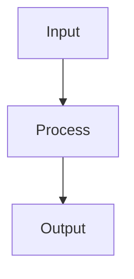

# Logistic Regression

## Detailed Explanation

Logistic regression predicts probabilities for classification by applying a sigmoid function to a linear model, squashing outputs into the [0,1] range. Despite its name, it's a classification algorithm (not regression), and it's arguably the most important baseline in machine learning. If logistic regression doesn't work well on a problem, more complex methods likely won't either (garbage in, garbage out). It's the first algorithm to try for binary classification.

The model outputs a probability via σ(w·x + b), where σ is the sigmoid function. This probability is interpreted as P(y=1|x), making the model interpretable: coefficients show log-odds changes. Training uses cross-entropy loss, which is information-theoretically justified and works better than squared error for classification. Regularization prevents overfitting, especially important when features vastly outnumber samples. Logistic regression extends naturally to multi-class via softmax.

Logistic regression is remarkably effective in practice because many real-world classification problems are approximately linear in the input space. Its interpretability (you can read off which features matter and in which direction) makes it invaluable for high-stakes applications. Understanding logistic regression helps you grasp how neural networks (which are logistic regression + nonlinearity + depth) work. It's also computationally efficient, making it suitable for deployment.

## Core Intuition

Logistic regression is like drawing a decision boundary (straight line) through scatter plot points to separate two classes. The probability near the boundary is uncertain (near 0.5), far from boundary is confident (near 0 or 1). It's the simplest way to turn a linear model into a probabilistic classifier.

## How It Works

1. Model the log-odds of the positive class as a linear function: log(p/(1−p)) = Xθ
2. Apply the sigmoid function to map log-odds to probabilities: p = 1/(1+e^(−Xθ))
3. Define cross-entropy loss: L(θ) = −(1/n) Σ[yᵢ log(pᵢ) + (1−yᵢ) log(1−pᵢ)]
4. Compute gradient: ∂L/∂θ = (1/n) Xᵀ(p − y)
5. Update parameters with gradient descent (or L-BFGS for small datasets)
6. Apply threshold (default 0.5) to predicted probabilities to get class labels
7. For multiclass, extend to softmax: pₖ = e^(Xθₖ) / Σⱼ e^(Xθⱼ)



## Architecture / Trade-offs

### Classification Scenarios

| Scenario | Output | Loss Function | Decision Boundary |
|----------|--------|-------------|-------------------|
| **Binary** | Single probability | Binary cross-entropy | Single hyperplane |
| **Multi-class** | K probabilities | Categorical cross-entropy | K hyperplanes |
| **Imbalanced** | Weighted loss | Weighted cross-entropy | Adjusted threshold |

### Regularization Impact

- **No regularization:** Overfits (especially p >> n)
- **L2 (Ridge):** Shrinks all, keeps features, interpretable
- **L1 (Lasso):** Zeros some, automatic selection, sparse
- **Class weights:** Penalizes minority class errors more

## Interview Q&A

**Q: Why is logistic regression preferred over linear regression for classification?**
A: Linear regression can predict values outside [0,1] which are uninterpretable as probabilities, and minimizing MSE on binary labels is suboptimal. Logistic regression directly models P(y=1|x) using the sigmoid function, ensures outputs are valid probabilities, and optimizes cross-entropy which is the proper loss for Bernoulli-distributed outcomes.

**Q: What happens when classes are perfectly linearly separable?**
A: Without regularization, gradient descent pushes the decision boundary to infinity — coefficients grow unbounded because the loss can always decrease by making predictions more extreme (0 or 1). In sklearn, the solver will issue a convergence warning. Fix by adding regularization (C parameter) which penalizes large coefficients and keeps the model bounded.

**Q: How do you handle a highly imbalanced dataset (1% positive class)?**
A: Set class_weight='balanced' to upweight minority class in the loss, or resample (oversample minority with SMOTE or undersample majority). Evaluate with PR-AUC or F1, not accuracy — a model predicting all negatives gets 99% accuracy but is useless. Tune the decision threshold based on the precision-recall trade-off for your application's cost structure.

**Q: When does logistic regression fail even with good features?**
A: Logistic regression assumes a linear decision boundary in the feature space. It fails when the true boundary is non-linear (e.g., XOR pattern). Solutions: add polynomial/interaction features manually, or switch to a kernel SVM or tree-based model. If the features are linearly separable but with complex decision boundaries, logistic regression will underfit.

**Q: What's the difference between L1 and L2 regularization in logistic regression?**
A: L2 (default C parameter in sklearn) shrinks all coefficients toward zero but keeps all features — good when all features contribute. L1 (penalty='l1') drives some coefficients exactly to zero, performing feature selection — good for high-dimensional sparse data. Elastic Net combines both. The C parameter is the inverse of regularization strength (smaller C = more regularization).

**Q: How would you extend binary logistic regression to multiclass?**
A: Two approaches: One-vs-Rest (OvR) trains k binary classifiers (one per class) and predicts the class with highest confidence; Softmax (multinomial) learns a single model with k output nodes using softmax normalization, ensuring probabilities sum to 1. Softmax is more principled and better when classes overlap; OvR can be faster for large k.
## Best Practices

- Scale features — logistic regression is sensitive to feature magnitude
- Use class_weight='balanced' for imbalanced datasets
- Tune regularization C with cross-validation (log scale: 0.001 to 100)
- Use predict_proba not predict for ranking/scoring tasks
- Check calibration curve — logistic regression is well-calibrated by default
- Monitor log-loss not just accuracy
- Use L1 regularization for feature selection

## Common Pitfalls

- Using accuracy on imbalanced classes hides poor performance on minority class
- Assuming predicted probabilities are perfectly calibrated without checking
- Forgetting to handle class imbalance (use class_weight or resample)
- Using default threshold 0.5 without considering business costs of FP vs FN


## Code Examples

### Example 1: Sigmoid and Cross-Entropy

```python
def sigmoid(z):
    return 1 / (1 + np.exp(-np.clip(z, -500, 500)))

def cross_entropy_loss(y_true, y_pred):
    y_pred = np.clip(y_pred, 1e-7, 1 - 1e-7)
    return -np.mean(y_true * np.log(y_pred) + (1 - y_true) * np.log(1 - y_pred))

# Binary classification data
from sklearn.datasets import make_classification
X, y = make_classification(n_samples=200, n_features=5, n_informative=3, random_state=42)
X = (X - X.mean(axis=0)) / X.std(axis=0)

# Gradient descent
theta = np.zeros(X.shape[1])
lr = 0.1
losses = []

for epoch in range(100):
    z = X @ theta
    p = sigmoid(z)
    grad = X.T @ (p - y) / len(y)
    theta -= lr * grad
    losses.append(cross_entropy_loss(y, sigmoid(X @ theta)))

plt.plot(losses)
plt.xlabel('Epoch'), plt.ylabel('Cross-Entropy Loss')
plt.title('Logistic Regression Training')
plt.show()
```

### Example 2: Decision Boundary

```python
# Visualize decision boundary
y_pred_proba = sigmoid(X @ theta)
y_pred = (y_pred_proba > 0.5).astype(int)

# For 2D visualization, use first 2 features
plt.figure(figsize=(10, 6))
plt.scatter(X[y == 0, 0], X[y == 0, 1], label='Class 0', alpha=0.6)
plt.scatter(X[y == 1, 0], X[y == 1, 1], label='Class 1', alpha=0.6)

# Decision boundary: θ0*x0 + θ1*x1 + ... = 0.5
x0_range = np.linspace(X[:, 0].min(), X[:, 0].max(), 100)
x1_boundary = (0.5 - theta[0] - theta[2:] @ X[:50, 2:].mean(axis=0) - theta[1] * x0_range) / theta[1]
plt.plot(x0_range, x1_boundary, 'k--', label='Decision Boundary')
plt.xlabel('Feature 1'), plt.ylabel('Feature 2')
plt.legend(), plt.title('Logistic Regression Decision Boundary')
plt.show()
```

### Example 3: Multiclass with Softmax

```python
def softmax(z):
    exp_z = np.exp(z - np.max(z, axis=1, keepdims=True))
    return exp_z / np.sum(exp_z, axis=1, keepdims=True)

# 3-class classification
X_multi, y_multi = make_classification(n_samples=200, n_features=5, n_classes=3,
                                        n_informative=4, random_state=42)
X_multi = (X_multi - X_multi.mean(axis=0)) / X_multi.std(axis=0)

# Weight matrix: (n_features, n_classes)
W = np.random.randn(X_multi.shape[1], 3) * 0.01
b = np.zeros(3)

for epoch in range(100):
    z = X_multi @ W + b
    probs = softmax(z)

    # Cross-entropy for multiclass
    loss = -np.mean(np.log(probs[np.arange(len(y_multi)), y_multi] + 1e-7))

    # Gradient
    grad_z = probs.copy()
    grad_z[np.arange(len(y_multi)), y_multi] -= 1
    W -= 0.1 * X_multi.T @ grad_z / len(y_multi)
    b -= 0.1 * np.sum(grad_z, axis=0) / len(y_multi)

print(f"Softmax multiclass final loss: {loss:.4f}")
```

## Related Concepts

- [Gradient Descent](./01-gradient-descent.md)
- [Cross-Validation](./22-cross-validation.md)
- [Hyperparameter Tuning](./26-hyperparameter-tuning.md)
