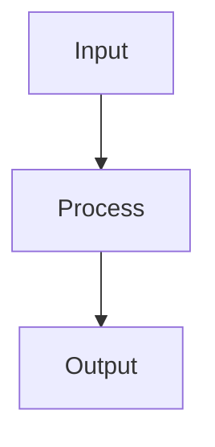

# Decision Trees

## Detailed Explanation

Recursively partitions feature space with axis-aligned splits...

## Core Intuition

A key technique in machine learning.

## How It Works

1. Start with the full training dataset at the root node
2. For each candidate feature and split threshold, compute impurity (Gini or entropy) of resulting child nodes
3. Select the split that maximizes information gain (parent impurity − weighted child impurity)
4. Recursively split each child node using the same procedure
5. Stop when a stopping criterion is met: max_depth reached, min_samples_leaf, or no impurity improvement
6. Assign each leaf node the majority class (classification) or mean value (regression) of its training samples
7. Optionally prune the tree post-hoc by removing splits that don't improve validation performance



## Architecture / Trade-offs

Trade-off 1 vs trade-off 2

## Interview Q&A

**Q: When would you use Decision Trees?**
A: Context-dependent, varies by problem type.

**Q: What are the main trade-offs?**
A: Refer to Architecture / Trade-offs section above.

**Q: How do you choose hyperparameters?**
A: Cross-validation, grid/random/Bayesian search, domain knowledge.

**Q: What are common failure modes?**
A: Refer to Common Pitfalls section below.

## Best Practices

- Set max_depth (3-6) or min_samples_leaf to prevent overfitting
- Use feature importances to identify noisy features
- Prune trees post-training for interpretability
- Visualize with sklearn.tree.plot_tree or export_graphviz
- Use Gini for classification speed, entropy when you need information gain interpretation
- Always validate depth with cross-validation, not just training accuracy
- Use min_impurity_decrease to stop splits below a threshold

## Common Pitfalls

- Unpruned trees perfectly memorize training data (max depth=None means overfit)
- Biased toward high-cardinality features in splitting criteria
- Unstable — small data changes create very different trees
- Single trees are weak learners — use ensembles (RF, GBM) in production


## Code Examples

### Example 1: CART Algorithm with Gini

```python
from sklearn.tree import DecisionTreeClassifier, plot_tree
from sklearn import datasets
import matplotlib.pyplot as plt

X, y = datasets.load_iris(return_X_y=True)
X, y = X[:, :2], y  # Use first 2 features for visualization

# Train decision tree
dt = DecisionTreeClassifier(max_depth=3, criterion='gini', random_state=42)
dt.fit(X, y)

# Feature importance
print("Feature importances:")
for i, imp in enumerate(dt.feature_importances_):
    print(f"  Feature {i}: {imp:.4f}")

# Visualize tree
plt.figure(figsize=(20, 10))
plot_tree(dt, feature_names=['SepalLength', 'SepalWidth'], class_names=['Setosa', 'Versicolor', 'Virginica'])
plt.show()
```

### Example 2: Pruning to Prevent Overfitting

```python
from sklearn.tree import DecisionTreeClassifier

# Train unpruned tree
dt_deep = DecisionTreeClassifier(random_state=42)
dt_deep.fit(X, y)

# Train pruned tree
dt_pruned = DecisionTreeClassifier(max_depth=5, min_samples_leaf=5, random_state=42)
dt_pruned.fit(X, y)

train_score_deep = dt_deep.score(X, y)
train_score_pruned = dt_pruned.score(X, y)

print(f"Deep tree - Depth: {dt_deep.get_depth()}, Train accuracy: {train_score_deep:.4f}")
print(f"Pruned tree - Depth: {dt_pruned.get_depth()}, Train accuracy: {train_score_pruned:.4f}")
```

### Example 3: Classification Tree

```python
from sklearn.tree import DecisionTreeClassifier
from sklearn.model_selection import cross_val_score

dt = DecisionTreeClassifier(max_depth=4, min_samples_leaf=2, random_state=42)
scores = cross_val_score(dt, X, y, cv=5)

print(f"5-fold CV scores: {scores}")
print(f"Mean accuracy: {scores.mean():.4f} ± {scores.std():.4f}")
```

## Related Concepts

- [Gradient Descent](./01-gradient-descent.md)
- [Cross-Validation](./22-cross-validation.md)
- [Hyperparameter Tuning](./26-hyperparameter-tuning.md)
