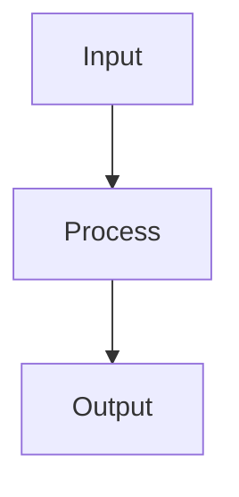

# Random Forests

## Detailed Explanation

Combines multiple trees via bagging for robustness...

## Core Intuition

A key technique in machine learning.

## How It Works

1. Draw B bootstrap samples (with replacement) from the training data, one per tree
2. For each bootstrap sample, train a decision tree — but at each split, consider only a random subset of √p features (for classification) or p/3 features (for regression)
3. Repeat until B trees are trained (typical B = 100–500)
4. For prediction, pass the input through all B trees: take majority vote (classification) or mean (regression)
5. Samples not in a tree's bootstrap sample form its Out-of-Bag (OOB) set — use these for free internal validation
6. Compute feature importances by measuring average impurity decrease per feature across all trees
7. Tune max_features (controls diversity) and n_estimators (controls variance reduction)



## Architecture / Trade-offs

Trade-off 1 vs trade-off 2

## Interview Q&A

**Q: Why does random feature subsampling (max_features) in Random Forests reduce variance?**
A: If all trees use the same features, they'll learn similar patterns and be highly correlated — averaging correlated predictors barely reduces variance. By forcing each split to consider only a random subset of features (√p for classification), trees are decorrelated, so averaging them gives a much larger variance reduction. The randomness creates diversity which is the source of Random Forest's power.

**Q: When does adding more trees stop helping in a Random Forest?**
A: After ~100-500 trees, the out-of-bag error stabilizes and additional trees provide negligible variance reduction while adding compute and memory cost. The law of diminishing returns applies — the first 100 trees provide most of the benefit. Monitor OOB error convergence to find the practical stopping point for your dataset.

**Q: How would you use a Random Forest for feature selection?**
A: Compute feature_importances_ from the trained forest (mean decrease in Gini). However, this is biased toward high-cardinality and correlated features. More reliable: use permutation importance (sklearn's permutation_importance), which measures how much performance drops when each feature is randomly shuffled. Keep top k features by permutation importance and retrain.

**Q: What's the difference between Random Forest and Gradient Boosting — when do you choose each?**
A: Random Forest trains trees in parallel (independent) — faster, easier to parallelize, more robust to hyperparameter choices. Gradient Boosting trains trees sequentially (each corrects the previous) — usually higher accuracy but slower, more sensitive to hyperparameters, needs careful LR tuning. Random Forest for quick baselines and when robustness matters; GBM for competition-level accuracy.

**Q: Why is the Out-of-Bag (OOB) error useful?**
A: Each bootstrap sample leaves out ~37% of training points, which serve as an implicit validation set for that tree. Aggregating OOB predictions across all trees gives a nearly unbiased generalization estimate without requiring a separate holdout set. This is particularly valuable for small datasets. OOB error closely tracks cross-validation error in practice.

**Q: How does Random Forest handle class imbalance?**
A: Poorly by default — it optimizes Gini which can be dominated by the majority class. Solutions: class_weight='balanced_subsample' reweights splits in each tree; class_weight='balanced' weights globally; or use stratified bootstrap sampling. Additionally, you can lower the classification threshold on predict_proba to improve minority class recall.
## Best Practices

- Start with n_estimators=100-500 (more is rarely worse, just slower)
- Use oob_score=True for free validation without a holdout set
- Feature importances via feature_importances_ — but prefer permutation importance for correlated features
- Tune max_features first (sqrt for classification, log2 or 0.3 for regression)
- Use n_jobs=-1 for parallel training
- For imbalanced data use class_weight='balanced_subsample'
- Set random_state for reproducibility

## Common Pitfalls

- Feature importances are biased toward high-cardinality and correlated features
- Extrapolation is poor — trees can't predict beyond training range
- Memory-intensive for large n_estimators + deep trees
- Ignoring correlation structure in feature importance leads to misleading rankings


## Code Examples

### Example 1: Basic Random Forest

```python
from sklearn.ensemble import RandomForestClassifier
from sklearn.model_selection import train_test_split

X_train, X_test, y_train, y_test = train_test_split(datasets.load_iris(return_X_y=True)[0],
                                                      datasets.load_iris(return_X_y=True)[1],
                                                      test_size=0.2, random_state=42)

# Random forest with 100 trees
rf = RandomForestClassifier(n_estimators=100, max_depth=5, random_state=42)
rf.fit(X_train, y_train)

train_score = rf.score(X_train, y_train)
test_score = rf.score(X_test, y_test)
print(f"Train: {train_score:.4f}, Test: {test_score:.4f}")

# Feature importance
feature_names = ['SepalLength', 'SepalWidth', 'PetalLength', 'PetalWidth']
for name, imp in zip(feature_names, rf.feature_importances_):
    print(f"{name}: {imp:.4f}")
```

### Example 2: Out-of-Bag (OOB) Error

```python
from sklearn.ensemble import RandomForestClassifier

rf_oob = RandomForestClassifier(n_estimators=100, oob_score=True, random_state=42)
rf_oob.fit(X_train, y_train)

print(f"OOB Score: {rf_oob.oob_score_:.4f}")
print(f"Test Score: {rf_oob.score(X_test, y_test):.4f}")
print(f"OOB provides free validation without holdout set!")
```

### Example 3: Tuning Random Forests

```python
from sklearn.model_selection import GridSearchCV

param_grid = {
    'n_estimators': [50, 100, 200],
    'max_depth': [3, 5, 10],
    'min_samples_leaf': [1, 2, 5]
}

grid = GridSearchCV(RandomForestClassifier(random_state=42), param_grid, cv=3)
grid.fit(X_train, y_train)

print(f"Best params: {grid.best_params_}")
print(f"Best CV score: {grid.best_score_:.4f}")
print(f"Test score: {grid.score(X_test, y_test):.4f}")
```

## Related Concepts

- [Gradient Descent](./01-gradient-descent.md)
- [Cross-Validation](./22-cross-validation.md)
- [Hyperparameter Tuning](./26-hyperparameter-tuning.md)
