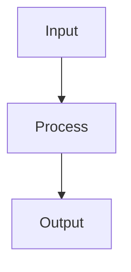

# Random Forests

## Detailed Explanation

Combines multiple trees via bagging for robustness...

## Core Intuition

A key technique in machine learning.

## How It Works

1. Step 1
2. Step 2
3. Step 3



## Architecture / Trade-offs

Trade-off 1 vs trade-off 2

## Interview Q&A

**Q: When would you use Random Forests?**
A: Context-dependent, varies by problem type.

**Q: What are the main trade-offs?**
A: Refer to Architecture / Trade-offs section above.

**Q: How do you choose hyperparameters?**
A: Cross-validation, grid/random/Bayesian search, domain knowledge.

**Q: What are common failure modes?**
A: Refer to Common Pitfalls section below.

## Best Practices

- Practice 1
- Practice 2
- Practice 3

## Common Pitfalls

- Pitfall 1
- Pitfall 2


## Code Examples

### Example 1: Basic Random Forest

```python
from sklearn.ensemble import RandomForestClassifier
from sklearn.model_selection import train_test_split

X_train, X_test, y_train, y_test = train_test_split(datasets.load_iris(return_X_y=True)[0],
                                                      datasets.load_iris(return_X_y=True)[1],
                                                      test_size=0.2, random_state=42)

# Random forest with 100 trees
rf = RandomForestClassifier(n_estimators=100, max_depth=5, random_state=42)
rf.fit(X_train, y_train)

train_score = rf.score(X_train, y_train)
test_score = rf.score(X_test, y_test)
print(f"Train: {train_score:.4f}, Test: {test_score:.4f}")

# Feature importance
feature_names = ['SepalLength', 'SepalWidth', 'PetalLength', 'PetalWidth']
for name, imp in zip(feature_names, rf.feature_importances_):
    print(f"{name}: {imp:.4f}")
```

### Example 2: Out-of-Bag (OOB) Error

```python
from sklearn.ensemble import RandomForestClassifier

rf_oob = RandomForestClassifier(n_estimators=100, oob_score=True, random_state=42)
rf_oob.fit(X_train, y_train)

print(f"OOB Score: {rf_oob.oob_score_:.4f}")
print(f"Test Score: {rf_oob.score(X_test, y_test):.4f}")
print(f"OOB provides free validation without holdout set!")
```

### Example 3: Tuning Random Forests

```python
from sklearn.model_selection import GridSearchCV

param_grid = {
    'n_estimators': [50, 100, 200],
    'max_depth': [3, 5, 10],
    'min_samples_leaf': [1, 2, 5]
}

grid = GridSearchCV(RandomForestClassifier(random_state=42), param_grid, cv=3)
grid.fit(X_train, y_train)

print(f"Best params: {grid.best_params_}")
print(f"Best CV score: {grid.best_score_:.4f}")
print(f"Test score: {grid.score(X_test, y_test):.4f}")
```

## Related Concepts

- [Gradient Descent](./01-gradient-descent.md)
- [Cross-Validation](./22-cross-validation.md)
- [Hyperparameter Tuning](./26-hyperparameter-tuning.md)
