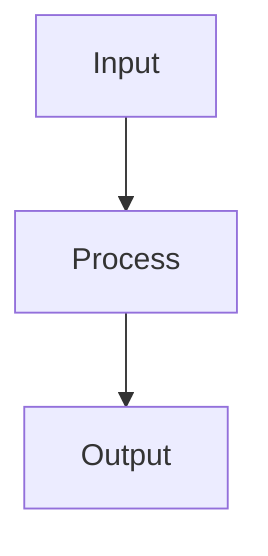

# Gradient Boosting

## Detailed Explanation

Trains trees sequentially, focusing on previous errors...

## Core Intuition

A key technique in machine learning.

## How It Works

1. Step 1
2. Step 2
3. Step 3



## Architecture / Trade-offs

Trade-off 1 vs trade-off 2

## Interview Q&A

**Q: When would you use Gradient Boosting?**
A: Context-dependent, varies by problem type.

**Q: What are the main trade-offs?**
A: Refer to Architecture / Trade-offs section above.

**Q: How do you choose hyperparameters?**
A: Cross-validation, grid/random/Bayesian search, domain knowledge.

**Q: What are common failure modes?**
A: Refer to Common Pitfalls section below.

## Best Practices

- Use small learning_rate (0.05-0.1) with more estimators for better generalization
- Set subsample=0.8 (stochastic GBM) to reduce overfitting and speed up
- Tune max_depth=3-6 first, then learning_rate
- Use early_stopping_rounds in XGBoost/LightGBM to find optimal n_estimators
- Use LightGBM for datasets >100k rows — much faster than sklearn GBM
- Monitor train vs validation loss curves to detect overfitting
- Use scale_pos_weight for imbalanced binary classification in XGBoost

## Common Pitfalls

- Learning rate too high causes poor generalization
- Not using early stopping wastes compute on too many estimators
- Over-tuning on validation set — use a separate final test set
- LightGBM default grows leaf-wise trees which need min_child_samples tuning to avoid overfit


## Code Examples

### Example 1: XGBoost Classifier

```python
import xgboost as xgb
from sklearn.model_selection import train_test_split

X, y = datasets.load_iris(return_X_y=True)
X_train, X_test, y_train, y_test = train_test_split(X, y, test_size=0.2, random_state=42)

# XGBoost classifier
xgb_model = xgb.XGBClassifier(n_estimators=100, max_depth=3, learning_rate=0.1, random_state=42)
xgb_model.fit(X_train, y_train, eval_set=[(X_test, y_test)], verbose=False)

train_score = xgb_model.score(X_train, y_train)
test_score = xgb_model.score(X_test, y_test)
print(f"Train: {train_score:.4f}, Test: {test_score:.4f}")
```

### Example 2: Early Stopping

```python
xgb_early = xgb.XGBClassifier(n_estimators=1000, max_depth=3, random_state=42)
xgb_early.fit(X_train, y_train,
              eval_set=[(X_test, y_test)],
              early_stopping_rounds=10,
              verbose=False)

print(f"Best iteration: {xgb_early.best_iteration}")
print(f"Final test score: {xgb_early.score(X_test, y_test):.4f}")
```

### Example 3: Feature Importance

```python
import matplotlib.pyplot as plt

feature_names = ['SepalLength', 'SepalWidth', 'PetalLength', 'PetalWidth']
importances = xgb_model.feature_importances_

plt.barh(feature_names, importances)
plt.xlabel('Importance')
plt.title('XGBoost Feature Importance')
plt.show()
```

## Related Concepts

- [Gradient Descent](./01-gradient-descent.md)
- [Cross-Validation](./22-cross-validation.md)
- [Hyperparameter Tuning](./26-hyperparameter-tuning.md)
