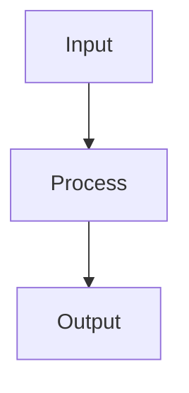

# Gradient Boosting

## Detailed Explanation

Gradient boosting builds trees sequentially, where each new tree learns to correct errors made by previous trees. Unlike random forests (parallel independent trees), boosting is sequential—each tree targets the residuals of the ensemble so far. This sequential correction process is powerful but requires careful tuning to avoid overfitting. XGBoost and LightGBM are optimized implementations used heavily in competitions and industry.

The algorithm starts with a base prediction (usually the mean), then fits a tree to residuals. Each new tree is scaled by a learning rate (small step sizes prevent overfitting). Early stopping (stop after validation error plateaus) prevents memorizing training data. Key hyperparameters are tree depth (shallow trees = regularization), number of boosting rounds (more = more capacity), and learning rate (lower = slower but more careful learning). Unlike random forests, gradient boosting requires careful tuning but often achieves state-of-the-art accuracy on tabular data.

Gradient boosting is the most effective algorithm for tabular/structured data in practice, winning most Kaggle competitions. Understanding the sequential error correction concept helps explain why boosting works: each successive tree is easier to fit because it only needs to capture the previous ensemble's errors, not the full complexity. XGBoost and LightGBM are industry standards, though both are complex to tune optimally. Starting with default hyperparameters and adjusting based on validation performance is practical.

## Core Intuition

Gradient boosting is like learning by mistakes: your first prediction is rough (tree 1), you see where you were wrong (residuals), and train a second model to correct those specific mistakes. Then you see the remaining errors and train a third model, etc. Each model learns from the collective mistakes of all previous models.

## How It Works

1. Initialize with a simple prediction: F₀(x) = argmin_γ Σ L(yᵢ, γ) (e.g., mean of y for regression)
2. Compute pseudo-residuals (negative gradient of loss w.r.t. current predictions): rᵢ = −∂L(yᵢ, F(xᵢ))/∂F(xᵢ)
3. Fit a weak learner (shallow decision tree) to the pseudo-residuals
4. Find the optimal step size γ by line search: γ = argmin_γ Σ L(yᵢ, F(xᵢ) + γ·hₜ(xᵢ))
5. Update the model: Fₜ(x) = Fₜ₋₁(x) + η·γ·hₜ(x), where η is the learning rate
6. Repeat steps 2–5 for T boosting rounds
7. Final prediction is the sum of all weak learners: F(x) = F₀(x) + η·Σₜ hₜ(x)



## Architecture / Trade-offs

Trade-off 1 vs trade-off 2

## Interview Q&A

**Q: Why does gradient boosting use shallow trees rather than deep ones?**
A: Shallow trees (max_depth=3-6) are "weak learners" — slightly better than random. Boosting's power comes from sequentially adding many weak learners, each correcting the previous ensemble's errors. Deep trees would be strong learners that fit noise, causing overfitting early. The combination of many small corrections is more generalizable than fewer large corrections.

**Q: What's the role of the learning rate in gradient boosting?**
A: The learning rate (eta/shrinkage) scales each tree's contribution: F_t = F_{t-1} + η·h_t. Small η (0.01-0.1) requires more trees but generalizes better because each update is conservative. High η converges faster but overfits. The key insight: n_estimators and learning_rate are inversely related — halving learning rate roughly requires doubling n_estimators for similar performance.

**Q: How does XGBoost differ from sklearn's GradientBoostingClassifier?**
A: XGBoost adds second-order gradient information (Newton boosting), built-in L1/L2 regularization on leaf weights, column/row subsampling for variance reduction, and efficient sparse matrix handling. It's typically 10-100x faster than sklearn's GBM due to parallel tree building and cache-aware access patterns. XGBoost and LightGBM are the standard choices for production; sklearn's GBM is mainly for teaching.

**Q: When would you NOT use gradient boosting?**
A: When interpretability is critical (single decision tree is more explainable), when data is very high-dimensional and sparse (linear models or SVMs may be better), when you need very low latency predictions and can't afford the sequential tree traversal cost, or when you have very little data (<500 samples) and need the regularization benefits of simpler models.

**Q: What is early stopping and why is it important for gradient boosting?**
A: Early stopping monitors a validation metric during training and stops adding trees when the metric stops improving for `early_stopping_rounds` rounds. Without it, you must manually tune n_estimators — too few underfit, too many overfit. Early stopping automates this: set n_estimators=10000 and let early stopping find the optimal count. Always use a separate eval_set, not the training set.

**Q: How would you explain a gradient boosting prediction to a non-technical stakeholder?**
A: GBM builds a sequence of simple decision rules that each fix the mistakes of the previous rules, similar to a committee of experts where each new expert focuses on the cases the previous experts got wrong. The final prediction is the sum of all experts' weighted opinions. For individual predictions, use SHAP values to show which features pushed the prediction higher or lower.
## Best Practices

- Use small learning_rate (0.05-0.1) with more estimators for better generalization
- Set subsample=0.8 (stochastic GBM) to reduce overfitting and speed up
- Tune max_depth=3-6 first, then learning_rate
- Use early_stopping_rounds in XGBoost/LightGBM to find optimal n_estimators
- Use LightGBM for datasets >100k rows — much faster than sklearn GBM
- Monitor train vs validation loss curves to detect overfitting
- Use scale_pos_weight for imbalanced binary classification in XGBoost

## Common Pitfalls

- Learning rate too high causes poor generalization
- Not using early stopping wastes compute on too many estimators
- Over-tuning on validation set — use a separate final test set
- LightGBM default grows leaf-wise trees which need min_child_samples tuning to avoid overfit


## Code Examples

### Example 1: XGBoost Classifier

```python
import xgboost as xgb
from sklearn.model_selection import train_test_split

X, y = datasets.load_iris(return_X_y=True)
X_train, X_test, y_train, y_test = train_test_split(X, y, test_size=0.2, random_state=42)

# XGBoost classifier
xgb_model = xgb.XGBClassifier(n_estimators=100, max_depth=3, learning_rate=0.1, random_state=42)
xgb_model.fit(X_train, y_train, eval_set=[(X_test, y_test)], verbose=False)

train_score = xgb_model.score(X_train, y_train)
test_score = xgb_model.score(X_test, y_test)
print(f"Train: {train_score:.4f}, Test: {test_score:.4f}")
```

### Example 2: Early Stopping

```python
xgb_early = xgb.XGBClassifier(n_estimators=1000, max_depth=3, random_state=42)
xgb_early.fit(X_train, y_train,
              eval_set=[(X_test, y_test)],
              early_stopping_rounds=10,
              verbose=False)

print(f"Best iteration: {xgb_early.best_iteration}")
print(f"Final test score: {xgb_early.score(X_test, y_test):.4f}")
```

### Example 3: Feature Importance

```python
import matplotlib.pyplot as plt

feature_names = ['SepalLength', 'SepalWidth', 'PetalLength', 'PetalWidth']
importances = xgb_model.feature_importances_

plt.barh(feature_names, importances)
plt.xlabel('Importance')
plt.title('XGBoost Feature Importance')
plt.show()
```

## Related Concepts

- [Gradient Descent](./01-gradient-descent.md)
- [Cross-Validation](./22-cross-validation.md)
- [Hyperparameter Tuning](./26-hyperparameter-tuning.md)
