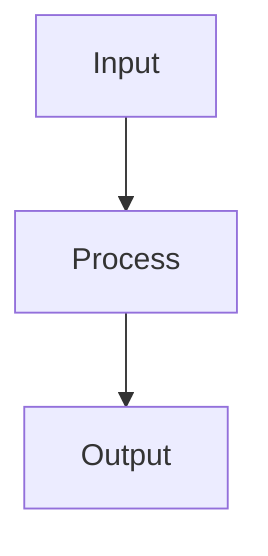

# Support Vector Machines

## Detailed Explanation

Finds maximum-margin hyperplane with kernel trick...

## Core Intuition

A key technique in machine learning.

## How It Works

1. Step 1
2. Step 2
3. Step 3



## Architecture / Trade-offs

Trade-off 1 vs trade-off 2

## Interview Q&A

**Q: When would you use Support Vector Machines?**
A: Context-dependent, varies by problem type.

**Q: What are the main trade-offs?**
A: Refer to Architecture / Trade-offs section above.

**Q: How do you choose hyperparameters?**
A: Cross-validation, grid/random/Bayesian search, domain knowledge.

**Q: What are common failure modes?**
A: Refer to Common Pitfalls section below.

## Best Practices

- Practice 1
- Practice 2
- Practice 3

## Common Pitfalls

- Pitfall 1
- Pitfall 2


## Code Examples

### Example 1: Linear SVM

```python
from sklearn.svm import SVC

X_train, X_test, y_train, y_test = train_test_split(X, y, test_size=0.2, random_state=42)

svm_linear = SVC(kernel='linear', C=1.0, random_state=42)
svm_linear.fit(X_train, y_train)

print(f"Support vectors: {svm_linear.n_support_}")
print(f"Train: {svm_linear.score(X_train, y_train):.4f}")
print(f"Test: {svm_linear.score(X_test, y_test):.4f}")
```

### Example 2: RBF Kernel SVM

```python
from sklearn.svm import SVC

svm_rbf = SVC(kernel='rbf', C=1.0, gamma='scale', random_state=42)
svm_rbf.fit(X_train, y_train)

print(f"Linear kernel score: {svm_linear.score(X_test, y_test):.4f}")
print(f"RBF kernel score: {svm_rbf.score(X_test, y_test):.4f}")
```

### Example 3: Tuning C Parameter

```python
from sklearn.model_selection import GridSearchCV

param_grid = {'C': [0.1, 1, 10, 100]}
grid = GridSearchCV(SVC(kernel='rbf'), param_grid, cv=5)
grid.fit(X_train, y_train)

print(f"Best C: {grid.best_params_['C']}")
print(f"Best CV score: {grid.best_score_:.4f}")
print(f"Test score: {grid.score(X_test, y_test):.4f}")
```

## Related Concepts

- [Gradient Descent](./01-gradient-descent.md)
- [Cross-Validation](./22-cross-validation.md)
- [Hyperparameter Tuning](./26-hyperparameter-tuning.md)
