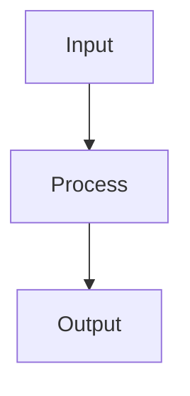

# K-Nearest Neighbors

## Detailed Explanation

Instance-based learning using nearest neighbors...

## Core Intuition

A key technique in machine learning.

## How It Works

1. Store the entire training dataset (lazy learning — no explicit training phase)
2. Given a new query point x, compute its distance to every training point using a distance metric (Euclidean, Manhattan, cosine)
3. Retrieve the k training points with the smallest distances to x
4. For classification: assign the majority class among the k neighbors (optionally weighted by 1/distance)
5. For regression: predict the mean (or distance-weighted mean) of the k neighbors' target values
6. Choose k using cross-validation — small k = low bias/high variance, large k = high bias/low variance
7. Optimize with spatial data structures (KD-tree for d < 20, Ball-tree for higher dimensions) to avoid O(nd) brute force



## Architecture / Trade-offs

Trade-off 1 vs trade-off 2

## Interview Q&A

**Q: How do you choose k in KNN?**
A: Use cross-validation: plot validation error vs k (1 to ~√n). k=1 perfectly memorizes training data (overfit), large k approximates the global mean (underfit). The optimal k is usually in the range 3-20, where the bias-variance tradeoff is best. Odd k values avoid ties in binary classification. Start with k=5 as a baseline and tune from there.

**Q: Why does KNN perform poorly in high-dimensional spaces?**
A: The curse of dimensionality: in high dimensions, all points become approximately equidistant from the query point (distances concentrate), making nearest neighbors no more similar than random points. Additionally, the volume of space grows exponentially with dimensions so the k nearest neighbors may be very far away and not representative. PCA or feature selection before KNN helps significantly.

**Q: What is the computational complexity of KNN at prediction time?**
A: Brute force: O(nd) per query (n training points, d dimensions) — very slow for large datasets. KD-tree: O(d·log(n)) for low dimensions (d < 20). Ball-tree: O(d·log(n)) for higher dimensions. For d > 50, both trees degrade and brute force may be faster. For very large n (millions), use approximate nearest neighbor libraries like FAISS or HNSW.

**Q: When would you use KNN over a tree-based model?**
A: KNN works well when decision boundaries are irregular and don't align well with axis-aligned splits (as in trees). It's also good for recommendation systems (user-item similarity) and anomaly detection (distance to k-th neighbor as anomaly score). For tabular data with many features, tree-based methods almost always outperform KNN. KNN shines for geometric similarity tasks.

**Q: How does the choice of distance metric affect KNN?**
A: Euclidean distance treats all features equally and is sensitive to scale and irrelevant features. Manhattan distance is more robust to outliers. Cosine similarity is appropriate for sparse high-dimensional data (text). Mahalanobis distance accounts for feature correlations. Always normalize features first, and consider learning a task-specific distance metric (metric learning) when accuracy is critical.

**Q: How does KNN handle class imbalance?**
A: KNN is sensitive to imbalance because majority class points dominate the neighborhood even if the query point is near a minority class. Solutions: weight votes inversely by distance (weights='distance' in sklearn); use SMOTE to oversample minority class; use a modified voting scheme that accounts for class prior probability. For severe imbalance, KNN performs poorly and tree-based methods or specialized classifiers are better.
## Best Practices

- Always normalize features before KNN — Euclidean distance is scale-sensitive
- Choose k with cross-validation (plot CV error vs k)
- Use KD-tree or Ball-tree for datasets <100k — much faster than brute force
- Compute distances in lower-dimensional space after PCA for high-dim data
- Weight neighbors by distance (weights='distance') for smoother boundaries
- Use leaf_size parameter to tune tree-build vs query speed trade-off
- Consider approximate nearest neighbors (FAISS, ANNOY) at large scale

## Common Pitfalls

- Slow at prediction time — O(n·d) per query with brute force
- Suffers from curse of dimensionality — distances become meaningless in high dimensions
- Sensitive to irrelevant features — feature selection helps
- No model to inspect — completely non-parametric, hard to interpret


## Code Examples

### Example 1: Basic KNN

```python
from sklearn.neighbors import KNeighborsClassifier

knn = KNeighborsClassifier(n_neighbors=5)
knn.fit(X_train, y_train)

print(f"Train: {knn.score(X_train, y_train):.4f}")
print(f"Test: {knn.score(X_test, y_test):.4f}")
```

### Example 2: Tuning k

```python
k_values = range(1, 20)
train_scores = []
test_scores = []

for k in k_values:
    knn = KNeighborsClassifier(n_neighbors=k)
    knn.fit(X_train, y_train)
    train_scores.append(knn.score(X_train, y_train))
    test_scores.append(knn.score(X_test, y_test))

plt.plot(k_values, train_scores, label='Train')
plt.plot(k_values, test_scores, label='Test')
plt.xlabel('k'), plt.ylabel('Accuracy')
plt.legend(), plt.title('KNN Performance vs k')
plt.show()
```

### Example 3: Distance Metrics

```python
from sklearn.neighbors import KNeighborsClassifier

knn_euclidean = KNeighborsClassifier(n_neighbors=5, metric='euclidean')
knn_manhattan = KNeighborsClassifier(n_neighbors=5, metric='manhattan')

knn_euclidean.fit(X_train, y_train)
knn_manhattan.fit(X_train, y_train)

print(f"Euclidean: {knn_euclidean.score(X_test, y_test):.4f}")
print(f"Manhattan: {knn_manhattan.score(X_test, y_test):.4f}")
```

## Related Concepts

- [Gradient Descent](./01-gradient-descent.md)
- [Cross-Validation](./22-cross-validation.md)
- [Hyperparameter Tuning](./26-hyperparameter-tuning.md)
