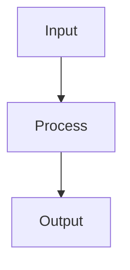

# K-Nearest Neighbors

## Detailed Explanation

Instance-based learning using nearest neighbors...

## Core Intuition

A key technique in machine learning.

## How It Works

1. Step 1
2. Step 2
3. Step 3



## Architecture / Trade-offs

Trade-off 1 vs trade-off 2

## Interview Q&A

**Q: When would you use K-Nearest Neighbors?**
A: Context-dependent, varies by problem type.

**Q: What are the main trade-offs?**
A: Refer to Architecture / Trade-offs section above.

**Q: How do you choose hyperparameters?**
A: Cross-validation, grid/random/Bayesian search, domain knowledge.

**Q: What are common failure modes?**
A: Refer to Common Pitfalls section below.

## Best Practices

- Practice 1
- Practice 2
- Practice 3

## Common Pitfalls

- Pitfall 1
- Pitfall 2


## Code Examples

### Example 1: Basic KNN

```python
from sklearn.neighbors import KNeighborsClassifier

knn = KNeighborsClassifier(n_neighbors=5)
knn.fit(X_train, y_train)

print(f"Train: {knn.score(X_train, y_train):.4f}")
print(f"Test: {knn.score(X_test, y_test):.4f}")
```

### Example 2: Tuning k

```python
k_values = range(1, 20)
train_scores = []
test_scores = []

for k in k_values:
    knn = KNeighborsClassifier(n_neighbors=k)
    knn.fit(X_train, y_train)
    train_scores.append(knn.score(X_train, y_train))
    test_scores.append(knn.score(X_test, y_test))

plt.plot(k_values, train_scores, label='Train')
plt.plot(k_values, test_scores, label='Test')
plt.xlabel('k'), plt.ylabel('Accuracy')
plt.legend(), plt.title('KNN Performance vs k')
plt.show()
```

### Example 3: Distance Metrics

```python
from sklearn.neighbors import KNeighborsClassifier

knn_euclidean = KNeighborsClassifier(n_neighbors=5, metric='euclidean')
knn_manhattan = KNeighborsClassifier(n_neighbors=5, metric='manhattan')

knn_euclidean.fit(X_train, y_train)
knn_manhattan.fit(X_train, y_train)

print(f"Euclidean: {knn_euclidean.score(X_test, y_test):.4f}")
print(f"Manhattan: {knn_manhattan.score(X_test, y_test):.4f}")
```

## Related Concepts

- [Gradient Descent](./01-gradient-descent.md)
- [Cross-Validation](./22-cross-validation.md)
- [Hyperparameter Tuning](./26-hyperparameter-tuning.md)
