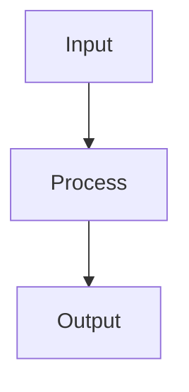

# Neural Networks

## Detailed Explanation

Stacks layers of parameterized transformations...

## Core Intuition

A key technique in machine learning.

## How It Works

1. Step 1
2. Step 2
3. Step 3



## Architecture / Trade-offs

Trade-off 1 vs trade-off 2

## Interview Q&A

**Q: When would you use Neural Networks?**
A: Context-dependent, varies by problem type.

**Q: What are the main trade-offs?**
A: Refer to Architecture / Trade-offs section above.

**Q: How do you choose hyperparameters?**
A: Cross-validation, grid/random/Bayesian search, domain knowledge.

**Q: What are common failure modes?**
A: Refer to Common Pitfalls section below.

## Best Practices

- Use ReLU for hidden layers as default; LeakyReLU or ELU if dying ReLU is a problem
- Initialize with He init for ReLU, Xavier for tanh/sigmoid
- Always use batch normalization before or after non-linearities in deep networks
- Use dropout (0.2-0.5) in fully connected layers for regularization
- Start with Adam optimizer, switch to SGD+momentum for final fine-tuning
- Monitor gradient norms — exploding/vanishing signals architecture problems
- Use learning rate warmup for large networks

## Common Pitfalls

- Using sigmoid/tanh in deep networks — leads to vanishing gradients
- Not normalizing inputs causes slow or failed convergence
- Too large batch size reduces generalization (sharp minima)
- No validation monitoring — can't detect overfitting early


## Code Examples

### Example 1: Simple MLP with PyTorch

```python
import torch
import torch.nn as nn

class SimpleNN(nn.Module):
    def __init__(self):
        super().__init__()
        self.fc1 = nn.Linear(4, 10)
        self.fc2 = nn.Linear(10, 3)

    def forward(self, x):
        x = torch.relu(self.fc1(x))
        return self.fc2(x)

model = SimpleNN()
X_tensor = torch.FloatTensor(X_train)
y_tensor = torch.LongTensor(y_train)

outputs = model(X_tensor)
print(f"Input shape: {X_tensor.shape}, Output shape: {outputs.shape}")
```

### Example 2: Training Loop

```python
import torch
import torch.nn as nn
import torch.optim as optim

model = SimpleNN()
criterion = nn.CrossEntropyLoss()
optimizer = optim.Adam(model.parameters(), lr=0.001)

for epoch in range(100):
    optimizer.zero_grad()
    outputs = model(X_tensor)
    loss = criterion(outputs, y_tensor)
    loss.backward()
    optimizer.step()

print(f"Final loss: {loss.item():.4f}")
```

### Example 3: Prediction

```python
with torch.no_grad():
    X_test_tensor = torch.FloatTensor(X_test)
    outputs = model(X_test_tensor)
    _, predicted = torch.max(outputs, 1)

accuracy = (predicted.numpy() == y_test).mean()
print(f"Test accuracy: {accuracy:.4f}")
```

## Related Concepts

- [Gradient Descent](./01-gradient-descent.md)
- [Cross-Validation](./22-cross-validation.md)
- [Hyperparameter Tuning](./26-hyperparameter-tuning.md)
