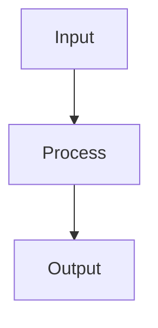

# Neural Networks

## Detailed Explanation

Stacks layers of parameterized transformations...

## Core Intuition

A key technique in machine learning.

## How It Works

1. Define network architecture: input layer (d features) → hidden layers (each with n neurons + activation) → output layer
2. Forward pass: for each layer l, compute zˡ = Wˡaˡ⁻¹ + bˡ, then apply activation aˡ = σ(zˡ)
3. Compute loss at the output: L = loss(ŷ, y) (e.g., cross-entropy for classification)
4. Backward pass: compute ∂L/∂W and ∂L/∂b for every layer using chain rule (backpropagation)
5. Start from output layer: δᴸ = ∂L/∂z, then propagate back: δˡ = ((Wˡ⁺¹)ᵀ δˡ⁺¹) ⊙ σ'(zˡ)
6. Update parameters with an optimizer (SGD, Adam): W ← W − α·∂L/∂W
7. Repeat forward and backward passes over mini-batches for multiple epochs until convergence



## Architecture / Trade-offs

Trade-off 1 vs trade-off 2

## Interview Q&A

**Q: What is the vanishing gradient problem and which architectures are vulnerable?**
A: In deep networks, gradients are multiplied by the activation derivative at each layer during backpropagation. Sigmoid and tanh saturate (derivative ≈ 0 at extremes), so gradients shrink exponentially with depth. For a 10-layer network with sigmoid activations, gradients at the first layer can be 10^-10 smaller than at the output. ReLU networks, BatchNorm, residual connections (ResNets), and proper initialization all mitigate this.

**Q: Why are deep networks better than wide shallow networks for the same parameter count?**
A: Deep networks learn hierarchical representations — early layers learn simple features (edges, textures), deeper layers compose them into complex patterns (objects, concepts). A shallow network would need exponentially more neurons to represent the same function. Practically, depth provides a powerful inductive bias for structured data (images, text, sequences) that matches how those signals are actually generated.

**Q: How would you diagnose whether your neural network is underfitting or overfitting?**
A: Plot training vs validation loss curves. Large gap (train loss low, val loss high) = overfitting — add regularization (dropout, weight decay), reduce model size, or get more data. Both losses high = underfitting — increase model capacity, train longer, reduce regularization. If val loss decreases then increases, use the checkpoint from minimum val loss.

**Q: What's the intuition behind batch size selection?**
A: Large batches give more accurate gradient estimates but: (1) use more memory, (2) converge to sharp minima that generalize worse (known as the "generalization gap" effect). Small batches add noise that acts as regularization and often find flatter minima. Practical range: 32-256 for most tasks. With large batch training, you must increase LR proportionally (linear scaling rule) to maintain training speed.

**Q: When would you use a neural network vs gradient boosting for tabular data?**
A: Gradient boosting typically outperforms neural networks on tabular data (structured features, heterogeneous types). Neural networks excel when: data is very large (>1M rows), features have spatial/temporal structure, transfer learning is available, or you need joint training with other modalities. For most tabular tasks up to ~10M rows, XGBoost/LightGBM is the baseline to beat.

**Q: What is the universal approximation theorem, and what are its practical limitations?**
A: The theorem states that a single hidden layer with enough neurons can approximate any continuous function to arbitrary accuracy. However, it says nothing about how many neurons are needed (could be exponential), how to find the weights (training), or how well the network generalizes. In practice, depth is more efficient than width, and generalization requires regularization — the theorem is theoretically important but practically misleading.
## Best Practices

- Use ReLU for hidden layers as default; LeakyReLU or ELU if dying ReLU is a problem
- Initialize with He init for ReLU, Xavier for tanh/sigmoid
- Always use batch normalization before or after non-linearities in deep networks
- Use dropout (0.2-0.5) in fully connected layers for regularization
- Start with Adam optimizer, switch to SGD+momentum for final fine-tuning
- Monitor gradient norms — exploding/vanishing signals architecture problems
- Use learning rate warmup for large networks

## Common Pitfalls

- Using sigmoid/tanh in deep networks — leads to vanishing gradients
- Not normalizing inputs causes slow or failed convergence
- Too large batch size reduces generalization (sharp minima)
- No validation monitoring — can't detect overfitting early


## Code Examples

### Example 1: Simple MLP with PyTorch

```python
import torch
import torch.nn as nn

class SimpleNN(nn.Module):
    def __init__(self):
        super().__init__()
        self.fc1 = nn.Linear(4, 10)
        self.fc2 = nn.Linear(10, 3)

    def forward(self, x):
        x = torch.relu(self.fc1(x))
        return self.fc2(x)

model = SimpleNN()
X_tensor = torch.FloatTensor(X_train)
y_tensor = torch.LongTensor(y_train)

outputs = model(X_tensor)
print(f"Input shape: {X_tensor.shape}, Output shape: {outputs.shape}")
```

### Example 2: Training Loop

```python
import torch
import torch.nn as nn
import torch.optim as optim

model = SimpleNN()
criterion = nn.CrossEntropyLoss()
optimizer = optim.Adam(model.parameters(), lr=0.001)

for epoch in range(100):
    optimizer.zero_grad()
    outputs = model(X_tensor)
    loss = criterion(outputs, y_tensor)
    loss.backward()
    optimizer.step()

print(f"Final loss: {loss.item():.4f}")
```

### Example 3: Prediction

```python
with torch.no_grad():
    X_test_tensor = torch.FloatTensor(X_test)
    outputs = model(X_test_tensor)
    _, predicted = torch.max(outputs, 1)

accuracy = (predicted.numpy() == y_test).mean()
print(f"Test accuracy: {accuracy:.4f}")
```

## Related Concepts

- [Gradient Descent](./01-gradient-descent.md)
- [Cross-Validation](./22-cross-validation.md)
- [Hyperparameter Tuning](./26-hyperparameter-tuning.md)
