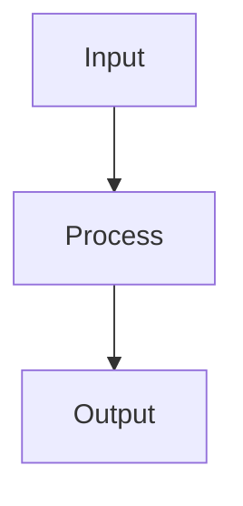

# Activation Functions

## Detailed Explanation

Introduces nonlinearity enabling deep learning...

## Core Intuition

A key technique in machine learning.

## How It Works

1. Step 1
2. Step 2
3. Step 3



## Architecture / Trade-offs

Trade-off 1 vs trade-off 2

## Interview Q&A

**Q: When would you use Activation Functions?**
A: Context-dependent, varies by problem type.

**Q: What are the main trade-offs?**
A: Refer to Architecture / Trade-offs section above.

**Q: How do you choose hyperparameters?**
A: Cross-validation, grid/random/Bayesian search, domain knowledge.

**Q: What are common failure modes?**
A: Refer to Common Pitfalls section below.

## Best Practices

- Practice 1
- Practice 2
- Practice 3

## Common Pitfalls

- Pitfall 1
- Pitfall 2


## Code Examples

### Example 1: Activation Functions Comparison

```python
import numpy as np
import matplotlib.pyplot as plt

z = np.linspace(-5, 5, 100)

relu = np.maximum(0, z)
sigmoid = 1 / (1 + np.exp(-z))
tanh = np.tanh(z)
elu = np.where(z > 0, z, 0.1 * (np.exp(z) - 1))

plt.figure(figsize=(12, 4))
plt.plot(z, relu, label='ReLU')
plt.plot(z, sigmoid, label='Sigmoid')
plt.plot(z, tanh, label='Tanh')
plt.plot(z, elu, label='ELU')
plt.xlabel('z'), plt.ylabel('f(z)')
plt.legend(), plt.title('Activation Functions')
plt.grid(), plt.show()
```

### Example 2: Dying ReLU Problem

```python
# Demonstrate dying ReLU
X_biased = X - 10  # Shift to negative region

relu_layer = nn.ReLU()
sigmoid_layer = nn.Sigmoid()

with torch.no_grad():
    X_torch = torch.FloatTensor(X_biased)
    relu_out = relu_layer(X_torch)
    sigmoid_out = sigmoid_layer(X_torch)

relu_dead = (relu_out == 0).sum() / relu_out.numel()
print(f"Dead ReLU percentage: {relu_dead:.1%}")
print(f"Sigmoid output min: {sigmoid_out.min():.4f}, max: {sigmoid_out.max():.4f}")
```

### Example 3: LeakyReLU vs ReLU

```python
from torch.nn import LeakyReLU

leaky_relu = LeakyReLU(negative_slope=0.1)
relu = nn.ReLU()

X_test_negative = torch.FloatTensor(X_biased)
relu_out = relu(X_test_negative)
leaky_out = leaky_relu(X_test_negative)

print(f"ReLU dead neurons: {(relu_out == 0).sum()}")
print(f"LeakyReLU dead neurons: {(leaky_out == 0).sum()}")
print(f"LeakyReLU allows gradients for negative inputs!")
```

## Related Concepts

- [Gradient Descent](./01-gradient-descent.md)
- [Cross-Validation](./22-cross-validation.md)
- [Hyperparameter Tuning](./26-hyperparameter-tuning.md)
