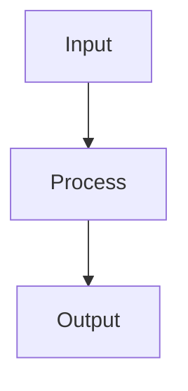

# Activation Functions

## Detailed Explanation

Introduces nonlinearity enabling deep learning...

## Core Intuition

A key technique in machine learning.

## How It Works

1. Receive pre-activation value z = w·x + b (weighted sum of inputs)
2. Apply the non-linear activation function: a = σ(z)
3. For ReLU: a = max(0, z) — zero for negative inputs, identity for positive
4. For sigmoid: a = 1/(1+e⁻ᶻ) — squashes output to (0,1), used for binary output
5. For softmax (output layer): aₖ = e^(zₖ)/Σⱼ e^(zⱼ) — produces probability distribution over K classes
6. The activation's derivative σ'(z) is used in backpropagation: δ = δ_next · σ'(z)
7. Choice of activation affects gradient flow — ReLU avoids vanishing gradients; sigmoid causes them in deep networks



## Architecture / Trade-offs

Trade-off 1 vs trade-off 2

## Interview Q&A

**Q: When would you use Activation Functions?**
A: Context-dependent, varies by problem type.

**Q: What are the main trade-offs?**
A: Refer to Architecture / Trade-offs section above.

**Q: How do you choose hyperparameters?**
A: Cross-validation, grid/random/Bayesian search, domain knowledge.

**Q: What are common failure modes?**
A: Refer to Common Pitfalls section below.

## Best Practices

- Use ReLU as default for hidden layers in feedforward networks
- Use GELU for transformers and attention-based models (standard in BERT/GPT)
- Use sigmoid only for binary output layer probabilities
- Use softmax only for multiclass output layer
- Use tanh for RNNs where negative outputs matter
- Monitor dead neuron rate (fraction with zero gradient) when using ReLU
- Try Swish/Mish if ReLU is causing issues — often small accuracy gains

## Common Pitfalls

- Using sigmoid in hidden layers of deep networks — vanishing gradient kills learning
- Dead ReLU neurons (always outputting 0) caused by high learning rates or bad initialization
- Applying softmax in hidden layers instead of output — it squashes gradients
- Forgetting that activation choice affects initialization — must pair ReLU with He init


## Code Examples

### Example 1: Activation Functions Comparison

```python
import numpy as np
import matplotlib.pyplot as plt

z = np.linspace(-5, 5, 100)

relu = np.maximum(0, z)
sigmoid = 1 / (1 + np.exp(-z))
tanh = np.tanh(z)
elu = np.where(z > 0, z, 0.1 * (np.exp(z) - 1))

plt.figure(figsize=(12, 4))
plt.plot(z, relu, label='ReLU')
plt.plot(z, sigmoid, label='Sigmoid')
plt.plot(z, tanh, label='Tanh')
plt.plot(z, elu, label='ELU')
plt.xlabel('z'), plt.ylabel('f(z)')
plt.legend(), plt.title('Activation Functions')
plt.grid(), plt.show()
```

### Example 2: Dying ReLU Problem

```python
# Demonstrate dying ReLU
X_biased = X - 10  # Shift to negative region

relu_layer = nn.ReLU()
sigmoid_layer = nn.Sigmoid()

with torch.no_grad():
    X_torch = torch.FloatTensor(X_biased)
    relu_out = relu_layer(X_torch)
    sigmoid_out = sigmoid_layer(X_torch)

relu_dead = (relu_out == 0).sum() / relu_out.numel()
print(f"Dead ReLU percentage: {relu_dead:.1%}")
print(f"Sigmoid output min: {sigmoid_out.min():.4f}, max: {sigmoid_out.max():.4f}")
```

### Example 3: LeakyReLU vs ReLU

```python
from torch.nn import LeakyReLU

leaky_relu = LeakyReLU(negative_slope=0.1)
relu = nn.ReLU()

X_test_negative = torch.FloatTensor(X_biased)
relu_out = relu(X_test_negative)
leaky_out = leaky_relu(X_test_negative)

print(f"ReLU dead neurons: {(relu_out == 0).sum()}")
print(f"LeakyReLU dead neurons: {(leaky_out == 0).sum()}")
print(f"LeakyReLU allows gradients for negative inputs!")
```

## Related Concepts

- [Gradient Descent](./01-gradient-descent.md)
- [Cross-Validation](./22-cross-validation.md)
- [Hyperparameter Tuning](./26-hyperparameter-tuning.md)
