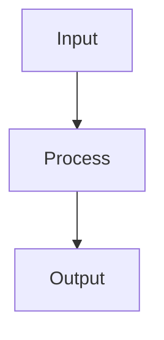

# Weight Initialization

## Detailed Explanation

Careful initialization prevents vanishing/exploding gradients...

## Core Intuition

A key technique in machine learning.

## How It Works

1. Step 1
2. Step 2
3. Step 3



## Architecture / Trade-offs

Trade-off 1 vs trade-off 2

## Interview Q&A

**Q: When would you use Weight Initialization?**
A: Context-dependent, varies by problem type.

**Q: What are the main trade-offs?**
A: Refer to Architecture / Trade-offs section above.

**Q: How do you choose hyperparameters?**
A: Cross-validation, grid/random/Bayesian search, domain knowledge.

**Q: What are common failure modes?**
A: Refer to Common Pitfalls section below.

## Best Practices

- Practice 1
- Practice 2
- Practice 3

## Common Pitfalls

- Pitfall 1
- Pitfall 2


## Code Examples

### Example 1: Xavier Initialization

```python
import numpy as np

def xavier_init(n_in, n_out):
    limit = np.sqrt(6 / (n_in + n_out))
    return np.random.uniform(-limit, limit, (n_in, n_out))

# Compare variance with different initializations
n_layers = 10
n_neurons = 100

random_std = 0.01
random_init = [np.random.randn(n_neurons, n_neurons) * random_std for _ in range(n_layers)]

xavier_init_weights = [xavier_init(n_neurons, n_neurons) for _ in range(n_layers)]

# Check activation variance through layers
random_activations = [np.random.randn(1000, n_neurons)]
xavier_activations = [np.random.randn(1000, n_neurons)]

for i in range(n_layers - 1):
    random_activations.append(np.maximum(0, random_activations[-1] @ random_init[i]))
    xavier_activations.append(np.maximum(0, xavier_activations[-1] @ xavier_init_weights[i]))

print("Random init - Activation variance per layer:", [np.var(a) for a in random_activations[:3]])
print("Xavier init - Activation variance per layer:", [np.var(a) for a in xavier_activations[:3]])
```

### Example 2: He Initialization for ReLU

```python
def he_init(n_in):
    return np.random.randn(n_in, n_in) * np.sqrt(2 / n_in)

he_weights = [he_init(n_neurons) for _ in range(n_layers)]
he_activations = [np.random.randn(1000, n_neurons)]

for i in range(n_layers - 1):
    he_activations.append(np.maximum(0, he_activations[-1] @ he_weights[i]))

print("He init - Activation variance per layer:", [np.var(a) for a in he_activations[:5]])
```

### Example 3: Impact on Training

```python
# Show impact on gradient flow
W_small = np.random.randn(100, 100) * 0.001
W_large = np.random.randn(100, 100) * 10
W_proper = np.random.randn(100, 100) * np.sqrt(2/100)

X_sample = np.random.randn(1, 100)

# Forward pass
z_small = X_sample @ W_small
z_large = X_sample @ W_large
z_proper = X_sample @ W_proper

print(f"Small init - z std: {np.std(z_small):.6f}")
print(f"Large init - z std: {np.std(z_large):.4f}")
print(f"Proper init - z std: {np.std(z_proper):.4f}")
```

## Related Concepts

- [Gradient Descent](./01-gradient-descent.md)
- [Cross-Validation](./22-cross-validation.md)
- [Hyperparameter Tuning](./26-hyperparameter-tuning.md)
