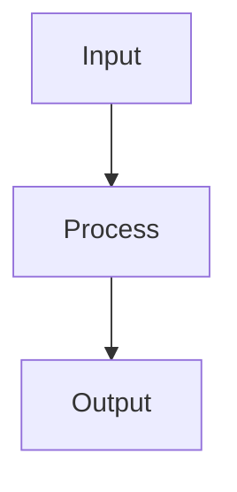

# Weight Initialization

## Detailed Explanation

Neural networks are sensitive to initialization: poor initialization can cause vanishing/exploding gradients even with good architectures and learning rates. Xavier initialization (also Glorot) scales initial weights inversely to the number of inputs, maintaining gradient magnitudes. He initialization is similar but scaled for ReLU activations. Bad initialization (too large) causes exploding gradients, (too small) causes vanishing gradients. Biases are typically initialized to zero.

The intuition is that initial weights should preserve gradient variance: if x has variance σ², then w·x should have similar variance. With fanin inputs, weights should have variance ≈ 1/fanin. Modern frameworks default to sensible initialization, but understanding this explains why networks fail to train sometimes. Orthogonal initialization (weights are orthogonal matrices) is elegant but less commonly used. Layer normalization makes initialization less critical by normalizing activations to fixed statistics.

Weight initialization is one of those details often overlooked because frameworks handle it. However, understanding why it matters explains training failures. Initialization affects how long the network takes to converge and sometimes whether it converges at all. Combined with batch normalization and ReLU activations, initialization is less critical, but understanding the principles helps debug networks that aren't training.

## Core Intuition

Weight initialization is like starting a game with different initial conditions: too heavy initial weights lead to extreme predictions immediately (exploding gradients), too light initial weights lead to barely-moving outputs (vanishing gradients). Proper initialization keeps gradients flowing smoothly so the network can learn.

## How It Works

1. Before training begins, assign initial values to all weight matrices W and bias vectors b
2. Set biases to zero — this is always safe and standard
3. For Xavier/Glorot initialization (tanh, sigmoid): draw W from Uniform(−√(6/(nᵢₙ+nₒᵤₜ)), √(6/(nᵢₙ+nₒᵤₜ))) or Normal(0, √(2/(nᵢₙ+nₒᵤₜ)))
4. For He initialization (ReLU): draw W from Normal(0, √(2/nᵢₙ)) — accounts for ReLU zeroing half the neurons
5. The goal is to keep activation variance stable across layers: Var(a^l) ≈ Var(a^(l-1))
6. Poor initialization (too large → exploding activations, too small → vanishing gradients) prevents gradient flow
7. Verify initialization quality by checking that activation statistics (mean, std) are reasonable in the first forward pass



## Architecture / Trade-offs

Trade-off 1 vs trade-off 2

## Interview Q&A

**Q: Why does zero initialization fail for neural networks?**
A: If all weights start at zero, every neuron in a layer computes identical outputs (symmetry), receives identical gradients during backprop, and updates identically — they never differentiate. The network effectively has only one neuron per layer regardless of width. Breaking symmetry requires random initialization. Biases can be zero because the weight randomness already breaks symmetry.

**Q: What is the intuition behind He and Xavier initialization?**
A: Both aim to keep activation variance stable across layers: Var(output) ≈ Var(input). If variance grows, activations saturate or explode; if it shrinks, gradients vanish. Xavier assumes symmetric activations (tanh) where the full neuron output is used. He accounts for ReLU zeroing ~half its inputs, requiring twice the variance to compensate (factor of 2/n_in instead of 1/n_in).

**Q: How would you diagnose a weight initialization problem in a deep network?**
A: After the first forward pass (before any training), inspect activation statistics: (1) plot histogram of activations in each layer — should be roughly Gaussian, centered near zero; (2) check for all-zero layers (dead ReLU from bad init) or all-saturated layers (sigmoid/tanh with too-large init); (3) check gradient norms — should be similar magnitude across layers. Frameworks like PyTorch autograd make this easy.

**Q: What special initialization do transformers use and why?**
A: Transformers often use truncated normal with std=0.02 (GPT-2, BERT). The output projections of attention and MLP blocks are sometimes initialized with 1/√(2·n_layers) scaling to prevent the residual stream variance from growing with depth (similar to how GPT-2 scales by 1/√n). This "depth scaling" is critical for training very deep transformers (12-96 layers) stably.

**Q: When does initialization matter less?**
A: With batch normalization or layer normalization, initialization matters much less because normalization rescales activations at each layer — the network can recover from poor initialization more easily. With modern adaptive optimizers (Adam) and normalization layers, training is relatively robust to initialization choice. Initialization matters most for plain networks (no BN) or networks trained with SGD.

**Q: What is orthogonal initialization and when is it used?**
A: Orthogonal initialization sets weight matrices to random orthogonal matrices (preserving Euclidean distance), which ensures singular values are all 1 — neither amplifying nor suppressing signals. It's used for RNNs to help gradient flow through many time steps without exploding or vanishing. Also used for some transformer experiments as it provides strong theoretical guarantees about gradient propagation.
## Best Practices

- Use He initialization for ReLU networks; Xavier/Glorot for tanh/sigmoid
- Use PyTorch defaults (Kaiming He) — they are already correct for most architectures
- Never use zero initialization for weights — breaks symmetry and all neurons learn identically
- Small random noise initialization works for shallow networks but fails for deep ones
- Initialize biases to zero — this is fine
- For transformers, follow architecture-specific init (often truncated normal with std=0.02)

## Common Pitfalls

- Zero initialization: all neurons compute identical outputs and receive identical gradients — complete training failure
- Too large initial weights cause exploding activations and NaN loss
- Too small initial weights cause vanishing gradients in deep networks
- Mismatching initialization to activation (e.g., Xavier with ReLU) leads to suboptimal variance scaling


## Code Examples

### Example 1: Xavier Initialization

```python
import numpy as np

def xavier_init(n_in, n_out):
    limit = np.sqrt(6 / (n_in + n_out))
    return np.random.uniform(-limit, limit, (n_in, n_out))

# Compare variance with different initializations
n_layers = 10
n_neurons = 100

random_std = 0.01
random_init = [np.random.randn(n_neurons, n_neurons) * random_std for _ in range(n_layers)]

xavier_init_weights = [xavier_init(n_neurons, n_neurons) for _ in range(n_layers)]

# Check activation variance through layers
random_activations = [np.random.randn(1000, n_neurons)]
xavier_activations = [np.random.randn(1000, n_neurons)]

for i in range(n_layers - 1):
    random_activations.append(np.maximum(0, random_activations[-1] @ random_init[i]))
    xavier_activations.append(np.maximum(0, xavier_activations[-1] @ xavier_init_weights[i]))

print("Random init - Activation variance per layer:", [np.var(a) for a in random_activations[:3]])
print("Xavier init - Activation variance per layer:", [np.var(a) for a in xavier_activations[:3]])
```

### Example 2: He Initialization for ReLU

```python
def he_init(n_in):
    return np.random.randn(n_in, n_in) * np.sqrt(2 / n_in)

he_weights = [he_init(n_neurons) for _ in range(n_layers)]
he_activations = [np.random.randn(1000, n_neurons)]

for i in range(n_layers - 1):
    he_activations.append(np.maximum(0, he_activations[-1] @ he_weights[i]))

print("He init - Activation variance per layer:", [np.var(a) for a in he_activations[:5]])
```

### Example 3: Impact on Training

```python
# Show impact on gradient flow
W_small = np.random.randn(100, 100) * 0.001
W_large = np.random.randn(100, 100) * 10
W_proper = np.random.randn(100, 100) * np.sqrt(2/100)

X_sample = np.random.randn(1, 100)

# Forward pass
z_small = X_sample @ W_small
z_large = X_sample @ W_large
z_proper = X_sample @ W_proper

print(f"Small init - z std: {np.std(z_small):.6f}")
print(f"Large init - z std: {np.std(z_large):.4f}")
print(f"Proper init - z std: {np.std(z_proper):.4f}")
```

## Related Concepts

- [Gradient Descent](./01-gradient-descent.md)
- [Cross-Validation](./22-cross-validation.md)
- [Hyperparameter Tuning](./26-hyperparameter-tuning.md)
