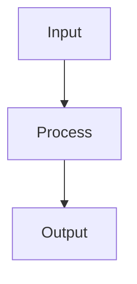

# Regularization

## Detailed Explanation

Prevents overfitting via L1, L2, dropout, early stopping...

## Core Intuition

A key technique in machine learning.

## How It Works

1. Step 1
2. Step 2
3. Step 3



## Architecture / Trade-offs

Trade-off 1 vs trade-off 2

## Interview Q&A

**Q: When would you use Regularization?**
A: Context-dependent, varies by problem type.

**Q: What are the main trade-offs?**
A: Refer to Architecture / Trade-offs section above.

**Q: How do you choose hyperparameters?**
A: Cross-validation, grid/random/Bayesian search, domain knowledge.

**Q: What are common failure modes?**
A: Refer to Common Pitfalls section below.

## Best Practices

- Practice 1
- Practice 2
- Practice 3

## Common Pitfalls

- Pitfall 1
- Pitfall 2


## Code Examples

### Example 1: L1 vs L2 Regularization

```python
from sklearn.linear_model import Ridge, Lasso

X_train, X_test, y_train, y_test = train_test_split(X, y, test_size=0.2, random_state=42)

ridge = Ridge(alpha=0.1).fit(X_train, y_train)
lasso = Lasso(alpha=0.01).fit(X_train, y_train)

print("Ridge weights:", ridge.coef_)
print("Lasso weights:", lasso.coef_)
print(f"Lasso sparsity: {np.sum(lasso.coef_ == 0)} zeros")
print(f"Ridge - Train: {ridge.score(X_train, y_train):.4f}, Test: {ridge.score(X_test, y_test):.4f}")
print(f"Lasso - Train: {lasso.score(X_train, y_train):.4f}, Test: {lasso.score(X_test, y_test):.4f}")
```

### Example 2: Dropout in PyTorch

```python
import torch.nn as nn

class RegularizedNN(nn.Module):
    def __init__(self, dropout_p=0.5):
        super().__init__()
        self.fc1 = nn.Linear(4, 10)
        self.dropout = nn.Dropout(dropout_p)
        self.fc2 = nn.Linear(10, 3)

    def forward(self, x):
        x = torch.relu(self.fc1(x))
        x = self.dropout(x)  # Random deactivation during training
        return self.fc2(x)

model = RegularizedNN(dropout_p=0.5)
model.train()  # Dropout active
model.eval()   # Dropout inactive (testing)
```

### Example 3: Early Stopping

```python
from sklearn.neural_network import MLPClassifier

mlp = MLPClassifier(hidden_layer_sizes=(100,), early_stopping=True,
                    validation_fraction=0.2, n_iter_no_change=20)
mlp.fit(X_train, y_train)

print(f"Training epochs: {mlp.n_iter_}")
print(f"Test score: {mlp.score(X_test, y_test):.4f}")
```

## Related Concepts

- [Gradient Descent](./01-gradient-descent.md)
- [Cross-Validation](./22-cross-validation.md)
- [Hyperparameter Tuning](./26-hyperparameter-tuning.md)
