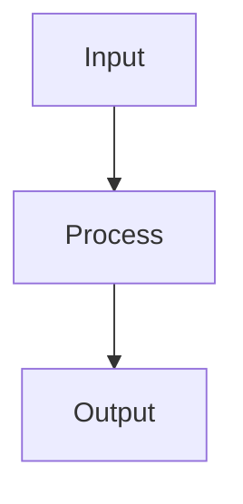

# Regularization

## Detailed Explanation

Regularization prevents overfitting by penalizing model complexity, encouraging simpler models that generalize better. L2 regularization (ridge) adds penalty proportional to squared weights, shrinking large weights but keeping all features. L1 regularization (lasso) adds penalty proportional to absolute weights, driving some weights exactly to zero (feature selection). L1 produces sparse solutions; L2 produces small but non-zero weights. Dropout randomly zeros activations during training (preventing co-adaptation), then scales by dropout rate at test time to compensate. Early stopping stops training when validation performance plateaus.

The regularization-generalization connection is fundamental: more parameters fit training data better but generalize worse. Regularization trades training performance for generalization. The regularization strength λ is a hyperparameter: high λ enforces strong regularization (underfitting risk), low λ weak regularization (overfitting risk). Different problems need different λ values; empirically finding the right trade-off is crucial. Dropout is applied per-layer and acts somewhat like averaging ensemble predictions, explaining its regularization effect.

Regularization is one of the most important tools in machine learning, yet often underappreciated. The difference between a model that overfits (memorizes) and one that generalizes is often just the right regularization. Understanding the L1 vs L2 distinction helps choose: use L1 for automatic feature selection, L2 for smoother regularization. Dropout is particularly important in deep learning—modern networks often require dropout to generalize. Practitioners should understand that regularization isn't just a technical detail but a core concept in machine learning.

## Core Intuition

Regularization is like penalizing complexity: L2 is like 'keep weights small', L1 is like 'remove unnecessary features entirely', dropout is like 'hide random neurons to prevent over-reliance on specific features'. All prevent the model from memorizing training data by constraining what it can learn.

## How It Works

1. Define the base loss function L(θ) (e.g., cross-entropy or MSE)
2. Add a regularization term: L_reg(θ) = L(θ) + λ·Ω(θ)
3. For L2 (Ridge/weight decay): Ω(θ) = ½‖θ‖² — penalizes large weights, shrinks them toward zero
4. For L1 (Lasso): Ω(θ) = ‖θ‖₁ — induces sparsity, drives some weights exactly to zero
5. For dropout: during each forward pass, randomly set each neuron's output to zero with probability p; scale remaining by 1/(1−p)
6. For early stopping: monitor validation loss; stop training when validation loss stops improving for patience epochs
7. Update regularized gradient: ∂L_reg/∂W = ∂L/∂W + λW (for L2), then apply optimizer update



## Architecture / Trade-offs

Trade-off 1 vs trade-off 2

## Interview Q&A

**Q: What is the difference between L1 and L2 regularization in terms of the solution they produce?**
A: L2 (Ridge) penalizes the sum of squared weights — it shrinks all weights toward zero but rarely to exactly zero, producing dense solutions. L1 (Lasso) penalizes the sum of absolute values — it produces sparse solutions with many weights exactly zero because the gradient of |w| is constant (not proportional to w), creating a tendency to eliminate small weights entirely. L1 is better for feature selection; L2 for general regularization.

**Q: Why does dropout work as a regularizer?**
A: Dropout prevents co-adaptation: neurons can't rely on specific other neurons always being present, so each learns more robust, independent features. This approximates training an ensemble of 2^n different architectures (all subnetworks of the full network), and using all weights at inference (scaled by 1-p) approximates averaging their predictions. The regularization effect is similar to noise injection and weight sharing.

**Q: When should you use early stopping vs explicit regularization (L2/dropout)?**
A: Use early stopping as a free baseline — it's always safe and costs nothing. Add L2/dropout when early stopping alone isn't sufficient. Early stopping is coarser (controls total training steps), while L2/dropout control model capacity more precisely. For deep learning, combine all three: use dropout in the architecture, L2 (weight_decay) in the optimizer, and early stopping to select the best checkpoint.

**Q: How does the dropout rate affect training vs inference behavior?**
A: During training, each neuron is dropped with probability p — effectively training a different subnetwork each step. During inference, dropout is disabled (model.eval()) and weights are scaled by (1-p) to maintain expected activation magnitude. Forgetting model.eval() is a common bug that adds noise to inference predictions. Higher dropout (0.5) gives more regularization but requires more training; lower (0.1-0.2) is standard for CNNs.

**Q: What is weight decay and how does it relate to L2 regularization?**
A: Weight decay directly multiplies weights by (1 - α·λ) at each step: w ← (1-λ)w - α·∇L. L2 regularization adds λ‖w‖²/2 to the loss, which produces a gradient -λw, giving the same update with standard optimizers (SGD). However, with adaptive optimizers like Adam, L2 regularization gets scaled by the adaptive learning rate, weakening its effect — hence AdamW implements true weight decay separately from gradient updates.

**Q: How would you choose the regularization strength (lambda/C)?**
A: Always use cross-validation on a log scale (1e-5, 1e-4, ..., 1, 10). Plot val error vs lambda to find the sweet spot — too small: overfitting; too large: underfitting. For neural networks, start with weight_decay=1e-4 and dropout=0.2-0.5 as defaults. Monitor the training-validation gap: if large, increase regularization; if small but both losses are high, decrease regularization.
## Best Practices

- Start with L2 (weight decay) — it's differentiable and works well with Adam
- Use dropout rate 0.1-0.3 for convolutional layers, 0.3-0.5 for dense layers
- Combine early stopping + L2 for best generalization
- Set weight_decay in optimizer (AdamW) rather than adding L2 manually
- Use data augmentation as implicit regularization for images and text
- Apply gradient clipping (max_norm=1.0) alongside regularization for RNNs
- Monitor train-val gap — large gap = underregularized, small gap but high loss = overregularized

## Common Pitfalls

- Adding L1 regularization to Adam breaks adaptive learning rates — use AdamW with L2 instead
- Dropout during inference without model.eval() adds noise to predictions
- Too high regularization causes underfitting — tune with cross-validation
- Applying dropout before batch norm breaks the normalization statistics


## Code Examples

### Example 1: L1 vs L2 Regularization

```python
from sklearn.linear_model import Ridge, Lasso

X_train, X_test, y_train, y_test = train_test_split(X, y, test_size=0.2, random_state=42)

ridge = Ridge(alpha=0.1).fit(X_train, y_train)
lasso = Lasso(alpha=0.01).fit(X_train, y_train)

print("Ridge weights:", ridge.coef_)
print("Lasso weights:", lasso.coef_)
print(f"Lasso sparsity: {np.sum(lasso.coef_ == 0)} zeros")
print(f"Ridge - Train: {ridge.score(X_train, y_train):.4f}, Test: {ridge.score(X_test, y_test):.4f}")
print(f"Lasso - Train: {lasso.score(X_train, y_train):.4f}, Test: {lasso.score(X_test, y_test):.4f}")
```

### Example 2: Dropout in PyTorch

```python
import torch.nn as nn

class RegularizedNN(nn.Module):
    def __init__(self, dropout_p=0.5):
        super().__init__()
        self.fc1 = nn.Linear(4, 10)
        self.dropout = nn.Dropout(dropout_p)
        self.fc2 = nn.Linear(10, 3)

    def forward(self, x):
        x = torch.relu(self.fc1(x))
        x = self.dropout(x)  # Random deactivation during training
        return self.fc2(x)

model = RegularizedNN(dropout_p=0.5)
model.train()  # Dropout active
model.eval()   # Dropout inactive (testing)
```

### Example 3: Early Stopping

```python
from sklearn.neural_network import MLPClassifier

mlp = MLPClassifier(hidden_layer_sizes=(100,), early_stopping=True,
                    validation_fraction=0.2, n_iter_no_change=20)
mlp.fit(X_train, y_train)

print(f"Training epochs: {mlp.n_iter_}")
print(f"Test score: {mlp.score(X_test, y_test):.4f}")
```

## Related Concepts

- [Gradient Descent](./01-gradient-descent.md)
- [Cross-Validation](./22-cross-validation.md)
- [Hyperparameter Tuning](./26-hyperparameter-tuning.md)
