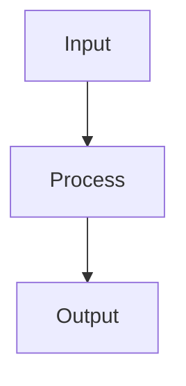

# Regularization

## Detailed Explanation

Prevents overfitting via L1, L2, dropout, early stopping...

## Core Intuition

A key technique in machine learning.

## How It Works

1. Define the base loss function L(θ) (e.g., cross-entropy or MSE)
2. Add a regularization term: L_reg(θ) = L(θ) + λ·Ω(θ)
3. For L2 (Ridge/weight decay): Ω(θ) = ½‖θ‖² — penalizes large weights, shrinks them toward zero
4. For L1 (Lasso): Ω(θ) = ‖θ‖₁ — induces sparsity, drives some weights exactly to zero
5. For dropout: during each forward pass, randomly set each neuron's output to zero with probability p; scale remaining by 1/(1−p)
6. For early stopping: monitor validation loss; stop training when validation loss stops improving for patience epochs
7. Update regularized gradient: ∂L_reg/∂W = ∂L/∂W + λW (for L2), then apply optimizer update



## Architecture / Trade-offs

Trade-off 1 vs trade-off 2

## Interview Q&A

**Q: When would you use Regularization?**
A: Context-dependent, varies by problem type.

**Q: What are the main trade-offs?**
A: Refer to Architecture / Trade-offs section above.

**Q: How do you choose hyperparameters?**
A: Cross-validation, grid/random/Bayesian search, domain knowledge.

**Q: What are common failure modes?**
A: Refer to Common Pitfalls section below.

## Best Practices

- Start with L2 (weight decay) — it's differentiable and works well with Adam
- Use dropout rate 0.1-0.3 for convolutional layers, 0.3-0.5 for dense layers
- Combine early stopping + L2 for best generalization
- Set weight_decay in optimizer (AdamW) rather than adding L2 manually
- Use data augmentation as implicit regularization for images and text
- Apply gradient clipping (max_norm=1.0) alongside regularization for RNNs
- Monitor train-val gap — large gap = underregularized, small gap but high loss = overregularized

## Common Pitfalls

- Adding L1 regularization to Adam breaks adaptive learning rates — use AdamW with L2 instead
- Dropout during inference without model.eval() adds noise to predictions
- Too high regularization causes underfitting — tune with cross-validation
- Applying dropout before batch norm breaks the normalization statistics


## Code Examples

### Example 1: L1 vs L2 Regularization

```python
from sklearn.linear_model import Ridge, Lasso

X_train, X_test, y_train, y_test = train_test_split(X, y, test_size=0.2, random_state=42)

ridge = Ridge(alpha=0.1).fit(X_train, y_train)
lasso = Lasso(alpha=0.01).fit(X_train, y_train)

print("Ridge weights:", ridge.coef_)
print("Lasso weights:", lasso.coef_)
print(f"Lasso sparsity: {np.sum(lasso.coef_ == 0)} zeros")
print(f"Ridge - Train: {ridge.score(X_train, y_train):.4f}, Test: {ridge.score(X_test, y_test):.4f}")
print(f"Lasso - Train: {lasso.score(X_train, y_train):.4f}, Test: {lasso.score(X_test, y_test):.4f}")
```

### Example 2: Dropout in PyTorch

```python
import torch.nn as nn

class RegularizedNN(nn.Module):
    def __init__(self, dropout_p=0.5):
        super().__init__()
        self.fc1 = nn.Linear(4, 10)
        self.dropout = nn.Dropout(dropout_p)
        self.fc2 = nn.Linear(10, 3)

    def forward(self, x):
        x = torch.relu(self.fc1(x))
        x = self.dropout(x)  # Random deactivation during training
        return self.fc2(x)

model = RegularizedNN(dropout_p=0.5)
model.train()  # Dropout active
model.eval()   # Dropout inactive (testing)
```

### Example 3: Early Stopping

```python
from sklearn.neural_network import MLPClassifier

mlp = MLPClassifier(hidden_layer_sizes=(100,), early_stopping=True,
                    validation_fraction=0.2, n_iter_no_change=20)
mlp.fit(X_train, y_train)

print(f"Training epochs: {mlp.n_iter_}")
print(f"Test score: {mlp.score(X_test, y_test):.4f}")
```

## Related Concepts

- [Gradient Descent](./01-gradient-descent.md)
- [Cross-Validation](./22-cross-validation.md)
- [Hyperparameter Tuning](./26-hyperparameter-tuning.md)
