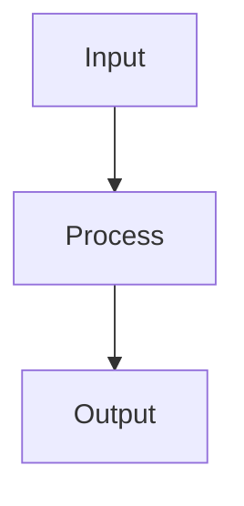

# Batch Normalization

## Detailed Explanation

Normalizes layer inputs for stable training...

## Core Intuition

A key technique in machine learning.

## How It Works

1. Step 1
2. Step 2
3. Step 3



## Architecture / Trade-offs

Trade-off 1 vs trade-off 2

## Interview Q&A

**Q: When would you use Batch Normalization?**
A: Context-dependent, varies by problem type.

**Q: What are the main trade-offs?**
A: Refer to Architecture / Trade-offs section above.

**Q: How do you choose hyperparameters?**
A: Cross-validation, grid/random/Bayesian search, domain knowledge.

**Q: What are common failure modes?**
A: Refer to Common Pitfalls section below.

## Best Practices

- Practice 1
- Practice 2
- Practice 3

## Common Pitfalls

- Pitfall 1
- Pitfall 2


## Code Examples

### Example 1: Batch Normalization Layer

```python
import torch
import torch.nn as nn

class BatchNormNN(nn.Module):
    def __init__(self):
        super().__init__()
        self.fc1 = nn.Linear(4, 10)
        self.bn1 = nn.BatchNorm1d(10)
        self.fc2 = nn.Linear(10, 3)

    def forward(self, x):
        x = self.fc1(x)
        x = self.bn1(x)  # Normalize before activation
        x = torch.relu(x)
        return self.fc2(x)

model = BatchNormNN()
print("Model with batch normalization created")
```

### Example 2: BN Effect on Training

```python
# Without and with batch norm
X_tensor = torch.FloatTensor(X_train)
y_tensor = torch.LongTensor(y_train)

model_no_bn = SimpleNN()
model_with_bn = BatchNormNN()

criterion = nn.CrossEntropyLoss()
opt_no_bn = torch.optim.Adam(model_no_bn.parameters(), lr=0.01)
opt_with_bn = torch.optim.Adam(model_with_bn.parameters(), lr=0.01)

losses_no_bn, losses_with_bn = [], []
for epoch in range(100):
    # Without BN
    opt_no_bn.zero_grad()
    out = model_no_bn(X_tensor)
    loss = criterion(out, y_tensor)
    loss.backward()
    opt_no_bn.step()
    losses_no_bn.append(loss.item())

    # With BN
    opt_with_bn.zero_grad()
    out = model_with_bn(X_tensor)
    loss = criterion(out, y_tensor)
    loss.backward()
    opt_with_bn.step()
    losses_with_bn.append(loss.item())

plt.plot(losses_no_bn, label='Without BN')
plt.plot(losses_with_bn, label='With BN')
plt.legend(), plt.title('Effect of Batch Normalization')
plt.show()
```

### Example 3: Layer Normalization

```python
# For smaller batches, use layer norm instead
class LayerNormNN(nn.Module):
    def __init__(self):
        super().__init__()
        self.fc1 = nn.Linear(4, 10)
        self.ln1 = nn.LayerNorm(10)
        self.fc2 = nn.Linear(10, 3)

    def forward(self, x):
        x = torch.relu(self.ln1(self.fc1(x)))
        return self.fc2(x)

model = LayerNormNN()
print("Layer norm (batch-size independent) created")
```

## Related Concepts

- [Gradient Descent](./01-gradient-descent.md)
- [Cross-Validation](./22-cross-validation.md)
- [Hyperparameter Tuning](./26-hyperparameter-tuning.md)
