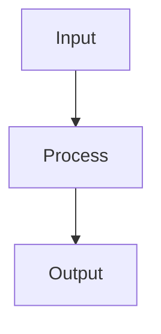

# K-Means Clustering

## Detailed Explanation

Partitions data minimizing within-cluster sum of squares...

## Core Intuition

A key technique in machine learning.

## How It Works

1. Step 1
2. Step 2
3. Step 3



## Architecture / Trade-offs

Trade-off 1 vs trade-off 2

## Interview Q&A

**Q: When would you use K-Means Clustering?**
A: Context-dependent, varies by problem type.

**Q: What are the main trade-offs?**
A: Refer to Architecture / Trade-offs section above.

**Q: How do you choose hyperparameters?**
A: Cross-validation, grid/random/Bayesian search, domain knowledge.

**Q: What are common failure modes?**
A: Refer to Common Pitfalls section below.

## Best Practices

- Always run k-means++ initialization (default in sklearn) — much better than random
- Run multiple restarts (n_init=10) and keep best inertia
- Scale features before clustering — Euclidean distance is scale-sensitive
- Use elbow method + silhouette score together to pick k
- For large datasets use MiniBatchKMeans — similar results, 10-100x faster
- Visualize clusters in 2D after PCA/t-SNE for sanity check
- Set random_state for reproducibility

## Common Pitfalls

- k-means assumes spherical, equal-size clusters — fails on elongated or irregular shapes
- Sensitive to outliers — one outlier can pull a centroid far from the cluster
- Number of clusters k must be specified — no automatic determination
- Results depend on initialization — always use k-means++ and multiple restarts


## Code Examples

### Example 1: Basic K-Means

```python
from sklearn.cluster import KMeans
from sklearn import datasets

X = datasets.load_iris()[0]

kmeans = KMeans(n_clusters=3, random_state=42)
labels = kmeans.fit_predict(X)

print(f"Cluster sizes: {np.bincount(labels)}")
print(f"Inertia: {kmeans.inertia_:.2f}")
```

### Example 2: Elbow Method

```python
inertias = []
for k in range(1, 10):
    kmeans = KMeans(n_clusters=k, random_state=42)
    kmeans.fit(X)
    inertias.append(kmeans.inertia_)

plt.plot(range(1, 10), inertias, 'o-')
plt.xlabel('k'), plt.ylabel('Inertia')
plt.title('Elbow Method'), plt.show()
```

### Example 3: K-Means++ Initialization

```python
from sklearn.cluster import KMeans

# Standard k-means
km_random = KMeans(n_clusters=3, init='random', n_init=1, random_state=42)
km_random.fit(X)

# K-Means++
km_kpp = KMeans(n_clusters=3, init='k-means++', n_init=10, random_state=42)
km_kpp.fit(X)

print(f"Random init inertia: {km_random.inertia_:.2f}")
print(f"K-means++ inertia: {km_kpp.inertia_:.2f}")
```

## Related Concepts

- [Gradient Descent](./01-gradient-descent.md)
- [Cross-Validation](./22-cross-validation.md)
- [Hyperparameter Tuning](./26-hyperparameter-tuning.md)
