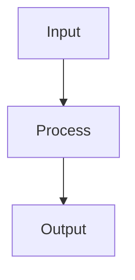

# K-Means Clustering

## Detailed Explanation

Partitions data minimizing within-cluster sum of squares...

## Core Intuition

A key technique in machine learning.

## How It Works

1. Choose k (number of clusters) and initialize k centroids — randomly or using k-means++ (choose each centroid with probability proportional to distance from nearest existing centroid)
2. Assignment step: assign each point xᵢ to the nearest centroid: cᵢ = argminⱼ ‖xᵢ − μⱼ‖²
3. Update step: recompute each centroid as the mean of its assigned points: μⱼ = (1/|Cⱼ|) Σᵢ∈Cⱼ xᵢ
4. Repeat assignment and update steps until centroids stop moving (convergence) or max iterations reached
5. Measure quality with inertia (sum of squared distances to nearest centroid) — lower is better
6. Run multiple restarts with different initializations and keep the result with lowest inertia
7. Select k using the elbow method (inertia vs k curve) or silhouette score (measures cluster cohesion vs separation)



## Architecture / Trade-offs

Trade-off 1 vs trade-off 2

## Interview Q&A

**Q: What are the main failure modes of k-means and when does it break down?**
A: K-means assumes spherical, equal-size, equal-density clusters. It fails on: elongated clusters (use DBSCAN or GMM), clusters of very different sizes (small clusters get absorbed), non-convex shapes (concentric rings), and data with very different feature scales (must standardize first). A single outlier can pull a centroid far from its cluster, effectively emptying it.

**Q: How does k-means++ initialization differ from random initialization, and why does it matter?**
A: Random initialization can place multiple centroids in the same dense region, leaving other clusters unrepresented. K-means++ chooses each centroid with probability proportional to its squared distance from the nearest existing centroid — spreading centroids to cover the data space. This reduces the chance of poor convergence, improves final inertia by 2-5x on average, and is the sklearn default (init='k-means++').

**Q: How would you determine the optimal k for a dataset?**
A: Use the elbow method (plot inertia vs k, find the "elbow" where the curve flattens — diminishing returns) and silhouette score (ranges from -1 to 1; higher is better; peaks at the optimal k). Use both together: inertia always decreases with more k (never use it alone), while silhouette penalizes poor cluster separation. For domain problems, also consider the business interpretation of k clusters.

**Q: What is the time complexity of k-means, and how do you scale it to large datasets?**
A: Standard k-means: O(n·k·d·i) per iteration where n=samples, k=clusters, d=features, i=iterations. For large datasets, MiniBatchKMeans processes random batches of size b per iteration: O(b·k·d·i) — typically 3-10x faster with similar quality. For very large k or d, consider approximate methods or dimensionality reduction before clustering.

**Q: Why must features be scaled before applying k-means?**
A: K-means uses Euclidean distance. A feature with range 0-1000 will dominate over a feature with range 0-1, regardless of their actual importance. Scaling ensures each feature contributes proportionally. Use StandardScaler (zero mean, unit variance) or MinMaxScaler. Failing to scale is one of the most common mistakes — clusters will primarily reflect the high-magnitude features.

**Q: How would you evaluate the quality of k-means clusters when you have no ground truth labels?**
A: Use intrinsic metrics: silhouette score (cohesion vs separation — higher is better), Calinski-Harabasz index (ratio of between-cluster to within-cluster variance — higher is better), Davies-Bouldin index (average similarity of each cluster to its most similar cluster — lower is better). Also visualize in 2D with PCA or t-SNE, and check if clusters make semantic sense in the domain.
## Best Practices

- Always run k-means++ initialization (default in sklearn) — much better than random
- Run multiple restarts (n_init=10) and keep best inertia
- Scale features before clustering — Euclidean distance is scale-sensitive
- Use elbow method + silhouette score together to pick k
- For large datasets use MiniBatchKMeans — similar results, 10-100x faster
- Visualize clusters in 2D after PCA/t-SNE for sanity check
- Set random_state for reproducibility

## Common Pitfalls

- k-means assumes spherical, equal-size clusters — fails on elongated or irregular shapes
- Sensitive to outliers — one outlier can pull a centroid far from the cluster
- Number of clusters k must be specified — no automatic determination
- Results depend on initialization — always use k-means++ and multiple restarts


## Code Examples

### Example 1: Basic K-Means

```python
from sklearn.cluster import KMeans
from sklearn import datasets

X = datasets.load_iris()[0]

kmeans = KMeans(n_clusters=3, random_state=42)
labels = kmeans.fit_predict(X)

print(f"Cluster sizes: {np.bincount(labels)}")
print(f"Inertia: {kmeans.inertia_:.2f}")
```

### Example 2: Elbow Method

```python
inertias = []
for k in range(1, 10):
    kmeans = KMeans(n_clusters=k, random_state=42)
    kmeans.fit(X)
    inertias.append(kmeans.inertia_)

plt.plot(range(1, 10), inertias, 'o-')
plt.xlabel('k'), plt.ylabel('Inertia')
plt.title('Elbow Method'), plt.show()
```

### Example 3: K-Means++ Initialization

```python
from sklearn.cluster import KMeans

# Standard k-means
km_random = KMeans(n_clusters=3, init='random', n_init=1, random_state=42)
km_random.fit(X)

# K-Means++
km_kpp = KMeans(n_clusters=3, init='k-means++', n_init=10, random_state=42)
km_kpp.fit(X)

print(f"Random init inertia: {km_random.inertia_:.2f}")
print(f"K-means++ inertia: {km_kpp.inertia_:.2f}")
```

## Related Concepts

- [Gradient Descent](./01-gradient-descent.md)
- [Cross-Validation](./22-cross-validation.md)
- [Hyperparameter Tuning](./26-hyperparameter-tuning.md)
