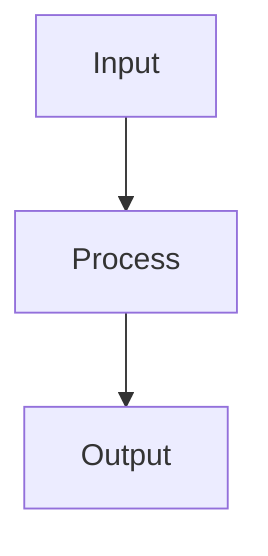

# Dimensionality Reduction

## Detailed Explanation

Finds lower-dimensional representation via PCA, t-SNE, UMAP...

## Core Intuition

A key technique in machine learning.

## How It Works

1. Step 1
2. Step 2
3. Step 3



## Architecture / Trade-offs

Trade-off 1 vs trade-off 2

## Interview Q&A

**Q: When would you use Dimensionality Reduction?**
A: Context-dependent, varies by problem type.

**Q: What are the main trade-offs?**
A: Refer to Architecture / Trade-offs section above.

**Q: How do you choose hyperparameters?**
A: Cross-validation, grid/random/Bayesian search, domain knowledge.

**Q: What are common failure modes?**
A: Refer to Common Pitfalls section below.

## Best Practices

- Always scale features before PCA (StandardScaler)
- Use explained_variance_ratio_ to pick n_components (aim for 90-95% explained variance)
- Use PCA for preprocessing before ML models, t-SNE/UMAP only for visualization
- Set perplexity=30-50 for t-SNE on most datasets
- UMAP is faster than t-SNE and preserves more global structure — prefer it for large datasets
- Use PCA to remove noise before applying t-SNE (reduces compute)
- Set random_state for reproducibility of t-SNE/UMAP

## Common Pitfalls

- t-SNE is non-parametric — you can't transform new points, only fit_transform
- t-SNE distances between clusters are not meaningful — don't interpret cluster separation as distance
- PCA loses non-linear structure — use kernel PCA or autoencoders for non-linear reduction
- Using too many components defeats the purpose — check scree plot


## Code Examples

### Example 1: PCA

```python
from sklearn.decomposition import PCA

pca = PCA(n_components=2)
X_reduced = pca.fit_transform(X)

print(f"Explained variance: {pca.explained_variance_ratio_}")
print(f"Total: {pca.explained_variance_ratio_.sum():.2%}")
```

### Example 2: t-SNE

```python
from sklearn.manifold import TSNE

tsne = TSNE(n_components=2, random_state=42)
X_tsne = tsne.fit_transform(X)

plt.scatter(X_tsne[:, 0], X_tsne[:, 1], c=y, cmap='viridis')
plt.title('t-SNE Visualization'), plt.show()
```

### Example 3: UMAP

```python
from umap import UMAP

umap_reducer = UMAP(n_components=2, random_state=42)
X_umap = umap_reducer.fit_transform(X)

plt.scatter(X_umap[:, 0], X_umap[:, 1], c=y, cmap='viridis')
plt.title('UMAP Visualization'), plt.show()
```

## Related Concepts

- [Gradient Descent](./01-gradient-descent.md)
- [Cross-Validation](./22-cross-validation.md)
- [Hyperparameter Tuning](./26-hyperparameter-tuning.md)
