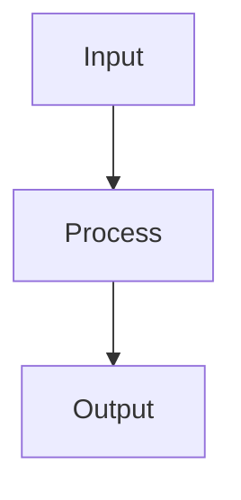

# Dimensionality Reduction

## Detailed Explanation

Dimensionality reduction maps high-dimensional data to lower dimensions while preserving important structure. Principal Component Analysis (PCA) finds orthogonal directions of maximum variance. t-SNE creates 2D visualizations by preserving local structure (nearby points stay nearby) but can't extrapolate beyond training data. UMAP is faster than t-SNE and more faithful to global structure. These methods address curse of dimensionality (in high dimensions, distances become less meaningful) and enable visualization.

PCA is linear (rotation to maximum-variance directions); t-SNE and UMAP are non-linear. PCA is deterministic and interpretable (principal components are weighted combinations of original features); t-SNE and UMAP involve randomness and are less interpretable. PCA is fast and scalable; t-SNE/UMAP are slower. Explained variance ratio measures how much information PCA preserves (cumulative explained variance guides choosing number of components). Feature scaling is critical for PCA.

Dimensionality reduction is useful for visualization (understanding data structure) and sometimes for preprocessing (reducing computational cost, reducing noise by dropping low-variance dimensions). PCA is the classical choice and remains useful. t-SNE is excellent for visualization but can be misleading about global structure. Understanding that different methods preserve different properties helps choose: use PCA for interpretability, t-SNE for visualization, UMAP for balance. Practitioners often apply reduction for visualization without realizing it changes apparent structure.

## Core Intuition

Dimensionality reduction is like taking a high-dimensional photo and printing a 2D picture: some information is lost, but key structures (who's near whom, overall grouping) are preserved. PCA is like rotating to the best viewing angle. t-SNE is like artistic rendering emphasizing details you find interesting.

## How It Works

1. Center the data by subtracting the mean: X_centered = X − mean(X)
2. Compute the covariance matrix: C = (1/(n−1)) X_centeredᵀ X_centered
3. Compute eigenvectors and eigenvalues of C: the eigenvectors are the principal components
4. Sort eigenvectors by decreasing eigenvalue magnitude — they capture the most variance first
5. Select the top k eigenvectors to form projection matrix W (d × k)
6. Project data into the k-dimensional space: Z = X_centered · W
7. The explained variance ratio for each component = eigenvalue / sum(all eigenvalues) — use to choose k (aim for 90-95% cumulative explained variance)



## Architecture / Trade-offs

### Technique Comparison

| Technique | Preserves | Interpretability | Scalability |
|-----------|-----------|-----------------|------------|
| **PCA** | Global variance | High | Excellent |
| **t-SNE** | Local structure | None | Poor |
| **UMAP** | Local + global | Low | Better |

### Information Loss vs Reduction

- **PCA:** Controllable, compute explained variance
- **t-SNE:** High loss, visualization only
- **UMAP:** Lower loss, preserves topology

## Interview Q&A

**Q: When should you use PCA vs t-SNE vs UMAP?**
A: PCA: for preprocessing before ML models (linear, preserves global variance), interpretable components, fast. t-SNE: for visualization only (2D/3D) — it's non-parametric (can't transform new points) and distances between clusters are not meaningful. UMAP: better than t-SNE for visualization (preserves more global structure, faster, can transform new points). Never use t-SNE/UMAP features as input to other models — use PCA for preprocessing.

**Q: What does explained variance ratio tell you in PCA?**
A: Each principal component's explained_variance_ratio_ is that component's eigenvalue divided by the sum of all eigenvalues — it's the fraction of total variance captured by that component. A cumulative explained variance of 95% means you've captured 95% of the information with far fewer dimensions. Plot the cumulative curve (scree plot) and select the "knee" or use the 95% rule to choose n_components.

**Q: How do you choose the number of components for PCA used as preprocessing?**
A: Use cross-validation: fit a pipeline (PCA → model) and evaluate CV performance for n_components in [0.8, 0.9, 0.95, 0.99] (fraction of variance) or a range of integers. More components = less information loss but slower downstream model. Common shortcut: use 95% explained variance as a starting point, then tune. Never just pick a number without validating on downstream model performance.

**Q: What are the limitations of PCA for non-linear data?**
A: PCA only finds linear projections — it can't capture non-linear manifolds (e.g., Swiss roll data). If the data lies on a curved manifold, PCA will project it to a hyperplane, potentially mixing different classes. Solutions: kernel PCA (uses kernel trick to implicitly map to higher dimensions), autoencoders (neural network-based non-linear reduction), or UMAP/t-SNE for visualization. For most practical preprocessing, PCA still works surprisingly well.

**Q: How is t-SNE different from PCA in terms of what it preserves?**
A: PCA preserves global structure (maximizes variance, preserves large pairwise distances) — far-apart points in high dimensions stay far apart. t-SNE preserves local structure — it keeps nearby points together but distorts global distances, so clusters in t-SNE plots may be closer or farther than they actually are. Never interpret t-SNE cluster separation distances as meaningful. t-SNE also uses a probabilistic model (KL divergence between high-dim and 2D neighbor distributions).

**Q: What is the curse of dimensionality and how does dimensionality reduction help?**
A: In high dimensions: (1) all distances become approximately equal — nearest neighbors are not meaningful; (2) volume grows exponentially — data becomes sparse; (3) many features are redundant or noisy — they add variance without signal. Dimensionality reduction removes these redundant/noisy dimensions, making distance metrics meaningful again. For KNN and SVMs, PCA before the model often improves performance significantly.
## Best Practices

- Always scale features before PCA (StandardScaler)
- Use explained_variance_ratio_ to pick n_components (aim for 90-95% explained variance)
- Use PCA for preprocessing before ML models, t-SNE/UMAP only for visualization
- Set perplexity=30-50 for t-SNE on most datasets
- UMAP is faster than t-SNE and preserves more global structure — prefer it for large datasets
- Use PCA to remove noise before applying t-SNE (reduces compute)
- Set random_state for reproducibility of t-SNE/UMAP

## Common Pitfalls

- t-SNE is non-parametric — you can't transform new points, only fit_transform
- t-SNE distances between clusters are not meaningful — don't interpret cluster separation as distance
- PCA loses non-linear structure — use kernel PCA or autoencoders for non-linear reduction
- Using too many components defeats the purpose — check scree plot


## Code Examples

### Example 1: PCA

```python
from sklearn.decomposition import PCA

pca = PCA(n_components=2)
X_reduced = pca.fit_transform(X)

print(f"Explained variance: {pca.explained_variance_ratio_}")
print(f"Total: {pca.explained_variance_ratio_.sum():.2%}")
```

### Example 2: t-SNE

```python
from sklearn.manifold import TSNE

tsne = TSNE(n_components=2, random_state=42)
X_tsne = tsne.fit_transform(X)

plt.scatter(X_tsne[:, 0], X_tsne[:, 1], c=y, cmap='viridis')
plt.title('t-SNE Visualization'), plt.show()
```

### Example 3: UMAP

```python
from umap import UMAP

umap_reducer = UMAP(n_components=2, random_state=42)
X_umap = umap_reducer.fit_transform(X)

plt.scatter(X_umap[:, 0], X_umap[:, 1], c=y, cmap='viridis')
plt.title('UMAP Visualization'), plt.show()
```

## Related Concepts

- [Gradient Descent](./01-gradient-descent.md)
- [Cross-Validation](./22-cross-validation.md)
- [Hyperparameter Tuning](./26-hyperparameter-tuning.md)
