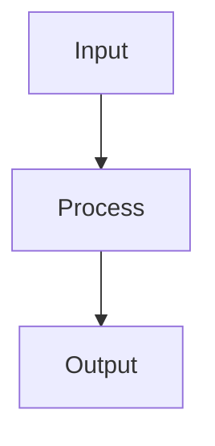

# Gaussian Mixture Models

## Detailed Explanation

Models data as mixture of Gaussians with soft assignments...

## Core Intuition

A key technique in machine learning.

## How It Works

1. Initialize K Gaussian components with means μₖ, covariances Σₖ, and mixing weights πₖ (often via k-means)
2. E-step (Expectation): compute soft assignment (responsibility) of each point to each component: rᵢₖ = πₖ·N(xᵢ|μₖ,Σₖ) / Σⱼ πⱼ·N(xᵢ|μⱼ,Σⱼ)
3. M-step (Maximization): update parameters using the responsibilities as weights: Nₖ = Σᵢ rᵢₖ, μₖ = (1/Nₖ)Σᵢ rᵢₖxᵢ
4. Update covariances: Σₖ = (1/Nₖ) Σᵢ rᵢₖ(xᵢ−μₖ)(xᵢ−μₖ)ᵀ
5. Update mixing weights: πₖ = Nₖ/n
6. Repeat E and M steps until log-likelihood converges: log p(X) = Σᵢ log Σₖ πₖ·N(xᵢ|μₖ,Σₖ)
7. Select K using BIC = −2·log p(X) + K·log(n) — choose K that minimizes BIC



## Architecture / Trade-offs

Trade-off 1 vs trade-off 2

## Interview Q&A

**Q: When would you use Gaussian Mixture Models?**
A: Context-dependent, varies by problem type.

**Q: What are the main trade-offs?**
A: Refer to Architecture / Trade-offs section above.

**Q: How do you choose hyperparameters?**
A: Cross-validation, grid/random/Bayesian search, domain knowledge.

**Q: What are common failure modes?**
A: Refer to Common Pitfalls section below.

## Best Practices

- Use BIC (lower is better) or AIC to select number of components — plot for k=1..15
- Always run multiple restarts (n_init=5-10) — GMM can converge to local optima
- Use covariance_type='full' for flexibility but 'diag' for speed on high-dim data
- Initialize GMM with k-means centroids for better convergence
- Validate with held-out log-likelihood, not just training BIC
- Use soft assignments (predict_proba) when downstream task benefits from uncertainty
- Add regularization_covar=1e-6 to prevent covariance matrices from becoming singular

## Common Pitfalls

- EM algorithm is not guaranteed to find global optimum — always use multiple restarts
- Too many components can overfit — use BIC/AIC to penalize complexity
- Full covariance matrix with high-dimensional data requires many samples to estimate reliably
- Doesn't handle heavy-tailed distributions well — consider t-mixture models


## Code Examples

### Example 1: Basic GMM

```python
from sklearn.mixture import GaussianMixture

gmm = GaussianMixture(n_components=3, random_state=42)
gmm.fit(X)

labels = gmm.predict(X)
probs = gmm.predict_proba(X)

print(f"BIC: {gmm.bic(X):.2f}")
print(f"Soft assignments shape: {probs.shape}
```

### Example 2: Choosing k with BIC

```python
bics = []
for k in range(1, 10):
    gmm = GaussianMixture(n_components=k)
    gmm.fit(X)
    bics.append(gmm.bic(X))

plt.plot(range(1, 10), bics, 'o-')
plt.xlabel('Components'), plt.ylabel('BIC')
plt.show()
```

### Example 3: Soft vs Hard Clustering

```python
hard_labels = gmm.predict(X)
soft_probs = gmm.predict_proba(X)

print(f"Hard assignment example: {hard_labels[0]}")
print(f"Soft assignment example: {soft_probs[0]}")
```

## Related Concepts

- [Gradient Descent](./01-gradient-descent.md)
- [Cross-Validation](./22-cross-validation.md)
- [Hyperparameter Tuning](./26-hyperparameter-tuning.md)
