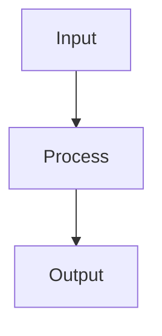

# Gaussian Mixture Models

## Detailed Explanation

Models data as mixture of Gaussians with soft assignments...

## Core Intuition

A key technique in machine learning.

## How It Works

1. Step 1
2. Step 2
3. Step 3



## Architecture / Trade-offs

Trade-off 1 vs trade-off 2

## Interview Q&A

**Q: When would you use Gaussian Mixture Models?**
A: Context-dependent, varies by problem type.

**Q: What are the main trade-offs?**
A: Refer to Architecture / Trade-offs section above.

**Q: How do you choose hyperparameters?**
A: Cross-validation, grid/random/Bayesian search, domain knowledge.

**Q: What are common failure modes?**
A: Refer to Common Pitfalls section below.

## Best Practices

- Practice 1
- Practice 2
- Practice 3

## Common Pitfalls

- Pitfall 1
- Pitfall 2


## Code Examples

### Example 1: Basic GMM

```python
from sklearn.mixture import GaussianMixture

gmm = GaussianMixture(n_components=3, random_state=42)
gmm.fit(X)

labels = gmm.predict(X)
probs = gmm.predict_proba(X)

print(f"BIC: {gmm.bic(X):.2f}")
print(f"Soft assignments shape: {probs.shape}
```

### Example 2: Choosing k with BIC

```python
bics = []
for k in range(1, 10):
    gmm = GaussianMixture(n_components=k)
    gmm.fit(X)
    bics.append(gmm.bic(X))

plt.plot(range(1, 10), bics, 'o-')
plt.xlabel('Components'), plt.ylabel('BIC')
plt.show()
```

### Example 3: Soft vs Hard Clustering

```python
hard_labels = gmm.predict(X)
soft_probs = gmm.predict_proba(X)

print(f"Hard assignment example: {hard_labels[0]}")
print(f"Soft assignment example: {soft_probs[0]}")
```

## Related Concepts

- [Gradient Descent](./01-gradient-descent.md)
- [Cross-Validation](./22-cross-validation.md)
- [Hyperparameter Tuning](./26-hyperparameter-tuning.md)
