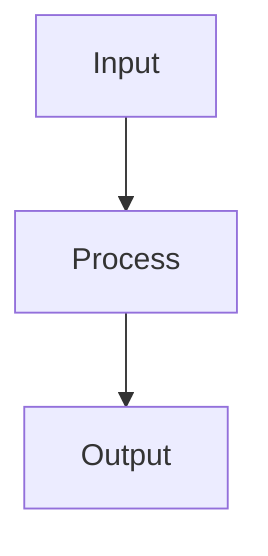

# Gaussian Mixture Models

## Detailed Explanation

Gaussian Mixture Models (GMMs) model data as generated by a mixture of Gaussian distributions, providing soft clustering (probabilities) rather than hard assignments. The EM algorithm learns parameters by iteratively assigning responsibilities (probability of point belonging to cluster) then updating cluster parameters. GMMs generalize K-means (K-means is GMM with fixed covariance), provide probabilistic cluster assignments (useful for uncertainty quantification), and have principled model selection (BIC/AIC).

Training uses Expectation-Maximization (EM): E-step assigns soft responsibilities based on current parameters, M-step updates parameters to maximize expected log-likelihood. Choosing number of clusters is non-trivial; BIC/AIC provide principled selection. Different covariance assumptions (spherical, diagonal, full) provide different trade-offs between flexibility and parameter count. GMMs provide posterior probabilities of cluster membership, enabling probabilistic downstream analysis. Computational cost scales with data size and dimensions; mini-batch EM enables large-scale fitting.

GMMs are more principled than K-means (probabilistic model with likelihood) but require more careful tuning. Understanding the difference between hard clustering (K-means) and soft clustering (GMM) is important: soft assignments are useful when cluster membership is uncertain. The EM algorithm is intellectually elegant (coordinate ascent in the likelihood, guaranteed convergence) and appears in many ML contexts. GMMs work well when data is approximately Gaussian-distributed; if not, other methods might be better.

## Core Intuition

GMMs are like describing a group of people's heights as a mixture of two Gaussians (short people + tall people). Instead of drawing a hard boundary, you assign probabilities: someone 5'10" might be 70% likely from the tall group, 30% from the short group. It's soft clustering where membership is probabilistic.

## How It Works

1. Initialize K Gaussian components with means μₖ, covariances Σₖ, and mixing weights πₖ (often via k-means)
2. E-step (Expectation): compute soft assignment (responsibility) of each point to each component: rᵢₖ = πₖ·N(xᵢ|μₖ,Σₖ) / Σⱼ πⱼ·N(xᵢ|μⱼ,Σⱼ)
3. M-step (Maximization): update parameters using the responsibilities as weights: Nₖ = Σᵢ rᵢₖ, μₖ = (1/Nₖ)Σᵢ rᵢₖxᵢ
4. Update covariances: Σₖ = (1/Nₖ) Σᵢ rᵢₖ(xᵢ−μₖ)(xᵢ−μₖ)ᵀ
5. Update mixing weights: πₖ = Nₖ/n
6. Repeat E and M steps until log-likelihood converges: log p(X) = Σᵢ log Σₖ πₖ·N(xᵢ|μₖ,Σₖ)
7. Select K using BIC = −2·log p(X) + K·log(n) — choose K that minimizes BIC



## Architecture / Trade-offs

Trade-off 1 vs trade-off 2

## Interview Q&A

**Q: What is the key difference between k-means and GMM clustering?**
A: K-means makes hard assignments — each point belongs to exactly one cluster. GMM makes soft assignments — each point has a probability of belonging to each cluster. GMM also models the shape of clusters through covariance matrices (can capture elongated, correlated clusters), while k-means assumes spherical, equal-size clusters. GMM generalizes k-means: k-means is a special case of GMM with spherical covariances and hard assignments.

**Q: What is the EM algorithm and why might it fail to find the global optimum?**
A: The Expectation-Maximization algorithm alternates between computing soft assignments (E-step) and updating parameters to maximize the likelihood given those assignments (M-step). It's guaranteed to converge to a local maximum of the likelihood but not the global maximum, because the likelihood surface is non-convex with many local optima. Always run multiple random restarts (n_init=5-10) and keep the solution with the highest log-likelihood.

**Q: How do you choose the number of components in a GMM?**
A: Use BIC (Bayesian Information Criterion) or AIC (Akaike Information Criterion): BIC = -2·log(L) + k·log(n). BIC penalizes complexity more than AIC. Fit GMMs for k=1..15, plot BIC vs k, choose k at the minimum (or where the curve starts to flatten for AIC). BIC typically selects more parsimonious models than AIC. BIC is preferred when model selection is the goal; AIC when predictive performance matters.

**Q: What are the different covariance types in GMM and when do you use each?**
A: 'full' — each component has its own full covariance matrix (most flexible, most parameters); 'tied' — all components share one covariance matrix (good if clusters have similar shape); 'diag' — diagonal covariance (faster, fewer parameters, assumes feature independence within clusters); 'spherical' — single variance per component (equivalent to k-means with EM). Start with 'full' for flexibility; use 'diag' if high-dimensional.

**Q: When would you use GMM for density estimation rather than clustering?**
A: GMM is a parametric density estimator: p(x) = Σₖ πₖ·N(x|μₖ,Σₖ). Use it for anomaly detection (low-probability regions under the fitted density are anomalies), generative modeling (sample from the fitted distribution), and likelihood-based model comparison. Unlike k-means, GMM gives a proper probability density, enabling log-likelihood evaluation on new data. This makes GMM useful as a prior in Bayesian models.

**Q: How does a GMM differ from a standard Gaussian (single component) in practice?**
A: A single Gaussian assumes unimodal, symmetric data — if data has multiple clusters or non-symmetric distribution, it fits poorly. GMM is a universal density approximator: with enough components, it can approximate any continuous distribution. In practice, even 2-5 components can dramatically improve fit for multimodal data. Score the fit on held-out data with log_prob() and compare single Gaussian vs GMM.
## Best Practices

- Use BIC (lower is better) or AIC to select number of components — plot for k=1..15
- Always run multiple restarts (n_init=5-10) — GMM can converge to local optima
- Use covariance_type='full' for flexibility but 'diag' for speed on high-dim data
- Initialize GMM with k-means centroids for better convergence
- Validate with held-out log-likelihood, not just training BIC
- Use soft assignments (predict_proba) when downstream task benefits from uncertainty
- Add regularization_covar=1e-6 to prevent covariance matrices from becoming singular

## Common Pitfalls

- EM algorithm is not guaranteed to find global optimum — always use multiple restarts
- Too many components can overfit — use BIC/AIC to penalize complexity
- Full covariance matrix with high-dimensional data requires many samples to estimate reliably
- Doesn't handle heavy-tailed distributions well — consider t-mixture models


## Code Examples

### Example 1: Basic GMM

```python
from sklearn.mixture import GaussianMixture

gmm = GaussianMixture(n_components=3, random_state=42)
gmm.fit(X)

labels = gmm.predict(X)
probs = gmm.predict_proba(X)

print(f"BIC: {gmm.bic(X):.2f}")
print(f"Soft assignments shape: {probs.shape}
```

### Example 2: Choosing k with BIC

```python
bics = []
for k in range(1, 10):
    gmm = GaussianMixture(n_components=k)
    gmm.fit(X)
    bics.append(gmm.bic(X))

plt.plot(range(1, 10), bics, 'o-')
plt.xlabel('Components'), plt.ylabel('BIC')
plt.show()
```

### Example 3: Soft vs Hard Clustering

```python
hard_labels = gmm.predict(X)
soft_probs = gmm.predict_proba(X)

print(f"Hard assignment example: {hard_labels[0]}")
print(f"Soft assignment example: {soft_probs[0]}")
```

## Related Concepts

- [Gradient Descent](./01-gradient-descent.md)
- [Cross-Validation](./22-cross-validation.md)
- [Hyperparameter Tuning](./26-hyperparameter-tuning.md)
