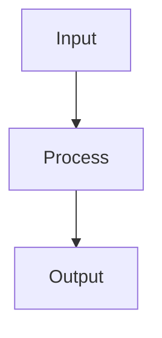

# Bias-Variance Tradeoff

## Detailed Explanation

The bias-variance decomposition decomposes expected test error into three components: bias (errors from wrong assumptions), variance (sensitivity to training data changes), and irreducible noise. High bias (underfitting) means the model is too simple to capture the true pattern. High variance (overfitting) means the model fits training data so closely it doesn't generalize. The trade-off is fundamental: simpler models (high bias, low variance) vs. complex models (low bias, high variance).

Model complexity controls the trade-off: low complexity → high bias, low variance; high complexity → low bias, high variance. With infinite training data, complexity can increase without increasing variance (each model fits data well), so variance only matters in finite-data regimes. Regularization moves the complexity slider: more regularization → simpler model → higher bias, lower variance. Empirical validation (train/test curves) reveals whether a model suffers from bias (high error on both sets) or variance (low train error, high test error).

The bias-variance trade-off is one of the most fundamental concepts in machine learning, applicable to all learning algorithms. Understanding this decomposition helps diagnose model problems: high training error suggests bias (need more capacity), high gap between training and test error suggests variance (need regularization or more data). Many practitioners struggle to distinguish between these, leading to ineffective fixes. Learning curves (error vs. training set size) reveal the nature of the problem: variance-limited problems improve with more data, bias-limited problems don't.

## Core Intuition

The bias-variance tradeoff is like target shooting: bias is systematic error (aiming wrong), variance is noise (inconsistent aim). A gun with consistent but wrong aim has high bias, low variance. A gun with inconsistent aim all over the place has low bias, high variance. The best gun balances accuracy (low bias) with consistency (low variance).

## How It Works

1. Decompose the expected prediction error at a point x into three components: Error = Bias² + Variance + Irreducible noise
2. Bias measures how far the average prediction is from the true value: Bias = E[f̂(x)] − f(x)
3. Variance measures how much predictions vary across different training sets: Var = E[(f̂(x) − E[f̂(x)])²]
4. Irreducible noise is the inherent randomness in the labels — cannot be reduced by any model
5. Complex models (deep trees, high-degree polynomials) have low bias but high variance — they fit noise
6. Simple models (linear, shallow trees) have high bias but low variance — they underfit the signal
7. Optimal model complexity minimizes total error — tune via validation curve (error vs model complexity plot)



## Architecture / Trade-offs

### Error Decomposition

```
TestError = Bias² + Variance + IrreducibleNoise
```

| Regime | Solution |
|--------|----------|
| **High bias** | More complex model |
| **High variance** | Regularization, more data |
| **High both** | Wrong model type |

### Diagnostic Path

- **High train error:** Underfitting (high bias)
- **High test, low train:** Overfitting (high variance)

## Interview Q&A

**Q: How do you diagnose whether your model has high bias or high variance from learning curves?**
A: Plot training and validation error vs training set size. High bias (underfitting): both training and validation error are high and converge to a high value — adding more data won't help, need more complex model. High variance (overfitting): large gap between low training error and high validation error — adding more data helps (curves converge), or add regularization.

**Q: Why does the bias-variance tradeoff differ between classical ML and modern deep learning?**
A: In classical ML, increasing model complexity monotonically increases variance and decreases bias (U-shaped test error curve). Modern deep learning exhibits "double descent" — after the classical overfitting peak, continuing to increase model size causes test error to decrease again. Very overparameterized models (GPT-3: 175B params for millions of training examples) can generalize well due to implicit regularization from gradient descent.

**Q: What's the effect of ensemble methods on bias and variance?**
A: Bagging (Random Forest): reduces variance by averaging uncorrelated trees — bias stays the same. Boosting (GBM): primarily reduces bias by sequentially correcting errors — slight variance increase. Stacking: can reduce both. This is why Random Forests excel when single trees overfit (high variance), and boosting excels when base models underfit (high bias, weak learners).

**Q: How does regularization affect the bias-variance tradeoff?**
A: Strong regularization increases bias (constrains model predictions toward simple functions) and decreases variance (model is less sensitive to training data noise). Zero regularization: low bias, potentially high variance (overfit). Too much regularization: high bias, low variance (underfit). The regularization hyperparameter (lambda, C, dropout rate) directly controls where on the bias-variance curve the model sits.

**Q: What is irreducible error and why can't it be eliminated?**
A: Irreducible error (Bayes error) is the noise in the labels themselves — if two identical input examples have different labels due to measurement noise, label ambiguity, or missing features, no model can predict correctly. It represents the minimum achievable error rate. You can reduce it by collecting better features, cleaning labels, or reducing measurement noise in the data collection process — not by improving the model.

**Q: How does cross-validation relate to the bias-variance tradeoff?**
A: Cross-validation gives an estimate of test error that includes both bias and variance components of the model. The mean CV score estimates the expected performance (inversely related to bias for a fixed model class), while the variance across folds estimates the sensitivity to training data choice. Highly variable CV scores indicate a high-variance model that needs regularization.
## Best Practices

- Plot learning curves (train vs val vs training set size) to diagnose bias vs variance
- Use cross-validation to estimate true generalization error
- High bias → more complex model, more features, lower regularization
- High variance → more data, more regularization, simpler model, ensemble methods
- Use bootstrap resampling to empirically measure variance
- Don't rely on a single train/test split — variance across splits is informative
- Use ensemble methods (random forests, boosting) to reduce variance without increasing bias

## Common Pitfalls

- Treating bias and variance as independent — increasing model complexity reduces bias but increases variance simultaneously
- Overfitting the validation set through repeated hyperparameter tuning — use nested CV
- Assuming more data always helps — high bias models (underfitting) benefit little from more data
- Ignoring irreducible error — perfect fit is impossible with noisy labels


## Code Examples

### Example 1: Polynomial Degree vs Bias-Variance

```python
import numpy as np
import matplotlib.pyplot as plt
from sklearn.preprocessing import PolynomialFeatures
from sklearn.linear_model import LinearRegression
from sklearn.pipeline import Pipeline

np.random.seed(42)
X_raw = np.linspace(0, 1, 100)
y_raw = np.sin(2 * np.pi * X_raw) + np.random.randn(100) * 0.2

X = X_raw.reshape(-1, 1)

train_errors, test_errors = [], []
degrees = range(1, 12)
for d in degrees:
    pipe = Pipeline([('poly', PolynomialFeatures(d)), ('lr', LinearRegression())])
    # Train on first 60
    pipe.fit(X[:60], y_raw[:60])
    train_errors.append(np.mean((pipe.predict(X[:60]) - y_raw[:60])**2))
    test_errors.append(np.mean((pipe.predict(X[60:]) - y_raw[60:])**2))

plt.figure(figsize=(10, 5))
plt.plot(degrees, train_errors, label='Train Error', marker='o')
plt.plot(degrees, test_errors, label='Test Error', marker='s')
plt.xlabel('Polynomial Degree'), plt.ylabel('MSE')
plt.title('Bias-Variance: Effect of Model Complexity')
plt.legend(), plt.show()
print(f"Best degree: {degrees[np.argmin(test_errors)]}")
```

### Example 2: Bias-Variance Decomposition

```python
from sklearn.model_selection import train_test_split
from sklearn.tree import DecisionTreeRegressor

np.random.seed(42)
X_all = np.linspace(0, 1, 200).reshape(-1, 1)
y_true = np.sin(2 * np.pi * X_all.ravel())

n_bootstraps = 50
predictions = {d: [] for d in [2, 5, 10]}

for _ in range(n_bootstraps):
    idx = np.random.choice(len(X_all), 100, replace=True)
    X_b, y_b = X_all[idx], y_true[idx] + np.random.randn(100) * 0.2
    for d in [2, 5, 10]:
        model = DecisionTreeRegressor(max_depth=d)
        model.fit(X_b, y_b)
        predictions[d].append(model.predict(X_all))

for d in [2, 5, 10]:
    preds = np.array(predictions[d])  # (n_bootstraps, n_points)
    bias_sq = np.mean((preds.mean(axis=0) - y_true)**2)
    variance = np.mean(preds.var(axis=0))
    print(f"Depth {d:2d}: Bias²={bias_sq:.4f}, Variance={variance:.4f}, Total={bias_sq+variance:.4f}")
```

### Example 3: Regularization to Control Overfitting

```python
from sklearn.linear_model import Ridge, Lasso
from sklearn.model_selection import cross_val_score

np.random.seed(42)
n_samples, n_features = 100, 50
X = np.random.randn(n_samples, n_features)
# Only first 5 features matter
y = X[:, :5] @ np.array([1, 2, -1, 0.5, 3]) + np.random.randn(n_samples) * 0.5

alphas = [0.001, 0.01, 0.1, 1.0, 10.0, 100.0]
ridge_scores, lasso_scores = [], []

for alpha in alphas:
    r = cross_val_score(Ridge(alpha), X, y, cv=5, scoring='neg_mean_squared_error')
    l = cross_val_score(Lasso(alpha, max_iter=5000), X, y, cv=5, scoring='neg_mean_squared_error')
    ridge_scores.append(-r.mean())
    lasso_scores.append(-l.mean())

best_ridge = alphas[np.argmin(ridge_scores)]
best_lasso = alphas[np.argmin(lasso_scores)]
print(f"Best Ridge alpha: {best_ridge}, CV MSE: {min(ridge_scores):.4f}")
print(f"Best Lasso alpha: {best_lasso}, CV MSE: {min(lasso_scores):.4f}")
```

## Related Concepts

- [Gradient Descent](./01-gradient-descent.md)
- [Cross-Validation](./22-cross-validation.md)
- [Hyperparameter Tuning](./26-hyperparameter-tuning.md)
