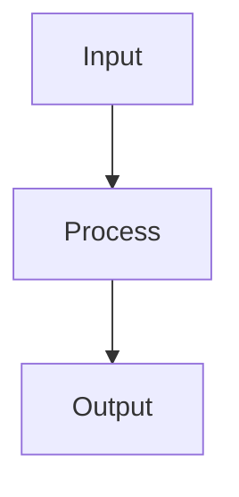

# Bias-Variance Tradeoff

## Detailed Explanation

Error decomposes into bias + variance + noise...

## Core Intuition

A key technique in machine learning.

## How It Works

1. Step 1
2. Step 2
3. Step 3



## Architecture / Trade-offs

Trade-off 1 vs trade-off 2

## Interview Q&A

**Q: When would you use Bias-Variance Tradeoff?**
A: Context-dependent, varies by problem type.

**Q: What are the main trade-offs?**
A: Refer to Architecture / Trade-offs section above.

**Q: How do you choose hyperparameters?**
A: Cross-validation, grid/random/Bayesian search, domain knowledge.

**Q: What are common failure modes?**
A: Refer to Common Pitfalls section below.

## Best Practices

- Plot learning curves (train vs val vs training set size) to diagnose bias vs variance
- Use cross-validation to estimate true generalization error
- High bias → more complex model, more features, lower regularization
- High variance → more data, more regularization, simpler model, ensemble methods
- Use bootstrap resampling to empirically measure variance
- Don't rely on a single train/test split — variance across splits is informative
- Use ensemble methods (random forests, boosting) to reduce variance without increasing bias

## Common Pitfalls

- Treating bias and variance as independent — increasing model complexity reduces bias but increases variance simultaneously
- Overfitting the validation set through repeated hyperparameter tuning — use nested CV
- Assuming more data always helps — high bias models (underfitting) benefit little from more data
- Ignoring irreducible error — perfect fit is impossible with noisy labels


## Code Examples

### Example 1: Polynomial Degree vs Bias-Variance

```python
import numpy as np
import matplotlib.pyplot as plt
from sklearn.preprocessing import PolynomialFeatures
from sklearn.linear_model import LinearRegression
from sklearn.pipeline import Pipeline

np.random.seed(42)
X_raw = np.linspace(0, 1, 100)
y_raw = np.sin(2 * np.pi * X_raw) + np.random.randn(100) * 0.2

X = X_raw.reshape(-1, 1)

train_errors, test_errors = [], []
degrees = range(1, 12)
for d in degrees:
    pipe = Pipeline([('poly', PolynomialFeatures(d)), ('lr', LinearRegression())])
    # Train on first 60
    pipe.fit(X[:60], y_raw[:60])
    train_errors.append(np.mean((pipe.predict(X[:60]) - y_raw[:60])**2))
    test_errors.append(np.mean((pipe.predict(X[60:]) - y_raw[60:])**2))

plt.figure(figsize=(10, 5))
plt.plot(degrees, train_errors, label='Train Error', marker='o')
plt.plot(degrees, test_errors, label='Test Error', marker='s')
plt.xlabel('Polynomial Degree'), plt.ylabel('MSE')
plt.title('Bias-Variance: Effect of Model Complexity')
plt.legend(), plt.show()
print(f"Best degree: {degrees[np.argmin(test_errors)]}")
```

### Example 2: Bias-Variance Decomposition

```python
from sklearn.model_selection import train_test_split
from sklearn.tree import DecisionTreeRegressor

np.random.seed(42)
X_all = np.linspace(0, 1, 200).reshape(-1, 1)
y_true = np.sin(2 * np.pi * X_all.ravel())

n_bootstraps = 50
predictions = {d: [] for d in [2, 5, 10]}

for _ in range(n_bootstraps):
    idx = np.random.choice(len(X_all), 100, replace=True)
    X_b, y_b = X_all[idx], y_true[idx] + np.random.randn(100) * 0.2
    for d in [2, 5, 10]:
        model = DecisionTreeRegressor(max_depth=d)
        model.fit(X_b, y_b)
        predictions[d].append(model.predict(X_all))

for d in [2, 5, 10]:
    preds = np.array(predictions[d])  # (n_bootstraps, n_points)
    bias_sq = np.mean((preds.mean(axis=0) - y_true)**2)
    variance = np.mean(preds.var(axis=0))
    print(f"Depth {d:2d}: Bias²={bias_sq:.4f}, Variance={variance:.4f}, Total={bias_sq+variance:.4f}")
```

### Example 3: Regularization to Control Overfitting

```python
from sklearn.linear_model import Ridge, Lasso
from sklearn.model_selection import cross_val_score

np.random.seed(42)
n_samples, n_features = 100, 50
X = np.random.randn(n_samples, n_features)
# Only first 5 features matter
y = X[:, :5] @ np.array([1, 2, -1, 0.5, 3]) + np.random.randn(n_samples) * 0.5

alphas = [0.001, 0.01, 0.1, 1.0, 10.0, 100.0]
ridge_scores, lasso_scores = [], []

for alpha in alphas:
    r = cross_val_score(Ridge(alpha), X, y, cv=5, scoring='neg_mean_squared_error')
    l = cross_val_score(Lasso(alpha, max_iter=5000), X, y, cv=5, scoring='neg_mean_squared_error')
    ridge_scores.append(-r.mean())
    lasso_scores.append(-l.mean())

best_ridge = alphas[np.argmin(ridge_scores)]
best_lasso = alphas[np.argmin(lasso_scores)]
print(f"Best Ridge alpha: {best_ridge}, CV MSE: {min(ridge_scores):.4f}")
print(f"Best Lasso alpha: {best_lasso}, CV MSE: {min(lasso_scores):.4f}")
```

## Related Concepts

- [Gradient Descent](./01-gradient-descent.md)
- [Cross-Validation](./22-cross-validation.md)
- [Hyperparameter Tuning](./26-hyperparameter-tuning.md)
