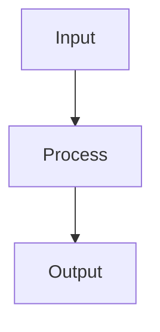

# Cross-Validation

## Detailed Explanation

Cross-validation estimates generalization performance by repeatedly splitting data into training and validation folds. K-fold splits data into k subsets, trains on k-1 subsets, tests on the held-out subset, repeating k times. Final performance is the average across folds. This provides robust estimates using all data for both training and testing (unlike single train/test split which wastes data). Stratified K-fold maintains class distribution in each fold, critical for imbalanced datasets.

Different fold choices exist: time-series data requires ordered splits (don't train on future predicting past), grouped data requires keeping groups together (don't split group across folds), high-variance problems benefit from more folds (5-10 typical). Computational cost is k × training cost. Nested cross-validation (CV inside CV) provides unbiased hyperparameter selection but is expensive. Leave-one-out cross-validation tests on single samples repeatedly (expensive but unbiased for small datasets).

Cross-validation is the standard for evaluating model performance, providing more reliable estimates than a single train/test split. Understanding when standard CV is inappropriate (time series, grouped data) prevents mistakes. Stratified CV is crucial for imbalanced classification but many practitioners forget. The variance across folds (how much does performance vary?) indicates stability: low variance = robust performance, high variance = unreliable. Modern practice often uses cross-validation early to validate that models actually work before deployment.

## Core Intuition

Cross-validation is like testing a recipe by cooking it multiple times with slightly different ingredients each time: instead of one expensive test, you get multiple data points about whether the recipe is good. Averaging across tests gives a better estimate than a single test would.

## How It Works

1. Split the training data into k equal-sized folds (e.g., k=5 or k=10)
2. For fold i (i=1..k): train the model on all folds except fold i, then evaluate on fold i
3. Record the evaluation metric (e.g., accuracy, RMSE) for each fold
4. Repeat for all k folds — every data point is used exactly once as a test point
5. Report mean ± standard deviation of the k metric values as the generalization estimate
6. For stratified k-fold (classification): ensure each fold preserves the original class distribution
7. For nested CV: wrap an inner CV (hyperparameter search) inside the outer CV — produces unbiased estimate of tuned model performance



## Architecture / Trade-offs

Trade-off 1 vs trade-off 2

## Interview Q&A

**Q: What is data leakage in cross-validation and how do you prevent it?**
A: Data leakage occurs when information from the test fold contaminates the training process. The most common form: fitting a scaler, imputer, or feature selector on the full dataset, then using those statistics in CV — the test fold's statistics influence the training preprocessing. Prevention: always wrap all preprocessing in a sklearn Pipeline so transformations are fit only on the training folds.

**Q: When should you use stratified k-fold vs regular k-fold?**
A: Use StratifiedKFold whenever the target class distribution matters — classification problems, especially with imbalanced classes. Regular KFold can produce folds with very different class ratios (especially for rare classes), making CV estimates noisy. For regression, regular KFold is standard; optionally use KFold with shuffle=True to ensure random fold assignment.

**Q: Why does nested cross-validation give a more honest performance estimate?**
A: Standard CV with hyperparameter tuning optimistically biases performance — you select hyperparameters based on validation performance, which inflates the estimate. Nested CV uses an outer CV loop for performance estimation and an inner CV loop for hyperparameter tuning, ensuring no hyperparameter choice information leaks into the outer performance estimate. The difference between nested and non-nested CV scores reveals the optimism bias.

**Q: How many folds should you use and what are the trade-offs?**
A: k=5 or k=10 are the standard choices. Large k (e.g., LOOCV): low bias (each test set is one point, training set is nearly full), high variance (highly variable scores), computationally expensive. Small k (e.g., k=2): high bias (training on only half the data), lower variance. k=5-10 balances bias, variance, and compute for most datasets. Use LOOCV only for very small datasets (<50 samples).

**Q: How does cross-validation for time-series differ from standard k-fold?**
A: Standard k-fold shuffles data, allowing future data to appear in the training fold — this is leakage for time-series. TimeSeriesSplit (sklearn) always trains on past data and tests on future: fold 1 trains on months 1-2, tests on month 3; fold 2 trains on months 1-3, tests on month 4; etc. This correctly simulates deployment: you predict future from past. Also consider gap periods between train and test to avoid autocorrelation.

**Q: What is the difference between CV for model selection vs CV for performance estimation?**
A: CV for model selection: compare multiple models or hyperparameter settings using the same CV splits — choose the model with the best mean CV score. CV for performance estimation: estimate how well the chosen model will generalize — report the CV score as the expected performance. If you use the same CV for both, you need nested CV to avoid optimistic bias in the performance estimate.
## Best Practices

- Use StratifiedKFold for classification to preserve class ratios across folds
- For time-series data always use TimeSeriesSplit — never shuffle
- Use nested CV for unbiased hyperparameter tuning AND performance estimation
- Report mean ± std across folds, not just mean
- Use k=5 or k=10 as default — LOOCV only for very small datasets (<50 samples)
- Pipeline preprocessing inside CV to prevent data leakage
- Use cross_val_score with n_jobs=-1 for parallelism

## Common Pitfalls

- Fitting scaler/imputer on all data before CV — leaks statistics from test folds
- Using regular KFold on time-series data — future data leaks into training
- Picking the best fold's score instead of the mean — optimistic bias
- Treating the CV estimate as exact — it has variance, report confidence intervals


## Code Examples

### Example 1: K-Fold Cross-Validation

```python
import numpy as np
from sklearn.datasets import make_classification
from sklearn.model_selection import KFold, StratifiedKFold, cross_val_score
from sklearn.ensemble import RandomForestClassifier

X, y = make_classification(n_samples=500, n_features=20, n_informative=10, random_state=42)

# Standard k-fold
kf = KFold(n_splits=5, shuffle=True, random_state=42)
skf = StratifiedKFold(n_splits=5, shuffle=True, random_state=42)

model = RandomForestClassifier(n_estimators=50, random_state=42)

kf_scores = cross_val_score(model, X, y, cv=kf, scoring='accuracy')
skf_scores = cross_val_score(model, X, y, cv=skf, scoring='accuracy')

print(f"KFold:     {kf_scores.mean():.4f} ± {kf_scores.std():.4f}")
print(f"StratKFold:{skf_scores.mean():.4f} ± {skf_scores.std():.4f}")

# Class distribution per fold
for fold_i, (_, test_idx) in enumerate(kf.split(X, y)):
    print(f"Fold {fold_i+1} class ratio: {y[test_idx].mean():.3f}")
```

### Example 2: Nested Cross-Validation

```python
from sklearn.model_selection import GridSearchCV, cross_val_score
from sklearn.svm import SVC

X, y = make_classification(n_samples=300, n_features=15, n_informative=8, random_state=42)

# Inner CV: hyperparameter search
inner_cv = StratifiedKFold(n_splits=3, shuffle=True, random_state=42)
# Outer CV: performance estimation
outer_cv = StratifiedKFold(n_splits=5, shuffle=True, random_state=42)

param_grid = {'C': [0.1, 1.0, 10.0], 'gamma': ['scale', 'auto']}
clf = GridSearchCV(SVC(), param_grid, cv=inner_cv, scoring='accuracy')

# Nested CV gives unbiased estimate
nested_scores = cross_val_score(clf, X, y, cv=outer_cv, scoring='accuracy')
# Non-nested (optimistic bias)
clf_best = GridSearchCV(SVC(), param_grid, cv=inner_cv, scoring='accuracy').fit(X, y)
non_nested = cross_val_score(clf_best.best_estimator_, X, y, cv=outer_cv, scoring='accuracy')

print(f"Nested CV:     {nested_scores.mean():.4f} ± {nested_scores.std():.4f}")
print(f"Non-nested CV: {non_nested.mean():.4f} ± {non_nested.std():.4f}")
print(f"Optimism bias: {(non_nested.mean() - nested_scores.mean()):.4f}")
```

### Example 3: Time-Series Cross-Validation

```python
import numpy as np
from sklearn.model_selection import TimeSeriesSplit
from sklearn.linear_model import Ridge
import matplotlib.pyplot as plt

np.random.seed(42)
n = 200
t = np.arange(n)
y_ts = np.sin(0.1 * t) + 0.5 * np.sin(0.05 * t) + np.random.randn(n) * 0.2

# Build lag features
def make_lag_features(y, lags=5):
    X_lag = np.column_stack([y[i:-(lags-i)] for i in range(lags)])
    return X_lag, y[lags:]

X_lag, y_lag = make_lag_features(y_ts)

tscv = TimeSeriesSplit(n_splits=5)
scores = []
for train_idx, test_idx in tscv.split(X_lag):
    model = Ridge(alpha=1.0)
    model.fit(X_lag[train_idx], y_lag[train_idx])
    pred = model.predict(X_lag[test_idx])
    mse = np.mean((pred - y_lag[test_idx])**2)
    scores.append(mse)
    print(f"Fold train size={len(train_idx)}, test size={len(test_idx)}, MSE={mse:.4f}")

print(f"Mean MSE: {np.mean(scores):.4f} ± {np.std(scores):.4f}")
```

## Related Concepts

- [Gradient Descent](./01-gradient-descent.md)
- [Cross-Validation](./22-cross-validation.md)
- [Hyperparameter Tuning](./26-hyperparameter-tuning.md)
