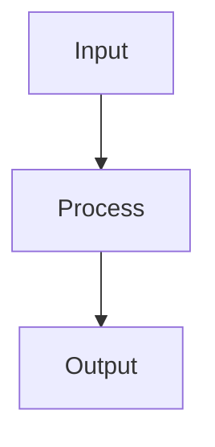

# Cross-Validation

## Detailed Explanation

K-fold CV estimates performance without wasting data...

## Core Intuition

A key technique in machine learning.

## How It Works

1. Step 1
2. Step 2
3. Step 3



## Architecture / Trade-offs

Trade-off 1 vs trade-off 2

## Interview Q&A

**Q: When would you use Cross-Validation?**
A: Context-dependent, varies by problem type.

**Q: What are the main trade-offs?**
A: Refer to Architecture / Trade-offs section above.

**Q: How do you choose hyperparameters?**
A: Cross-validation, grid/random/Bayesian search, domain knowledge.

**Q: What are common failure modes?**
A: Refer to Common Pitfalls section below.

## Best Practices

- Practice 1
- Practice 2
- Practice 3

## Common Pitfalls

- Pitfall 1
- Pitfall 2


## Code Examples

### Example 1: K-Fold Cross-Validation

```python
import numpy as np
from sklearn.datasets import make_classification
from sklearn.model_selection import KFold, StratifiedKFold, cross_val_score
from sklearn.ensemble import RandomForestClassifier

X, y = make_classification(n_samples=500, n_features=20, n_informative=10, random_state=42)

# Standard k-fold
kf = KFold(n_splits=5, shuffle=True, random_state=42)
skf = StratifiedKFold(n_splits=5, shuffle=True, random_state=42)

model = RandomForestClassifier(n_estimators=50, random_state=42)

kf_scores = cross_val_score(model, X, y, cv=kf, scoring='accuracy')
skf_scores = cross_val_score(model, X, y, cv=skf, scoring='accuracy')

print(f"KFold:     {kf_scores.mean():.4f} ± {kf_scores.std():.4f}")
print(f"StratKFold:{skf_scores.mean():.4f} ± {skf_scores.std():.4f}")

# Class distribution per fold
for fold_i, (_, test_idx) in enumerate(kf.split(X, y)):
    print(f"Fold {fold_i+1} class ratio: {y[test_idx].mean():.3f}")
```

### Example 2: Nested Cross-Validation

```python
from sklearn.model_selection import GridSearchCV, cross_val_score
from sklearn.svm import SVC

X, y = make_classification(n_samples=300, n_features=15, n_informative=8, random_state=42)

# Inner CV: hyperparameter search
inner_cv = StratifiedKFold(n_splits=3, shuffle=True, random_state=42)
# Outer CV: performance estimation
outer_cv = StratifiedKFold(n_splits=5, shuffle=True, random_state=42)

param_grid = {'C': [0.1, 1.0, 10.0], 'gamma': ['scale', 'auto']}
clf = GridSearchCV(SVC(), param_grid, cv=inner_cv, scoring='accuracy')

# Nested CV gives unbiased estimate
nested_scores = cross_val_score(clf, X, y, cv=outer_cv, scoring='accuracy')
# Non-nested (optimistic bias)
clf_best = GridSearchCV(SVC(), param_grid, cv=inner_cv, scoring='accuracy').fit(X, y)
non_nested = cross_val_score(clf_best.best_estimator_, X, y, cv=outer_cv, scoring='accuracy')

print(f"Nested CV:     {nested_scores.mean():.4f} ± {nested_scores.std():.4f}")
print(f"Non-nested CV: {non_nested.mean():.4f} ± {non_nested.std():.4f}")
print(f"Optimism bias: {(non_nested.mean() - nested_scores.mean()):.4f}")
```

### Example 3: Time-Series Cross-Validation

```python
import numpy as np
from sklearn.model_selection import TimeSeriesSplit
from sklearn.linear_model import Ridge
import matplotlib.pyplot as plt

np.random.seed(42)
n = 200
t = np.arange(n)
y_ts = np.sin(0.1 * t) + 0.5 * np.sin(0.05 * t) + np.random.randn(n) * 0.2

# Build lag features
def make_lag_features(y, lags=5):
    X_lag = np.column_stack([y[i:-(lags-i)] for i in range(lags)])
    return X_lag, y[lags:]

X_lag, y_lag = make_lag_features(y_ts)

tscv = TimeSeriesSplit(n_splits=5)
scores = []
for train_idx, test_idx in tscv.split(X_lag):
    model = Ridge(alpha=1.0)
    model.fit(X_lag[train_idx], y_lag[train_idx])
    pred = model.predict(X_lag[test_idx])
    mse = np.mean((pred - y_lag[test_idx])**2)
    scores.append(mse)
    print(f"Fold train size={len(train_idx)}, test size={len(test_idx)}, MSE={mse:.4f}")

print(f"Mean MSE: {np.mean(scores):.4f} ± {np.std(scores):.4f}")
```

## Related Concepts

- [Gradient Descent](./01-gradient-descent.md)
- [Cross-Validation](./22-cross-validation.md)
- [Hyperparameter Tuning](./26-hyperparameter-tuning.md)
