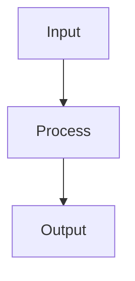

# Classification Metrics

## Detailed Explanation

Precision, recall, F1, ROC-AUC for evaluating classifiers...

## Core Intuition

A key technique in machine learning.

## How It Works

1. Obtain predicted class labels (or probabilities) from the model on a held-out test set
2. Build the confusion matrix: count True Positives (TP), True Negatives (TN), False Positives (FP), False Negatives (FN)
3. Compute Precision = TP/(TP+FP) — of all predicted positives, what fraction are correct?
4. Compute Recall (Sensitivity) = TP/(TP+FN) — of all actual positives, what fraction did we catch?
5. Compute F1 = 2·(Precision·Recall)/(Precision+Recall) — harmonic mean, penalizes extreme imbalance
6. For threshold-independent evaluation, compute ROC-AUC: area under the Receiver Operating Characteristic curve (TPR vs FPR at all thresholds)
7. For imbalanced classes, prefer PR-AUC (area under Precision-Recall curve) — more sensitive to minority class performance



## Architecture / Trade-offs

Trade-off 1 vs trade-off 2

## Interview Q&A

**Q: When should you use AUC-ROC vs AUC-PR?**
A: Use AUC-ROC when the negative class matters (balanced or near-balanced datasets). Use AUC-PR (average precision) for imbalanced datasets — ROC is overly optimistic because it includes true negatives in the denominator, and rare positive predictions can look good by ROC but terrible by PR. As a rule of thumb: if positive class < 10% of data, AUC-PR is more meaningful. Both should be reported for imbalanced problems.

**Q: Why is accuracy a misleading metric for imbalanced datasets?**
A: With 99% negative and 1% positive, a model that always predicts negative gets 99% accuracy — but is completely useless. Accuracy treats all errors equally and ignores class frequency. Use F1 (balances precision and recall for the positive class), AUC-PR, or Matthews Correlation Coefficient (MCC) which accounts for all four confusion matrix cells and gives credit for correctly identifying both classes.

**Q: How do you choose the right classification threshold?**
A: The default threshold of 0.5 is arbitrary — it only makes sense when false positives and false negatives have equal cost. Define the business cost matrix (cost of FP vs FN), then find the threshold that minimizes expected cost: plot cost vs threshold and select the minimum. For medical diagnosis, FN (missed disease) costs more than FP (unnecessary test), so use a lower threshold. Use model.predict_proba() and threshold manually.

**Q: How do you evaluate a classifier on multiclass problems?**
A: Use classification_report() which shows per-class precision, recall, F1, and aggregate averages. Macro average treats all classes equally (good when class sizes are balanced). Weighted average weights by class size (penalizes poor performance on frequent classes more). For visualization, the confusion matrix shows which classes are confused with each other. Use the normalized confusion matrix (normalize='true') to see per-class recall regardless of class size.

**Q: What does high precision but low recall mean in practice?**
A: The model is conservative — it only predicts positive when very confident, so predictions are usually correct (high precision) but it misses many actual positives (low recall). Example: a fraud detection system that only flags obvious fraud has high precision (few false alarms) but low recall (lets subtle fraud through). Adjust the threshold downward to accept more false positives and improve recall. The trade-off is application-specific.

**Q: How would you evaluate a ranking model or retrieval system differently from a classifier?**
A: Ranking models need rank-aware metrics: NDCG (normalized discounted cumulative gain — rewards relevant items appearing earlier in the list), MAP (mean average precision — averages precision at each relevant item's position), and MRR (mean reciprocal rank — focuses on the first relevant result). These capture the quality of ordering, not just binary relevance. Scikit-learn doesn't include these natively; use ir_measures or trec_eval.
## Best Practices

- Never use accuracy alone on imbalanced datasets — use F1, ROC-AUC, or PR-AUC
- Use PR-AUC (average precision) for heavily imbalanced problems — more informative than ROC-AUC
- Report confusion matrix alongside scalar metrics
- Tune threshold based on business cost matrix (FP cost vs FN cost)
- Use macro-averaged F1 for multiclass when all classes equally important
- Use weighted F1 when class frequencies should influence the metric
- Monitor calibration (reliability diagram) when predicted probabilities matter

## Common Pitfalls

- Using accuracy on 99/1 imbalanced data — predicting all majority gets 99% accuracy
- ROC-AUC is optimistic with severe imbalance — use PR-AUC instead
- Default threshold 0.5 is rarely optimal — always evaluate threshold vs metric curves
- Reporting only training metrics — models memorize training data


## Code Examples

### Example 1: Confusion Matrix and F1 Score

```python
import numpy as np
from sklearn.datasets import make_classification
from sklearn.ensemble import GradientBoostingClassifier
from sklearn.model_selection import train_test_split
from sklearn.metrics import (confusion_matrix, classification_report,
                              precision_recall_curve, roc_auc_score)
import matplotlib.pyplot as plt
import seaborn as sns

X, y = make_classification(n_samples=1000, n_features=20, n_informative=10,
                            weights=[0.7, 0.3], random_state=42)
X_train, X_test, y_train, y_test = train_test_split(X, y, test_size=0.2, random_state=42)

model = GradientBoostingClassifier(n_estimators=100, random_state=42)
model.fit(X_train, y_train)
y_pred = model.predict(X_test)
y_proba = model.predict_proba(X_test)[:, 1]

cm = confusion_matrix(y_test, y_pred)
plt.figure(figsize=(6, 5))
sns.heatmap(cm, annot=True, fmt='d', cmap='Blues')
plt.xlabel('Predicted'), plt.ylabel('Actual')
plt.title('Confusion Matrix')
plt.show()

print(classification_report(y_test, y_pred))
print(f"ROC-AUC: {roc_auc_score(y_test, y_proba):.4f}")
```

### Example 2: ROC and Precision-Recall Curves

```python
from sklearn.metrics import roc_curve, precision_recall_curve, average_precision_score

fpr, tpr, roc_thresh = roc_curve(y_test, y_proba)
precision, recall, pr_thresh = precision_recall_curve(y_test, y_proba)

fig, (ax1, ax2) = plt.subplots(1, 2, figsize=(12, 5))

ax1.plot(fpr, tpr, label=f'AUC={roc_auc_score(y_test, y_proba):.3f}')
ax1.plot([0, 1], [0, 1], 'k--')
ax1.set_xlabel('FPR'), ax1.set_ylabel('TPR')
ax1.set_title('ROC Curve'), ax1.legend()

ap = average_precision_score(y_test, y_proba)
ax2.plot(recall, precision, label=f'AP={ap:.3f}')
ax2.axhline(y=y_test.mean(), color='k', linestyle='--', label='Random')
ax2.set_xlabel('Recall'), ax2.set_ylabel('Precision')
ax2.set_title('Precision-Recall Curve'), ax2.legend()

plt.tight_layout(), plt.show()
```

### Example 3: Threshold Selection by Business Metric

```python
# Choose threshold based on cost matrix
# False negative (missing fraud) costs 10x more than false positive
cost_fn, cost_fp = 10, 1

thresholds = np.linspace(0.01, 0.99, 100)
costs = []
for t in thresholds:
    y_pred_t = (y_proba >= t).astype(int)
    tn, fp, fn, tp = confusion_matrix(y_test, y_pred_t).ravel()
    cost = fn * cost_fn + fp * cost_fp
    costs.append(cost)

best_thresh = thresholds[np.argmin(costs)]
y_pred_opt = (y_proba >= best_thresh).astype(int)

plt.plot(thresholds, costs)
plt.axvline(best_thresh, color='r', linestyle='--', label=f'Optimal={best_thresh:.2f}')
plt.xlabel('Threshold'), plt.ylabel('Total Cost')
plt.title('Threshold vs Business Cost'), plt.legend(), plt.show()

print(f"Default 0.5 threshold:")
print(classification_report(y_test, (y_proba >= 0.5).astype(int), digits=3))
print(f"Optimal {best_thresh:.2f} threshold:")
print(classification_report(y_test, y_pred_opt, digits=3))
```

## Related Concepts

- [Gradient Descent](./01-gradient-descent.md)
- [Cross-Validation](./22-cross-validation.md)
- [Hyperparameter Tuning](./26-hyperparameter-tuning.md)
