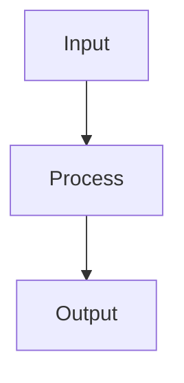

# Classification Metrics

## Detailed Explanation

Precision, recall, F1, ROC-AUC for evaluating classifiers...

## Core Intuition

A key technique in machine learning.

## How It Works

1. Step 1
2. Step 2
3. Step 3



## Architecture / Trade-offs

Trade-off 1 vs trade-off 2

## Interview Q&A

**Q: When would you use Classification Metrics?**
A: Context-dependent, varies by problem type.

**Q: What are the main trade-offs?**
A: Refer to Architecture / Trade-offs section above.

**Q: How do you choose hyperparameters?**
A: Cross-validation, grid/random/Bayesian search, domain knowledge.

**Q: What are common failure modes?**
A: Refer to Common Pitfalls section below.

## Best Practices

- Never use accuracy alone on imbalanced datasets — use F1, ROC-AUC, or PR-AUC
- Use PR-AUC (average precision) for heavily imbalanced problems — more informative than ROC-AUC
- Report confusion matrix alongside scalar metrics
- Tune threshold based on business cost matrix (FP cost vs FN cost)
- Use macro-averaged F1 for multiclass when all classes equally important
- Use weighted F1 when class frequencies should influence the metric
- Monitor calibration (reliability diagram) when predicted probabilities matter

## Common Pitfalls

- Using accuracy on 99/1 imbalanced data — predicting all majority gets 99% accuracy
- ROC-AUC is optimistic with severe imbalance — use PR-AUC instead
- Default threshold 0.5 is rarely optimal — always evaluate threshold vs metric curves
- Reporting only training metrics — models memorize training data


## Code Examples

### Example 1: Confusion Matrix and F1 Score

```python
import numpy as np
from sklearn.datasets import make_classification
from sklearn.ensemble import GradientBoostingClassifier
from sklearn.model_selection import train_test_split
from sklearn.metrics import (confusion_matrix, classification_report,
                              precision_recall_curve, roc_auc_score)
import matplotlib.pyplot as plt
import seaborn as sns

X, y = make_classification(n_samples=1000, n_features=20, n_informative=10,
                            weights=[0.7, 0.3], random_state=42)
X_train, X_test, y_train, y_test = train_test_split(X, y, test_size=0.2, random_state=42)

model = GradientBoostingClassifier(n_estimators=100, random_state=42)
model.fit(X_train, y_train)
y_pred = model.predict(X_test)
y_proba = model.predict_proba(X_test)[:, 1]

cm = confusion_matrix(y_test, y_pred)
plt.figure(figsize=(6, 5))
sns.heatmap(cm, annot=True, fmt='d', cmap='Blues')
plt.xlabel('Predicted'), plt.ylabel('Actual')
plt.title('Confusion Matrix')
plt.show()

print(classification_report(y_test, y_pred))
print(f"ROC-AUC: {roc_auc_score(y_test, y_proba):.4f}")
```

### Example 2: ROC and Precision-Recall Curves

```python
from sklearn.metrics import roc_curve, precision_recall_curve, average_precision_score

fpr, tpr, roc_thresh = roc_curve(y_test, y_proba)
precision, recall, pr_thresh = precision_recall_curve(y_test, y_proba)

fig, (ax1, ax2) = plt.subplots(1, 2, figsize=(12, 5))

ax1.plot(fpr, tpr, label=f'AUC={roc_auc_score(y_test, y_proba):.3f}')
ax1.plot([0, 1], [0, 1], 'k--')
ax1.set_xlabel('FPR'), ax1.set_ylabel('TPR')
ax1.set_title('ROC Curve'), ax1.legend()

ap = average_precision_score(y_test, y_proba)
ax2.plot(recall, precision, label=f'AP={ap:.3f}')
ax2.axhline(y=y_test.mean(), color='k', linestyle='--', label='Random')
ax2.set_xlabel('Recall'), ax2.set_ylabel('Precision')
ax2.set_title('Precision-Recall Curve'), ax2.legend()

plt.tight_layout(), plt.show()
```

### Example 3: Threshold Selection by Business Metric

```python
# Choose threshold based on cost matrix
# False negative (missing fraud) costs 10x more than false positive
cost_fn, cost_fp = 10, 1

thresholds = np.linspace(0.01, 0.99, 100)
costs = []
for t in thresholds:
    y_pred_t = (y_proba >= t).astype(int)
    tn, fp, fn, tp = confusion_matrix(y_test, y_pred_t).ravel()
    cost = fn * cost_fn + fp * cost_fp
    costs.append(cost)

best_thresh = thresholds[np.argmin(costs)]
y_pred_opt = (y_proba >= best_thresh).astype(int)

plt.plot(thresholds, costs)
plt.axvline(best_thresh, color='r', linestyle='--', label=f'Optimal={best_thresh:.2f}')
plt.xlabel('Threshold'), plt.ylabel('Total Cost')
plt.title('Threshold vs Business Cost'), plt.legend(), plt.show()

print(f"Default 0.5 threshold:")
print(classification_report(y_test, (y_proba >= 0.5).astype(int), digits=3))
print(f"Optimal {best_thresh:.2f} threshold:")
print(classification_report(y_test, y_pred_opt, digits=3))
```

## Related Concepts

- [Gradient Descent](./01-gradient-descent.md)
- [Cross-Validation](./22-cross-validation.md)
- [Hyperparameter Tuning](./26-hyperparameter-tuning.md)
