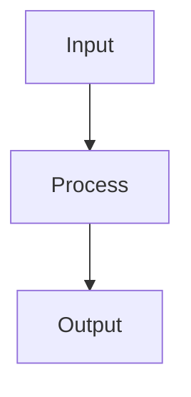

# Regression Metrics

## Detailed Explanation

Regression metrics quantify prediction error for continuous targets. Mean Absolute Error (MAE) is interpretable (average |prediction - actual| error in same units as target) and robust to outliers. Mean Squared Error (MSE) penalizes large errors quadratically (outlier-sensitive). Root Mean Squared Error (RMSE) is back in original units, comparable to MAE but penalizes large errors more. R² (proportion of variance explained) ranges [0,1] with 1 = perfect, 0 = just predicting mean. R² is scale-independent, making comparisons across datasets possible.

The trade-off between MAE and MSE: MSE is differentiable and has nice mathematical properties (used in derivations, fast computation), but MAE is interpretable and outlier-robust. Median Absolute Error (MedianAE) is even more robust but less standard. Mean Absolute Percentage Error (MAPE) is useful when relative error matters, but undefined when actuals are zero. Custom metrics can encode domain knowledge about relative importance of different errors.

Choosing metrics should reflect what matters in the application: predicting demand (small errors acceptable?) vs. medical dosing (large errors very costly?). Residual analysis (plotting errors vs fitted values, checking for patterns) is crucial: systematic patterns reveal model misspecification. Multiple metrics paint different pictures (model A has lower MSE, model B has lower MAE). R² can be misleading (R² = 0.9 sounds great but might be unimpressive depending on domain). Practitioners often report only one metric without understanding what it really tells them.

## Core Intuition

Regression metrics are different ways to measure 'how wrong you were': MAE is like average distance from target (dollar amount off), MSE penalizes big mistakes heavily, R² is like 'what fraction of the variation did you explain'. Different metrics suit different situations.

## How It Works

1. Obtain predicted values ŷᵢ from the model on a held-out test set
2. Compute residuals: eᵢ = yᵢ − ŷᵢ for each prediction
3. Compute Mean Absolute Error: MAE = (1/n)Σ|eᵢ| — robust to outliers, same units as target
4. Compute Mean Squared Error: MSE = (1/n)Σeᵢ² — penalizes large errors more heavily
5. Compute RMSE = √MSE — returns to original units; compare directly to target scale
6. Compute R² = 1 − SSres/SStot, where SSres = Σeᵢ², SStot = Σ(yᵢ−ȳ)² — proportion of variance explained (1.0 is perfect)
7. Plot residuals vs fitted values and residual histogram — patterns reveal model misspecification



## Architecture / Trade-offs

### Metric Properties

| Metric | Outlier Robust | Interpretable | Scale-Invariant |
|--------|----------------|---|---|
| **MAE** | ✓ Yes | ✓ Yes | ✗ No |
| **MSE** | ✗ No | ✗ No | ✗ No |
| **R²** | ✗ No | ✓ Yes | ✓ Yes |

### When to Use

- **Interpretable:** MAE (units same as y)
- **Outlier-robust:** MAE or Median AE
- **Math:** MSE/RMSE (differentiable)
- **Compare models:** R² (scale-independent)

## Interview Q&A

**Q: When should you prefer MAE over RMSE and vice versa?**
A: Use RMSE when large errors are especially costly (financial loss prediction, safety-critical systems) — its squared error term penalizes outliers heavily. Use MAE when all errors should be treated proportionally (demand forecasting, general metrics) — it's more robust to outliers and directly interpretable in the target's units. Report both: if RMSE >> MAE, you have large outliers; understanding this matters for model diagnosis.

**Q: What does R² actually measure, and when is it misleading?**
A: R² = 1 - SS_res/SS_tot measures the proportion of variance in y explained by the model. It's misleading when: (1) used for non-linear models without checking residuals (high R² doesn't mean good fit); (2) compared across datasets with different y variance (R² depends on y variance, not just model quality); (3) reported on training data without cross-validation; (4) negative on test data — means the model is worse than predicting the mean, which is a red flag.

**Q: How would you diagnose heteroscedasticity and why does it matter?**
A: Plot residuals vs fitted values — heteroscedasticity shows as a funnel shape (variance grows with predicted values). It violates OLS assumptions, making confidence intervals and p-values unreliable (not the predictions themselves). Fix options: log-transform the target (if residuals have positive skew), use weighted least squares, or use robust regression (Huber regressor). Models like GBM are naturally robust to heteroscedasticity.

**Q: Why is MAPE problematic for certain prediction tasks?**
A: MAPE = mean |error|/|actual| blows up when actual values are near zero (e.g., demand forecasting with some zero-demand days), making it meaningless. It also asymmetrically penalizes over-prediction vs under-prediction. Use SMAPE (symmetric MAPE) for near-zero values, or simply use MAE with a note about the target scale. For demand forecasting, WMAPE (weighted MAPE, weighted by actual volume) is more stable.

**Q: How do you evaluate a regression model when the target is log-transformed?**
A: Transform predictions back to original scale before computing metrics: exp(y_pred) → original scale. Compute RMSE and MAE in original scale for interpretability. Log-transformed predictions tend to underestimate large values (log compression), so check residuals at both extremes of the target range. Don't compare RMSE in log-space vs original-space across models — always use the same scale.

**Q: What additional diagnostics would you run beyond standard metrics?**
A: (1) Residual histogram — should be roughly Gaussian for OLS assumptions; (2) QQ plot — check normality of residuals; (3) Residuals vs feature values — detect non-linear relationships not captured by the model; (4) Cook's distance — identify influential outliers that disproportionately affect coefficients; (5) Autocorrelation of residuals (Durbin-Watson test) for time-series data — residual correlation indicates missing temporal structure.
## Best Practices

- Always plot residuals vs fitted values to check for patterns (non-linearity, heteroscedasticity)
- Use RMSE when large errors are especially bad (it penalizes them more)
- Use MAE when you want a robust metric less sensitive to outliers
- Use MAPE only when target values are always positive and far from zero
- Report multiple metrics — RMSE and MAE together reveal outlier influence
- Check residual distribution for normality (QQ plot) if confidence intervals are needed
- Use adjusted R² when comparing models with different numbers of features

## Common Pitfalls

- MAPE blows up when true values are near zero — use SMAPE or MAE instead
- High R² doesn't mean the model generalizes — check on held-out data
- Evaluating on training data only — always use cross-validation or a test set
- Assuming residuals are normally distributed without checking


## Code Examples

### Example 1: MSE, MAE, R² Comparison

```python
import numpy as np
import matplotlib.pyplot as plt
from sklearn.datasets import make_regression
from sklearn.linear_model import LinearRegression, HuberRegressor
from sklearn.model_selection import train_test_split
from sklearn.metrics import mean_squared_error, mean_absolute_error, r2_score

np.random.seed(42)
X, y = make_regression(n_samples=300, n_features=10, noise=20, random_state=42)

# Add outliers
outlier_idx = np.random.choice(len(y), 20)
y[outlier_idx] += np.random.randn(20) * 200

X_train, X_test, y_train, y_test = train_test_split(X, y, test_size=0.2, random_state=42)

models = {'OLS': LinearRegression(), 'Huber': HuberRegressor()}
for name, model in models.items():
    model.fit(X_train, y_train)
    pred = model.predict(X_test)
    mse = mean_squared_error(y_test, pred)
    mae = mean_absolute_error(y_test, pred)
    r2 = r2_score(y_test, pred)
    print(f"{name}: RMSE={mse**0.5:.2f}, MAE={mae:.2f}, R²={r2:.4f}")
```

### Example 2: Residual Analysis

```python
from sklearn.linear_model import LinearRegression

model = LinearRegression().fit(X_train, y_train)
pred = model.predict(X_test)
residuals = y_test - pred

fig, axes = plt.subplots(1, 3, figsize=(15, 4))

axes[0].scatter(pred, residuals, alpha=0.5)
axes[0].axhline(0, color='r', linestyle='--')
axes[0].set_xlabel('Predicted'), axes[0].set_ylabel('Residuals')
axes[0].set_title('Residuals vs Fitted')

axes[1].hist(residuals, bins=30, edgecolor='k')
axes[1].set_title('Residual Distribution')

# QQ plot
from scipy import stats
stats.probplot(residuals, dist='norm', plot=axes[2])
axes[2].set_title('QQ Plot')

plt.tight_layout(), plt.show()
print(f"Shapiro-Wilk normality p-value: {stats.shapiro(residuals[:50]).pvalue:.4f}")
```

### Example 3: MAPE and Custom Metrics

```python
def mape(y_true, y_pred, epsilon=1e-8):
    return np.mean(np.abs((y_true - y_pred) / (np.abs(y_true) + epsilon))) * 100

def smape(y_true, y_pred):
    return 100 * np.mean(2 * np.abs(y_true - y_pred) / (np.abs(y_true) + np.abs(y_pred) + 1e-8))

def adjusted_r2(r2, n, p):
    return 1 - (1 - r2) * (n - 1) / (n - p - 1)

model = LinearRegression().fit(X_train, y_train)
pred = model.predict(X_test)
r2 = r2_score(y_test, pred)

print(f"MAPE:       {mape(y_test, pred):.2f}%")
print(f"SMAPE:      {smape(y_test, pred):.2f}%")
print(f"R²:         {r2:.4f}")
print(f"Adj. R²:    {adjusted_r2(r2, len(y_test), X_test.shape[1]):.4f}")
print(f"Max Error:  {np.max(np.abs(y_test - pred)):.2f}")
```

## Related Concepts

- [Gradient Descent](./01-gradient-descent.md)
- [Cross-Validation](./22-cross-validation.md)
- [Hyperparameter Tuning](./26-hyperparameter-tuning.md)
