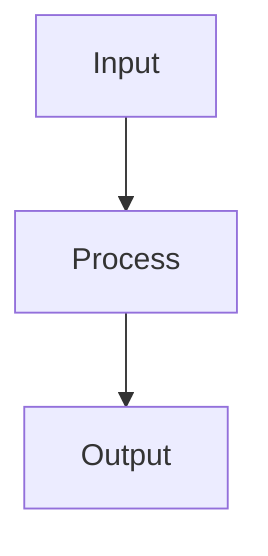

# Regression Metrics

## Detailed Explanation

MSE, MAE, R² for evaluating regressors...

## Core Intuition

A key technique in machine learning.

## How It Works

1. Obtain predicted values ŷᵢ from the model on a held-out test set
2. Compute residuals: eᵢ = yᵢ − ŷᵢ for each prediction
3. Compute Mean Absolute Error: MAE = (1/n)Σ|eᵢ| — robust to outliers, same units as target
4. Compute Mean Squared Error: MSE = (1/n)Σeᵢ² — penalizes large errors more heavily
5. Compute RMSE = √MSE — returns to original units; compare directly to target scale
6. Compute R² = 1 − SSres/SStot, where SSres = Σeᵢ², SStot = Σ(yᵢ−ȳ)² — proportion of variance explained (1.0 is perfect)
7. Plot residuals vs fitted values and residual histogram — patterns reveal model misspecification



## Architecture / Trade-offs

Trade-off 1 vs trade-off 2

## Interview Q&A

**Q: When would you use Regression Metrics?**
A: Context-dependent, varies by problem type.

**Q: What are the main trade-offs?**
A: Refer to Architecture / Trade-offs section above.

**Q: How do you choose hyperparameters?**
A: Cross-validation, grid/random/Bayesian search, domain knowledge.

**Q: What are common failure modes?**
A: Refer to Common Pitfalls section below.

## Best Practices

- Always plot residuals vs fitted values to check for patterns (non-linearity, heteroscedasticity)
- Use RMSE when large errors are especially bad (it penalizes them more)
- Use MAE when you want a robust metric less sensitive to outliers
- Use MAPE only when target values are always positive and far from zero
- Report multiple metrics — RMSE and MAE together reveal outlier influence
- Check residual distribution for normality (QQ plot) if confidence intervals are needed
- Use adjusted R² when comparing models with different numbers of features

## Common Pitfalls

- MAPE blows up when true values are near zero — use SMAPE or MAE instead
- High R² doesn't mean the model generalizes — check on held-out data
- Evaluating on training data only — always use cross-validation or a test set
- Assuming residuals are normally distributed without checking


## Code Examples

### Example 1: MSE, MAE, R² Comparison

```python
import numpy as np
import matplotlib.pyplot as plt
from sklearn.datasets import make_regression
from sklearn.linear_model import LinearRegression, HuberRegressor
from sklearn.model_selection import train_test_split
from sklearn.metrics import mean_squared_error, mean_absolute_error, r2_score

np.random.seed(42)
X, y = make_regression(n_samples=300, n_features=10, noise=20, random_state=42)

# Add outliers
outlier_idx = np.random.choice(len(y), 20)
y[outlier_idx] += np.random.randn(20) * 200

X_train, X_test, y_train, y_test = train_test_split(X, y, test_size=0.2, random_state=42)

models = {'OLS': LinearRegression(), 'Huber': HuberRegressor()}
for name, model in models.items():
    model.fit(X_train, y_train)
    pred = model.predict(X_test)
    mse = mean_squared_error(y_test, pred)
    mae = mean_absolute_error(y_test, pred)
    r2 = r2_score(y_test, pred)
    print(f"{name}: RMSE={mse**0.5:.2f}, MAE={mae:.2f}, R²={r2:.4f}")
```

### Example 2: Residual Analysis

```python
from sklearn.linear_model import LinearRegression

model = LinearRegression().fit(X_train, y_train)
pred = model.predict(X_test)
residuals = y_test - pred

fig, axes = plt.subplots(1, 3, figsize=(15, 4))

axes[0].scatter(pred, residuals, alpha=0.5)
axes[0].axhline(0, color='r', linestyle='--')
axes[0].set_xlabel('Predicted'), axes[0].set_ylabel('Residuals')
axes[0].set_title('Residuals vs Fitted')

axes[1].hist(residuals, bins=30, edgecolor='k')
axes[1].set_title('Residual Distribution')

# QQ plot
from scipy import stats
stats.probplot(residuals, dist='norm', plot=axes[2])
axes[2].set_title('QQ Plot')

plt.tight_layout(), plt.show()
print(f"Shapiro-Wilk normality p-value: {stats.shapiro(residuals[:50]).pvalue:.4f}")
```

### Example 3: MAPE and Custom Metrics

```python
def mape(y_true, y_pred, epsilon=1e-8):
    return np.mean(np.abs((y_true - y_pred) / (np.abs(y_true) + epsilon))) * 100

def smape(y_true, y_pred):
    return 100 * np.mean(2 * np.abs(y_true - y_pred) / (np.abs(y_true) + np.abs(y_pred) + 1e-8))

def adjusted_r2(r2, n, p):
    return 1 - (1 - r2) * (n - 1) / (n - p - 1)

model = LinearRegression().fit(X_train, y_train)
pred = model.predict(X_test)
r2 = r2_score(y_test, pred)

print(f"MAPE:       {mape(y_test, pred):.2f}%")
print(f"SMAPE:      {smape(y_test, pred):.2f}%")
print(f"R²:         {r2:.4f}")
print(f"Adj. R²:    {adjusted_r2(r2, len(y_test), X_test.shape[1]):.4f}")
print(f"Max Error:  {np.max(np.abs(y_test - pred)):.2f}")
```

## Related Concepts

- [Gradient Descent](./01-gradient-descent.md)
- [Cross-Validation](./22-cross-validation.md)
- [Hyperparameter Tuning](./26-hyperparameter-tuning.md)
