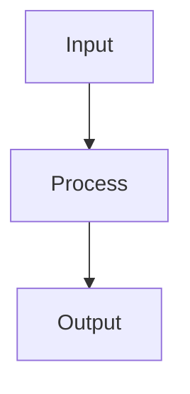

# Feature Engineering

## Detailed Explanation

Creates useful representations of raw data...

## Core Intuition

A key technique in machine learning.

## How It Works

1. Explore the raw data: check distributions, missing values, cardinality of categoricals, correlations
2. Handle missing values: impute with mean/median (numeric) or mode/constant (categorical), or use indicator features for missingness
3. Encode categorical variables: one-hot for low-cardinality, target encoding for high-cardinality, ordinal for ordered categories
4. Scale numeric features: StandardScaler (zero mean, unit variance) for distance-based models; MinMaxScaler for neural networks; RobustScaler when outliers are present
5. Create interaction features: multiply or divide related features when domain knowledge suggests interactions
6. Transform skewed features: log(1+x) for right-skewed, Box-Cox for general skewness, binning for non-linear relationships
7. Select features: remove zero-variance features, apply correlation filtering (drop one of correlated pairs), then use model-based importance for final selection



## Architecture / Trade-offs

Trade-off 1 vs trade-off 2

## Interview Q&A

**Q: What is target encoding and why can it cause data leakage if done incorrectly?**
A: Target encoding replaces a categorical value with the mean of the target for that category (e.g., "city=NYC" becomes the mean income of NYC residents in training data). If computed on the full dataset before CV, the validation fold's target values influence the encoding — this is leakage. Correct approach: fit target encoding only on the training folds inside each CV split, or use leave-one-out encoding which excludes the current sample.

**Q: When would you use one-hot encoding vs ordinal encoding for categorical features?**
A: One-hot: for nominal categories with no order (color, city) and low cardinality (<20 values) — creates interpretable binary features. Ordinal: for ordered categories (education level, rating) or high-cardinality categories with tree-based models (trees handle ordinal efficiently). For high-cardinality nominal features (1000+ categories), use target encoding or embeddings — one-hot creates too many sparse features.

**Q: How do you handle a new category in production that wasn't in training data?**
A: This is the "unseen category" or "cold start" problem. Solutions: (1) handle_unknown='ignore' in OneHotEncoder — maps unseen to zero vector; (2) handle_unknown='infrequent_if_exist' — maps rare/unseen to a special "other" bucket; (3) mean encoding fallback to global mean for unseen categories; (4) pre-define an "OTHER" category during training for any low-frequency categories. Always test your encoding pipeline on data with new categories.

**Q: What's the difference between feature selection and dimensionality reduction?**
A: Feature selection keeps a subset of original features unchanged — results are interpretable (you know which features matter). Dimensionality reduction (PCA) creates new features as linear combinations — more compact but harder to interpret. Use feature selection when interpretability matters (regulated industries, feature cost analysis). Use PCA when you need the most compact representation and don't care about feature interpretability.

**Q: How do interaction features affect model complexity and when do you add them?**
A: Interaction features (x1·x2) explicitly capture non-linear effects that linear models can't model from x1 and x2 separately. They increase dimensionality (p features → p² interactions), which can cause overfitting without regularization. Add them when domain knowledge suggests a multiplicative relationship (e.g., price × quantity = revenue), or when EDA reveals different slopes for x1 across x2 values. Tree-based models capture interactions implicitly — interaction features mainly help linear models.

**Q: How would you handle a feature with 30% missing values?**
A: First, understand the missingness mechanism: MCAR (missing completely at random — impute), MAR (missing at random given other features — impute with model-based imputation), MNAR (missing not at random — the missing indicator itself is informative, add as feature). Options: mean/median imputation for MCAR, KNN or iterative imputer for MAR, or add a binary "was_missing" feature to preserve the information that the value was missing, then impute.
## Best Practices

- Create interaction features for known domain relationships before trying automated methods
- Use log transformation for right-skewed features and targets
- Bin continuous features (age groups, income brackets) when non-linear boundaries are expected
- Use target encoding carefully — always apply within cross-validation folds to prevent leakage
- Compute feature importances first to identify what to engineer
- Apply polynomial features only up to degree 2 for most tabular tasks
- Document every feature transformation for reproducibility

## Common Pitfalls

- Target encoding without cross-validation causes severe data leakage
- Creating polynomial features on unscaled data creates numerically unstable large values
- Feature selection on the full dataset before CV leaks information
- Forgetting to apply the same transformations to test/inference data


## Code Examples

### Example 1: Encoding and Scaling

```python
import numpy as np
import pandas as pd
from sklearn.preprocessing import (StandardScaler, MinMaxScaler, RobustScaler,
                                    LabelEncoder, OneHotEncoder)
from sklearn.pipeline import Pipeline
from sklearn.compose import ColumnTransformer

np.random.seed(42)
n = 200
df = pd.DataFrame({
    'age': np.random.randint(18, 70, n),
    'income': np.random.exponential(50000, n),
    'city': np.random.choice(['NYC', 'LA', 'Chicago', 'Houston'], n),
    'edu': np.random.choice(['HS', 'BS', 'MS', 'PhD'], n),
    'target': np.random.randint(0, 2, n)
})

# ColumnTransformer: numeric → StandardScaler, categorical → OneHotEncoder
numeric_features = ['age', 'income']
categorical_features = ['city', 'edu']

preprocessor = ColumnTransformer([
    ('num', StandardScaler(), numeric_features),
    ('cat', OneHotEncoder(handle_unknown='ignore'), categorical_features)
])

X = df.drop('target', axis=1)
y = df['target']
X_transformed = preprocessor.fit_transform(X)
print(f"Original shape: {X.shape}, Transformed shape: {X_transformed.shape}")
```

### Example 2: Polynomial and Interaction Features

```python
from sklearn.preprocessing import PolynomialFeatures
from sklearn.linear_model import LogisticRegression
from sklearn.model_selection import cross_val_score
from sklearn.datasets import make_classification

X, y = make_classification(n_samples=300, n_features=5, n_informative=4, random_state=42)
X = (X - X.mean(axis=0)) / X.std(axis=0)

results = {}
for degree in [1, 2, 3]:
    poly = PolynomialFeatures(degree=degree, include_bias=False)
    X_poly = poly.fit_transform(X)
    model = LogisticRegression(max_iter=1000, C=0.1)
    cv_scores = cross_val_score(model, X_poly, y, cv=5, scoring='accuracy')
    results[degree] = (X_poly.shape[1], cv_scores.mean(), cv_scores.std())
    print(f"Degree {degree}: {X_poly.shape[1]:4d} features, "
          f"CV accuracy={cv_scores.mean():.4f}±{cv_scores.std():.4f}")

# Feature names
poly_d2 = PolynomialFeatures(degree=2, include_bias=False)
poly_d2.fit(X[:, :3])
print(f"\nSample feature names: {poly_d2.get_feature_names_out(['x1','x2','x3'])}")
```

### Example 3: Feature Selection

```python
from sklearn.feature_selection import SelectKBest, f_classif, RFE, mutual_info_classif
from sklearn.ensemble import RandomForestClassifier

X, y = make_classification(n_samples=300, n_features=20, n_informative=5, random_state=42)

# Filter: ANOVA F-test
selector_f = SelectKBest(f_classif, k=5)
X_f = selector_f.fit_transform(X, y)
selected_f = np.where(selector_f.get_support())[0]

# Wrapper: RFE
rfe = RFE(RandomForestClassifier(n_estimators=50, random_state=42), n_features_to_select=5)
rfe.fit(X, y)
selected_rfe = np.where(rfe.support_)[0]

# Embedded: Random Forest importance
rf = RandomForestClassifier(n_estimators=100, random_state=42).fit(X, y)
top5_rf = np.argsort(rf.feature_importances_)[-5:][::-1]

print(f"ANOVA selected:      {sorted(selected_f)}")
print(f"RFE selected:        {sorted(selected_rfe)}")
print(f"RF importance top-5: {sorted(top5_rf)}")
print(f"True informative: features 0-4")
```

## Related Concepts

- [Gradient Descent](./01-gradient-descent.md)
- [Cross-Validation](./22-cross-validation.md)
- [Hyperparameter Tuning](./26-hyperparameter-tuning.md)
