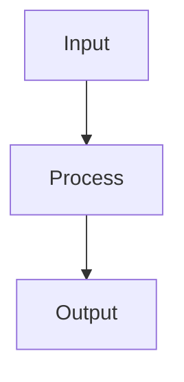

# Feature Engineering

## Detailed Explanation

Creates useful representations of raw data...

## Core Intuition

A key technique in machine learning.

## How It Works

1. Explore the raw data: check distributions, missing values, cardinality of categoricals, correlations
2. Handle missing values: impute with mean/median (numeric) or mode/constant (categorical), or use indicator features for missingness
3. Encode categorical variables: one-hot for low-cardinality, target encoding for high-cardinality, ordinal for ordered categories
4. Scale numeric features: StandardScaler (zero mean, unit variance) for distance-based models; MinMaxScaler for neural networks; RobustScaler when outliers are present
5. Create interaction features: multiply or divide related features when domain knowledge suggests interactions
6. Transform skewed features: log(1+x) for right-skewed, Box-Cox for general skewness, binning for non-linear relationships
7. Select features: remove zero-variance features, apply correlation filtering (drop one of correlated pairs), then use model-based importance for final selection



## Architecture / Trade-offs

Trade-off 1 vs trade-off 2

## Interview Q&A

**Q: When would you use Feature Engineering?**
A: Context-dependent, varies by problem type.

**Q: What are the main trade-offs?**
A: Refer to Architecture / Trade-offs section above.

**Q: How do you choose hyperparameters?**
A: Cross-validation, grid/random/Bayesian search, domain knowledge.

**Q: What are common failure modes?**
A: Refer to Common Pitfalls section below.

## Best Practices

- Create interaction features for known domain relationships before trying automated methods
- Use log transformation for right-skewed features and targets
- Bin continuous features (age groups, income brackets) when non-linear boundaries are expected
- Use target encoding carefully — always apply within cross-validation folds to prevent leakage
- Compute feature importances first to identify what to engineer
- Apply polynomial features only up to degree 2 for most tabular tasks
- Document every feature transformation for reproducibility

## Common Pitfalls

- Target encoding without cross-validation causes severe data leakage
- Creating polynomial features on unscaled data creates numerically unstable large values
- Feature selection on the full dataset before CV leaks information
- Forgetting to apply the same transformations to test/inference data


## Code Examples

### Example 1: Encoding and Scaling

```python
import numpy as np
import pandas as pd
from sklearn.preprocessing import (StandardScaler, MinMaxScaler, RobustScaler,
                                    LabelEncoder, OneHotEncoder)
from sklearn.pipeline import Pipeline
from sklearn.compose import ColumnTransformer

np.random.seed(42)
n = 200
df = pd.DataFrame({
    'age': np.random.randint(18, 70, n),
    'income': np.random.exponential(50000, n),
    'city': np.random.choice(['NYC', 'LA', 'Chicago', 'Houston'], n),
    'edu': np.random.choice(['HS', 'BS', 'MS', 'PhD'], n),
    'target': np.random.randint(0, 2, n)
})

# ColumnTransformer: numeric → StandardScaler, categorical → OneHotEncoder
numeric_features = ['age', 'income']
categorical_features = ['city', 'edu']

preprocessor = ColumnTransformer([
    ('num', StandardScaler(), numeric_features),
    ('cat', OneHotEncoder(handle_unknown='ignore'), categorical_features)
])

X = df.drop('target', axis=1)
y = df['target']
X_transformed = preprocessor.fit_transform(X)
print(f"Original shape: {X.shape}, Transformed shape: {X_transformed.shape}")
```

### Example 2: Polynomial and Interaction Features

```python
from sklearn.preprocessing import PolynomialFeatures
from sklearn.linear_model import LogisticRegression
from sklearn.model_selection import cross_val_score
from sklearn.datasets import make_classification

X, y = make_classification(n_samples=300, n_features=5, n_informative=4, random_state=42)
X = (X - X.mean(axis=0)) / X.std(axis=0)

results = {}
for degree in [1, 2, 3]:
    poly = PolynomialFeatures(degree=degree, include_bias=False)
    X_poly = poly.fit_transform(X)
    model = LogisticRegression(max_iter=1000, C=0.1)
    cv_scores = cross_val_score(model, X_poly, y, cv=5, scoring='accuracy')
    results[degree] = (X_poly.shape[1], cv_scores.mean(), cv_scores.std())
    print(f"Degree {degree}: {X_poly.shape[1]:4d} features, "
          f"CV accuracy={cv_scores.mean():.4f}±{cv_scores.std():.4f}")

# Feature names
poly_d2 = PolynomialFeatures(degree=2, include_bias=False)
poly_d2.fit(X[:, :3])
print(f"\nSample feature names: {poly_d2.get_feature_names_out(['x1','x2','x3'])}")
```

### Example 3: Feature Selection

```python
from sklearn.feature_selection import SelectKBest, f_classif, RFE, mutual_info_classif
from sklearn.ensemble import RandomForestClassifier

X, y = make_classification(n_samples=300, n_features=20, n_informative=5, random_state=42)

# Filter: ANOVA F-test
selector_f = SelectKBest(f_classif, k=5)
X_f = selector_f.fit_transform(X, y)
selected_f = np.where(selector_f.get_support())[0]

# Wrapper: RFE
rfe = RFE(RandomForestClassifier(n_estimators=50, random_state=42), n_features_to_select=5)
rfe.fit(X, y)
selected_rfe = np.where(rfe.support_)[0]

# Embedded: Random Forest importance
rf = RandomForestClassifier(n_estimators=100, random_state=42).fit(X, y)
top5_rf = np.argsort(rf.feature_importances_)[-5:][::-1]

print(f"ANOVA selected:      {sorted(selected_f)}")
print(f"RFE selected:        {sorted(selected_rfe)}")
print(f"RF importance top-5: {sorted(top5_rf)}")
print(f"True informative: features 0-4")
```

## Related Concepts

- [Gradient Descent](./01-gradient-descent.md)
- [Cross-Validation](./22-cross-validation.md)
- [Hyperparameter Tuning](./26-hyperparameter-tuning.md)
