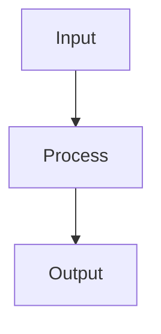

# Hyperparameter Tuning

## Detailed Explanation

Grid, random, Bayesian search for optimal parameters...

## Core Intuition

A key technique in machine learning.

## How It Works

1. Define the hyperparameter search space: specify ranges and scales (log-scale for learning rate, linear for dropout rate)
2. Choose a search strategy: grid search for small spaces (< 3 hyperparameters), random search for larger spaces, Bayesian optimization for expensive models
3. For random search: sample n_iter configurations uniformly at random from the search space
4. For Bayesian optimization: fit a surrogate model (Gaussian process) to observed (config, score) pairs; use an acquisition function (Expected Improvement) to select the next configuration
5. Evaluate each configuration with k-fold cross-validation to get an unbiased performance estimate
6. Track all configurations and scores in a registry — prevents redundant evaluations
7. Select the best configuration, retrain on the full training set, and evaluate once on the held-out test set



## Architecture / Trade-offs

Trade-off 1 vs trade-off 2

## Interview Q&A

**Q: When would you use Hyperparameter Tuning?**
A: Context-dependent, varies by problem type.

**Q: What are the main trade-offs?**
A: Refer to Architecture / Trade-offs section above.

**Q: How do you choose hyperparameters?**
A: Cross-validation, grid/random/Bayesian search, domain knowledge.

**Q: What are common failure modes?**
A: Refer to Common Pitfalls section below.

## Best Practices

- Tune hyperparameters in order of importance: learning rate first, then capacity (depth, width), then regularization
- Use log-scale for learning rates and regularization strengths
- Start with RandomizedSearchCV (30-100 iterations) before refining with GridSearch
- Use HalvingRandomSearchCV or Optuna for large search spaces
- Always tune inside cross-validation, not on a single val split
- Set n_jobs=-1 for parallel search
- Document the search space — easy to forget why you chose specific ranges

## Common Pitfalls

- Tuning on the test set and reporting test performance as final — use a separate final eval
- Grid search exponentially expensive in high dimensions — use random or Bayesian instead
- Overfitting to the validation set through many tuning iterations — use separate test set
- Forgetting that hyperparameter sensitivity varies by dataset size


## Code Examples

### Example 1: Grid Search vs Random Search

```python
import numpy as np
from sklearn.datasets import make_classification
from sklearn.model_selection import GridSearchCV, RandomizedSearchCV, cross_val_score
from sklearn.ensemble import RandomForestClassifier
import time

X, y = make_classification(n_samples=500, n_features=20, n_informative=10, random_state=42)

# Grid search
grid_params = {
    'n_estimators': [50, 100, 200],
    'max_depth': [3, 5, 10, None],
    'min_samples_split': [2, 5, 10]
}
t0 = time.time()
gs = GridSearchCV(RandomForestClassifier(random_state=42), grid_params, cv=3, n_jobs=-1)
gs.fit(X, y)
gs_time = time.time() - t0

# Random search (same budget as 1/3 of grid configs)
from scipy.stats import randint
rand_params = {
    'n_estimators': randint(50, 300),
    'max_depth': [3, 5, 10, None],
    'min_samples_split': randint(2, 20)
}
t0 = time.time()
rs = RandomizedSearchCV(RandomForestClassifier(random_state=42), rand_params,
                         n_iter=12, cv=3, n_jobs=-1, random_state=42)
rs.fit(X, y)
rs_time = time.time() - t0

print(f"Grid Search:   best={gs.best_score_:.4f}, time={gs_time:.1f}s, configs={gs.cv_results_['mean_test_score'].shape[0]}")
print(f"Random Search: best={rs.best_score_:.4f}, time={rs_time:.1f}s, configs=12")
print(f"Grid best params: {gs.best_params_}")
print(f"Random best params: {rs.best_params_}")
```

### Example 2: Bayesian Optimization with Optuna

```python
# Bayesian optimization conceptual example (without optuna dependency)
import numpy as np
from sklearn.datasets import make_classification
from sklearn.svm import SVC
from sklearn.model_selection import cross_val_score

X, y = make_classification(n_samples=300, n_features=10, n_informative=6, random_state=42)

# Simulate Bayesian optimization: Gaussian Process surrogate
# For real code: pip install optuna
# import optuna
# def objective(trial):
#     C = trial.suggest_float('C', 0.01, 100, log=True)
#     gamma = trial.suggest_categorical('gamma', ['scale', 'auto'])
#     svc = SVC(C=C, gamma=gamma)
#     return cross_val_score(svc, X, y, cv=3).mean()
# study = optuna.create_study(direction='maximize')
# study.optimize(objective, n_trials=50)
# print(f"Best: {study.best_value:.4f}, params: {study.best_params}")

# Manual approximation: log-uniform sampling
np.random.seed(42)
best_score, best_C = 0, None
for _ in range(30):
    C = 10 ** np.random.uniform(-2, 2)  # Log-uniform in [0.01, 100]
    gamma = np.random.choice(['scale', 'auto'])
    score = cross_val_score(SVC(C=C, gamma=gamma), X, y, cv=3).mean()
    if score > best_score:
        best_score, best_C, best_gamma = score, C, gamma

print(f"Best score: {best_score:.4f}, C={best_C:.4f}, gamma={best_gamma}")
```

### Example 3: Early Stopping and Halving

```python
from sklearn.model_selection import HalvingRandomSearchCV
from sklearn.ensemble import GradientBoostingClassifier
from scipy.stats import randint, uniform
import numpy as np
from sklearn.datasets import make_classification

X, y = make_classification(n_samples=1000, n_features=20, n_informative=10, random_state=42)

param_distributions = {
    'n_estimators': randint(50, 500),
    'max_depth': randint(2, 8),
    'learning_rate': uniform(0.01, 0.3),
    'min_samples_leaf': randint(1, 20)
}

# Successive Halving: start with many configs, eliminate worst each round
sh = HalvingRandomSearchCV(
    GradientBoostingClassifier(random_state=42),
    param_distributions,
    n_candidates=100,
    factor=3,
    cv=3,
    random_state=42,
    n_jobs=-1
)
sh.fit(X, y)

print(f"Best score: {sh.best_score_:.4f}")
print(f"Best params: {sh.best_params_}")
print(f"Iterations run: {sh.n_iterations_}")
print(f"Total fits: {sh.n_resources_}")
```

## Related Concepts

- [Gradient Descent](./01-gradient-descent.md)
- [Cross-Validation](./22-cross-validation.md)
- [Hyperparameter Tuning](./26-hyperparameter-tuning.md)
