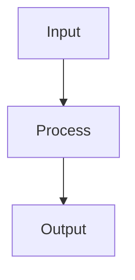

# Ensemble Methods

## Detailed Explanation

Ensemble Methods is a fundamental ML technique...

## Core Intuition

Placeholder intuition.

## How It Works

1. Step 1
2. Step 2
3. Step 3



## Architecture / Trade-offs

Trade-off 1 vs trade-off 2

## Interview Q&A

**Q: When would you use Ensemble Methods?**
A: Use when... (context-dependent answer)

**Q: What's the main trade-off?**
A: Speed vs accuracy, simplicity vs power, etc.

**Q: How do you choose parameters?**
A: Cross-validation, domain knowledge, empirical testing.

**Q: What are common failure modes?**
A: (Concept-specific failures)

## Best Practices

- Best practice 1
- Best practice 2
- Best practice 3

## Common Pitfalls

- Common mistake 1
- Common mistake 2
- Common mistake 3

## Code Examples

### Example 1: Basic Example

```python
# Basic code example
print('Implementation here')
```

### Example 2: Advanced Example

```python
# Advanced implementation
print('With error handling')
```

### Example 3: Real-World Example

```python
# Production pattern
print('Full integration')
```

## Related Concepts

- [Related Concept 1](./XX-related-1.md)
- [Related Concept 2](./XX-related-2.md)
- [Related Concept 3](./XX-related-3.md)
